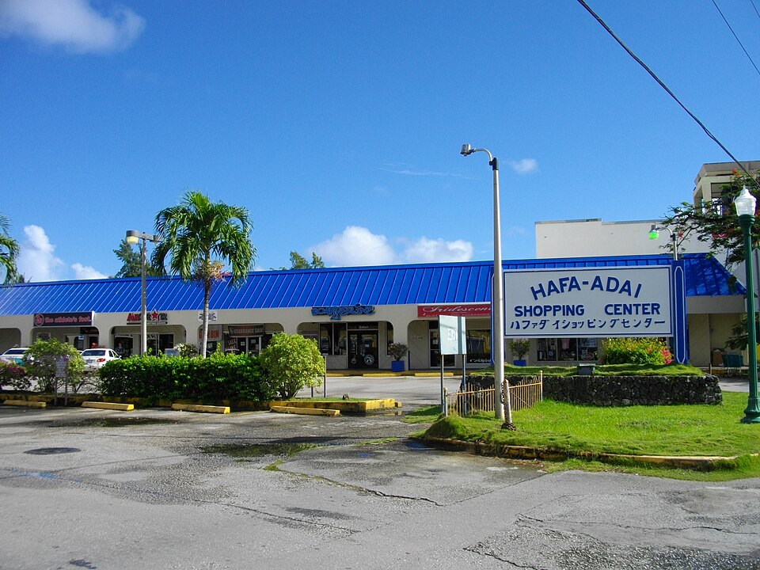
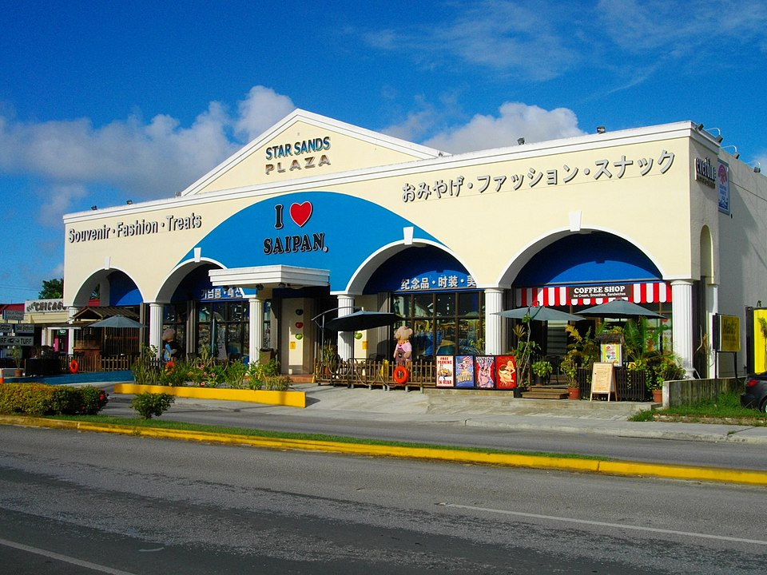

    <h2 class="section-title">{}</h2>
    <ul class="rule-list">
        <li>ドメインは.mp</li>
        <li>Google Carの右前に長いアンテナがある</li>
        <li>英語の他に日本語・中国語・韓国語の表記が店の看板などにある</li>
    </ul>

{}
{}
{}
観光客の半分以上が日本人で構成されているという。そのため店の看板や旗に日本語が見つかるときがある{}。
{}

{}
Google Carの右前に長いアンテナがある{}。{}や{}にもアンテナがあるので注意。
{}

<iframe src="https://www.google.com/maps/embed?pb=!4v1683473042222!6m8!1m7!1safrS82f1nqI__b_6b6fQDw!2m2!1d15.21143473229066!2d145.7537668222292!3f169.99762325557893!4f-24.22246046686091!5f3.325193203789971" width="495" height="295" style="border:0;" allowfullscreen="" loading="lazy" referrerpolicy="no-referrer-when-downgrade"></iframe>

{}
{}

    <h2 class="section-title">{}</h2>
    <ul class="rule-list">
        <li>数少ない海外神社のひとつ、羅宗神社跡地にストリートビューがある{}</li>
    </ul>

{}
{}

{}
テアニン島にも小さな徒歩のカバレッジが複数あり、羅宗神社跡地も含まれている{}。神社に関する詳細な情報は検索しても見つけられなかった。
{}

{}
{}