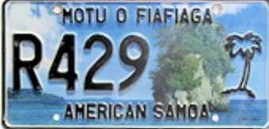

    <h2 class="section-title">{}</h2>
    <ul class="rule-list">
        <li>Google Carが特徴的</li>
        <li>ナンバープレートに海が描かれており青と緑色に見える</li>
        <li>ドメインは.ws・.asだが.asはサモア以外でも使用される（事実上gTLD扱いとなっている{}のような感じ）</li>
    </ul>

{}
{}
{}Fatu Rockが描かれており全体的に青と緑色に見える{}
{}

<iframe src="https://www.google.com/maps/embed?pb=!4v1686032855051!6m8!1m7!1sHPIiNcithd4KU_EVDtu6lA!2m2!1d-14.33887336276767!2d-170.729863518567!3f213.31038393606119!4f-10.481208429969783!5f3.325193203789971" width="400" height="250" style="border:0;" allowfullscreen="" loading="lazy" referrerpolicy="no-referrer-when-downgrade"></iframe>

{}

<a href="https://creativecommons.org/licenses/by-sa/4.0" title="Creative Commons Attribution-Share Alike 4.0">CC BY-SA 4.0</a>, <a href="https://commons.wikimedia.org/w/index.php?curid=76588121">Link</a>
{}

{}Google Carが特徴的
{}

<iframe src="https://www.google.com/maps/embed?pb=!4v1683468379937!6m8!1m7!1sUN54FqEehjDyWtfeanvp_w!2m2!1d-14.33035647793342!2d-170.7263398522896!3f258.53246131342013!4f-24.39911786029907!5f0.4000000000000002" width="295" height="295" style="border:0;" allowfullscreen="" loading="lazy" referrerpolicy="no-referrer-when-downgrade"></iframe>
<iframe src="https://www.google.com/maps/embed?pb=!4v1689181623079!6m8!1m7!1s1RIW_4IZTjTw5oNtgRjj1w!2m2!1d-14.21375867390343!2d-169.4321770377156!3f276.7220122790132!4f-44.383469271166206!5f0.7820865974627469" width="295" height="295" style="border:0;" allowfullscreen="" loading="lazy" referrerpolicy="no-referrer-when-downgrade"></iframe>
<iframe src="https://www.google.com/maps/embed?pb=!4v1689181679474!6m8!1m7!1sxVD4ee76dyrL_RGgU9lthQ!2m2!1d-14.18077710201051!2d-169.6215019226212!3f169.21572252276042!4f-35.78019326894807!5f0.7820865974627469" width="295" height="295" style="border:0;" allowfullscreen="" loading="lazy" referrerpolicy="no-referrer-when-downgrade"></iframe>

{}ローズ環礁がある{{% ref "https://ja.wikipedia.org/wiki/%E3%83%AD%E3%83%BC%E3%82%BA%E7%92%B0%E7%A4%81" "ローズ環礁" %}}。アメリカ合衆国の領土のうちで最南端の場所。
{}

<iframe src="https://www.google.com/maps/embed?pb=!4v1689181857488!6m8!1m7!1sTCiQW84h8SL6WXIiUcN8tA!2m2!1d-14.53633081044816!2d-168.1510589499278!3f193.71594662849276!4f-1.856130367900704!5f0.7820865974627469" width="295" height="295" style="border:0;" allowfullscreen="" loading="lazy" referrerpolicy="no-referrer-when-downgrade"></iframe>
<iframe src="https://www.google.com/maps/embed?pb=!4v1689181887890!6m8!1m7!1sxKnpUj4WcXuQ5Nmpk9T9bA!2m2!1d-14.54844054705358!2d-168.1444021735183!3f45.68349330346174!4f-2.2055474292601644!5f0.8741720002879085" width="295" height="295" style="border:0;" allowfullscreen="" loading="lazy" referrerpolicy="no-referrer-when-downgrade"></iframe>

{}
{}