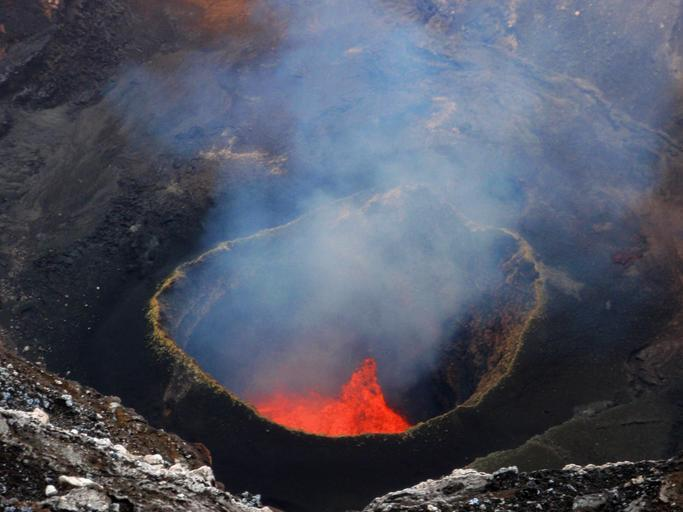

    <h2 class="section-title">{}</h2>
    <ul class="rule-list">
        <li>El dominio es .vu</li>
        <li>Hay alguien que camina delante como guía</li>
    </ul>

{}
{}

{}
Un guía que camina delante. Gracias.
{}

<iframe src="https://www.google.com/maps/embed?pb=!4v1685047835470!6m8!1m7!1sCF3_VNzlSKEYZUF37FzpLw!2m2!1d-16.26153953219388!2d168.1865441090426!3f9.824664345565452!4f-16.996343372250365!5f0.7237900267763412" width="295" height="295" style="border:0;" allowfullscreen="" loading="lazy" referrerpolicy="no-referrer-when-downgrade"></iframe>
<iframe src="https://www.google.com/maps/embed?pb=!4v1685047885476!6m8!1m7!1s_B5L1fP-zRlHL62OM1jNMA!2m2!1d-16.25896235374018!2d168.2545363115354!3f112.1140436902644!4f-4.6456743893584616!5f1.6647983662564774" width="295" height="295" style="border:0;" allowfullscreen="" loading="lazy" referrerpolicy="no-referrer-when-downgrade"></iframe>

{}
Hay lugares donde se camina cerca de un cráter, viendo lava y humo. {}
{}

{}
{}
