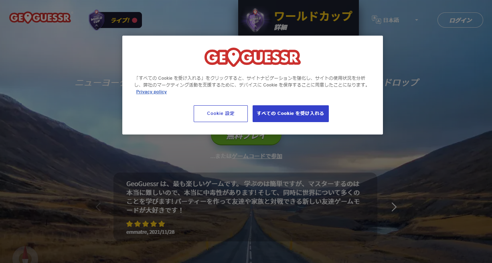
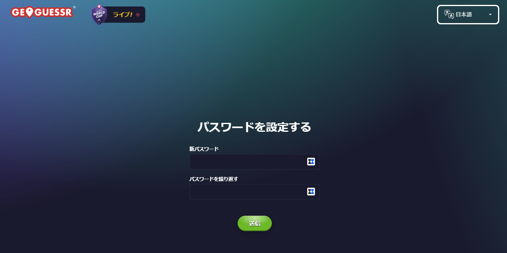
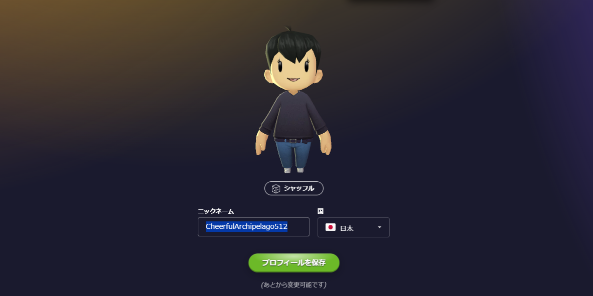
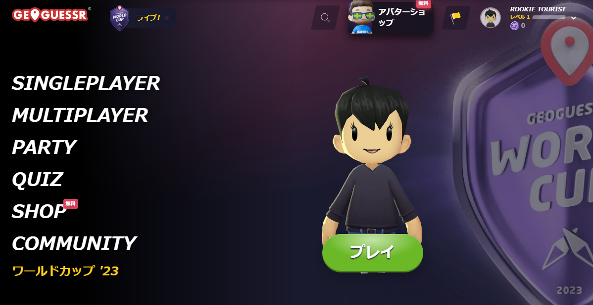
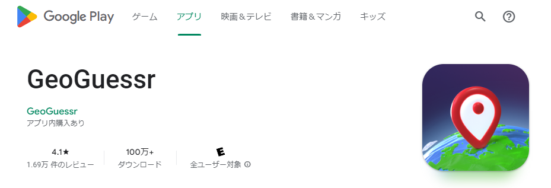
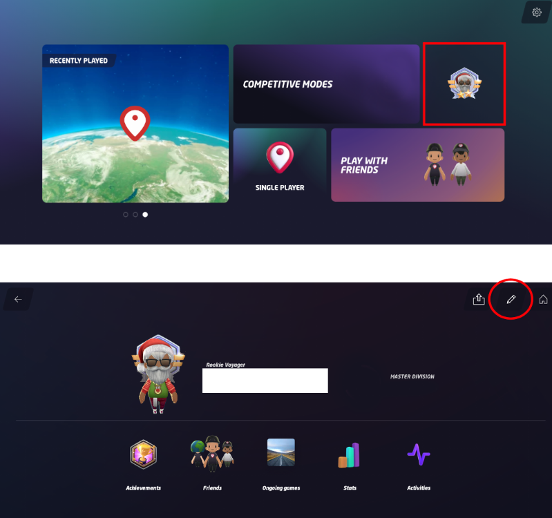

{}ジオゲッサーをこれから初めて遊ぶ人に向けての説明です。デスクトップのブラウザかスマートフォンのアプリでプレイすることができます。
{}

{}
{}

{}
①{}にアクセス
{}

{}
②Googleアカウント等で登録をしてください。登録だけならクレジットカードやPaypalの入力は必要なく課金も発生しません。
{}

{}
③パスワードを設定し、ニックネームを決定してください。Gmailなどから登録する場合はニックネームが個人名になっていないことを確認してください。
{}

{}
⑤15分毎に5分間無料でプレイ可能になります。ただし他の課金済みアカウントの人が作成したパーティに参加する場合は時間制限なしでプレイ可能になります。
{}

{}
{}

{}
①{}もしくは{}からGeoguessrをインストールします。
{}

{}
②チュートリアルを完了させます。チュートリアルではエッフェル塔や自由の女神がある場所が出題されます。最後にプレイを続ける前にアカウント名がGmailのアドレスや本名になっていないことを確認してください。以下の赤の箇所をクリックすることでアカウント名を変更することができます。
{}

{}
{}