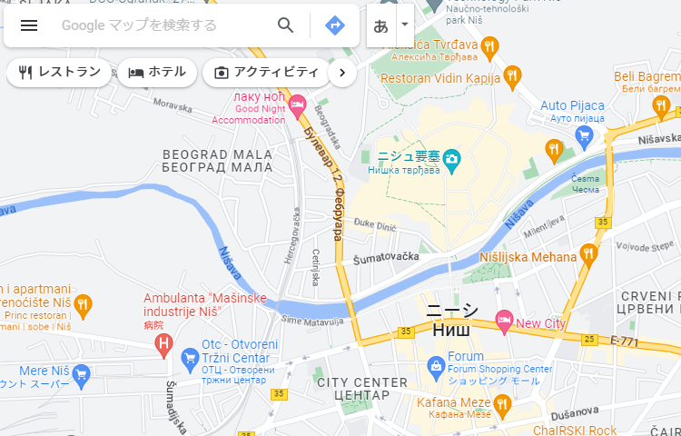

 

Por la naturaleza del juego es muy fácil mostrar datos personales sin querer. Después de probar varias cosas, estas son las medidas que utilizo ahora mismo.

- Cuando transmito juego en una ventana de incógnito o con la sesión de Google cerrada
- Fijo mi ubicación actual en San Francisco desde las herramientas para desarrolladores
- Cualquier texto en pantalla que coincida con palabras clave (direcciones IP, correos, etc.) se reemplaza automáticamente por caracteres ficticios
- Botones que no quiero pulsar —por ejemplo el de “actualizar tu ubicación” de Google— los oculto con CSS para que no sean clicables

Si tienes más ideas útiles, cuéntamelas. ¡Me ayudarían mucho!

 
 
<h3 class="no-blur">Cambiar la ubicación que usa Google Search</h3>

Si sigues conectado a Google, la página de resultados puede mostrar direcciones muy precisas, así que ten cuidado. Incluso cerrando sesión, Google puede deducir la zona aproximada mediante la IP, así que no bajes la guardia.
Al buscar transporte público, restaurantes o tiendas, Google a veces mueve el mapa a un punto cercano a tu IP. Durante los directos evito palabras cotidianas, como “konbini” o “supermercado”, que puedan señalar mi barrio.
Puedes cambiar la ubicación detectada con una VPN o abriendo las herramientas de desarrollo de Chrome y sobrescribiendo toda la geolocalización.

 
 

<h3 class="no-blur">Reemplazar de golpe las palabras sensibles</h3>

Con algunas extensiones de Chrome (un script casero también sirve) es posible ocultar las palabras que definas. Si haces que sustituya correos electrónicos, nombres de prefecturas/ciudades, apellidos, direcciones IP o incluso parte del prefijo telefónico, aunque la información aparezca en pantalla será difícil identificarte.
Por ejemplo, puedes usar un complemento que oculte las palabras prohibidas para que los nombres de lugares nunca lleguen a mostrarse.

<b>[Extensión ● TextForma](https://chrome.google.com/webstore/detail/textforma/nmoicgikomkhfcfimpldahmfabckjiie?hl=ja)</b>

 
 

<h3 class="no-blur">Ocultar zonas de la UI con CSS</h3>

Es más que nada para ir sobre seguro, pero aplicar CSS personalizado para ocultar las áreas que podrían mostrar datos personales —y los enlaces que llevan a ellas— ayuda a evitar errores porque simplemente no se pueden clicar. El ejemplo siguiente elimina por completo los botones que podrían revelar correos o prefijos telefónicos (vigente en enero de 2023).

<pre>
@-moz-document domain("google.co.jp") {
    div.qLP7kc {
        display: none;
    }
    
    div.qWuU9c {
        display: none;
    }
    
    div.scene-footer-container {
        bottom: 3em !important;
        right: 10em !important;
        margin-top: 0;
        transform: scale(1.5, 1.5);
    }
    
    div.sW9vGe {
        width: 12em;
    }
    
    img.gb_h {
        display: none;
    }
    
    div.gb_Ef {
        display: none;
    }
    
    div.hdeJwf{
        display: none;
    }
    
    div.etWJQ {
        display: none;
    }
}
</pre>

<pre>
@-moz-document url-prefix("https://www.google.com/maps/") {
    img.gb_h {
        display: none;
    }
    
    div.gb_Ef {
        display: none;
    }
    
    div.hdeJwf{
        display: none;
    }
    
    div.etWJQ {
        display: none;
    }
}
</pre>

<h3 class="no-blur">Antes de aplicar el CSS</h3>

Puedes leer tu correo y los nombres de otras cuentas en la esquina superior derecha.
Al pulsar “Enviar al dispositivo móvil”, etc., también aparece parte del prefijo telefónico.

<h3 class="no-blur">Después de aplicar el CSS</h3>

Toda el área de los botones desaparece y solo queda la descripción del lugar.

A veces ciertas webs te redirigen de repente a la página de inicio de sesión de Google, así que conviene desenfocar esa pantalla con CSS. Recuerda que un simple blur podría revertirse, de modo que añade caracteres mediante `:before` o `:after` y cambia la longitud del texto si necesitas más protección.

