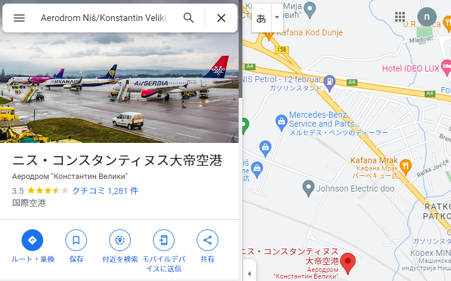
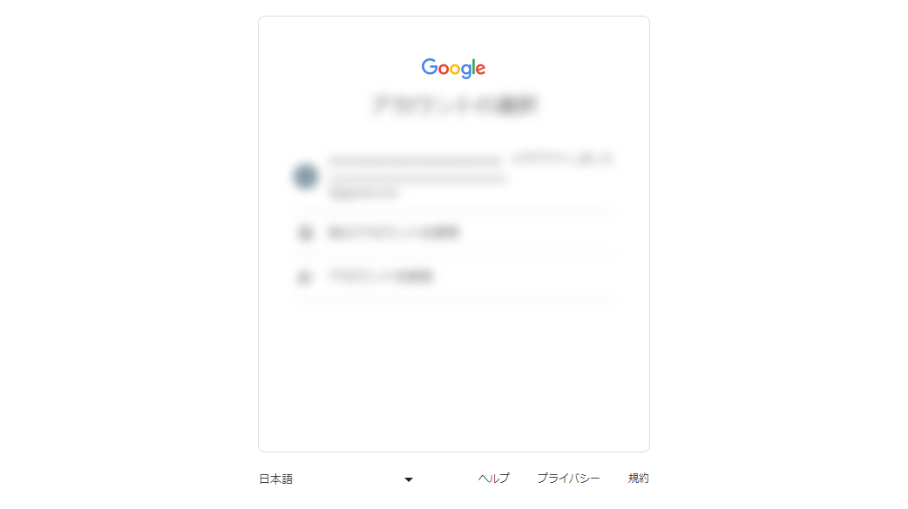

 

Karena sifat permainan ini, informasi pribadi bisa muncul di layar tanpa sengaja. Setelah banyak mencoba, sejauh ini inilah langkah-langkah yang saya lakukan.

- Saat siaran saya selalu memakai jendela mode samaran atau keluar dari akun Google
- Lokasi saat ini saya paksa ke San Francisco lewat developer tools
- Teks yang cocok dengan kata kunci tertentu (alamat IP, alamat surel, dll.) diganti otomatis dengan karakter pengganti
- Tombol yang tidak ingin diklik—seperti tombol Google “perbarui lokasi sekarang”—saya sembunyikan dengan CSS agar tidak bisa ditekan

Kalau ada cara lain yang lebih baik, silakan beri tahu saya. Saya akan sangat berterima kasih.

 
 
<h3 class="no-blur">Mengubah lokasi yang dipakai Google Search</h3>

Jika tetap masuk ke akun Google, layar hasil pencarian bisa menampilkan alamat yang cukup rinci, jadi harap perhatikan. Walaupun sudah keluar, Google masih bisa memperkirakan wilayah besar dari alamat IP.
Saat mencari transportasi, restoran, atau toko, Google terkadang memindahkan posisi peta ke daerah dekat rumah berdasarkan IP. Ketika siaran saya menghindari kata kunci yang terlalu spesifik seperti “konbini” atau “supermarket”.
Anda bisa mengganti lokasi yang terdeteksi dengan VPN atau lewat developer tools di Chrome untuk menimpa geolokasi sepenuhnya.

 
 

<h3 class="no-blur">Mengganti kata kunci sensitif sekaligus</h3>

Beberapa ekstensi Chrome (skrip buatan sendiri pun bisa) dapat menyembunyikan kata yang ditentukan. Jika kita memasukkan alamat surel, nama prefektur/kota, nama keluarga, alamat IP, bahkan sebagian kode area sebagai target penggantian, maka sekalipun terlihat di layar orang lain tetap sulit mengidentifikasi kita.
Contohnya, Anda bisa memakai plugin yang menyembunyikan kata terlarang sehingga nama tempat tidak pernah ditampilkan.

<b>[Ekstensi ● TextForma](https://chrome.google.com/webstore/detail/textforma/nmoicgikomkhfcfimpldahmfabckjiie?hl=ja)</b>

 
 

<h3 class="no-blur">Menyembunyikan bagian UI dengan CSS</h3>

Ini lebih ke langkah pencegahan, tetapi menambahkan CSS khusus untuk menyembunyikan area yang mungkin memuat informasi pribadi—beserta tautan menuju area itu—dapat mencegah salah klik karena unsur tersebut tidak lagi terlihat. Contoh di bawah menghilangkan tombol yang berpotensi menampilkan alamat surel atau kode area (masih berlaku pada Januari 2023).

<pre>
@-moz-document domain("google.co.jp") {
    div.qLP7kc {
        display: none;
    }
    
    div.qWuU9c {
        display: none;
    }
    
    div.scene-footer-container {
        bottom: 3em !important;
        right: 10em !important;
        margin-top: 0;
        transform: scale(1.5, 1.5);
    }
    
    div.sW9vGe {
        width: 12em;
    }
    
    img.gb_h {
        display: none;
    }
    
    div.gb_Ef {
        display: none;
    }
    
    div.hdeJwf{
        display: none;
    }
    
    div.etWJQ {
        display: none;
    }
}
</pre>

<pre>
@-moz-document url-prefix("https://www.google.com/maps/") {
    img.gb_h {
        display: none;
    }
    
    div.gb_Ef {
        display: none;
    }
    
    div.hdeJwf{
        display: none;
    }
    
    div.etWJQ {
        display: none;
    }
}
</pre>

<h3 class="no-blur">Sebelum CSS diterapkan</h3>

Alamat surel dan nama akun lain terlihat di sudut kanan atas.
Saat menekan “Kirim ke perangkat seluler” dan sejenisnya, sebagian kode area juga muncul.

<h3 class="no-blur">Setelah CSS diterapkan</h3>

Seluruh area tombol dihapus sehingga hanya deskripsi lokasi yang tersisa.

Kadang ada situs web yang tiba-tiba membuka halaman login Google, jadi layar tersebut sebaiknya ikut diburamkan dengan CSS. Namun ingat, hasil blur masih mungkin dipulihkan, jadi tambahkan karakter melalui `:before` atau `:after` dan ubah panjang string bila butuh perlindungan ekstra.

