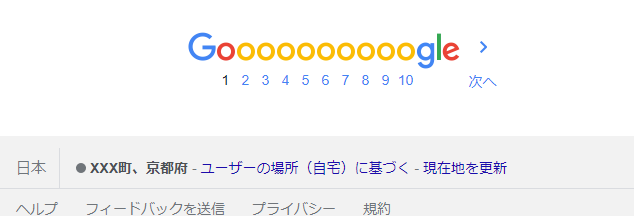
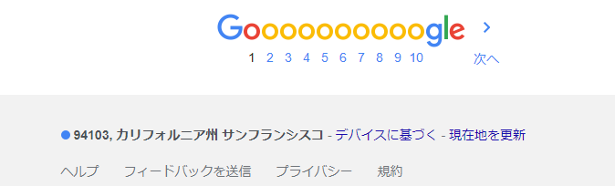
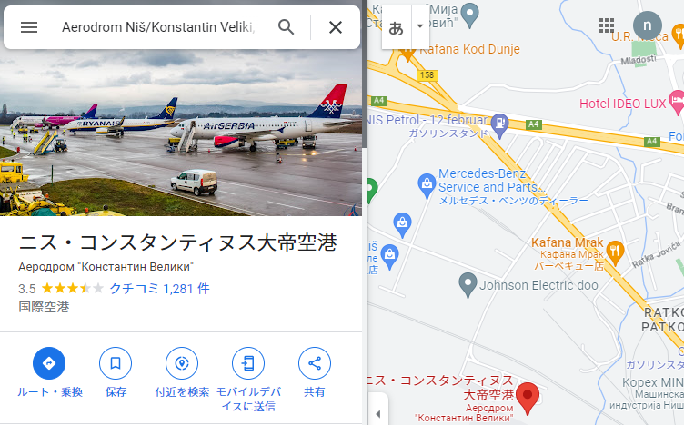
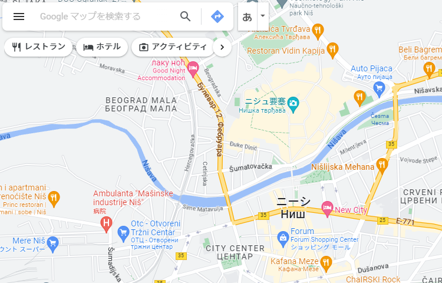
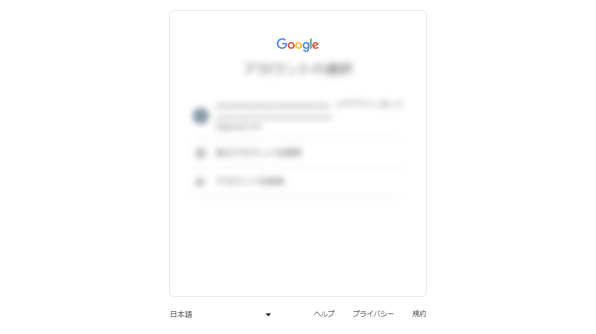

 

ゲームの性質上、うっかり個人情報を晒す可能性が高い。
いろいろ考えた結果、自分は以下のような対策をしています。

- 配信時はシークレットモードかGoogleはログアウトした状態
- 開発者モードから現在地をサンフランシスコに設定
- 画面上に表示された指定ワード（IPアドレス・メールアドレス等）を自動的に特定の文字に置換
- 押したくないボタン（Google検索の『現在地を更新』ボタン等）はcssで非表示にしてクリック不可にする

他になにか良い方法あれば教えていただけると大変うれしいです。

 
 
<h3 class="no-blur">Google検索の位置情報を書き換える</h3>

Googleにログインしていると検索した際の画面表示にかなり詳細な住所が映ってしまうので注意する。ログアウトしてもIPなどから大まかな地域が分かる可能性がある。IPによる推定地域はシークレットモードでも表示されるので注意する。
また、交通機関や飲食店、小売店を検索するとIPをもとに住所の近くに移動させられる可能性もある。配信する場合はコンビニ・スーパーなど身近なワードは検索を避けるのが無難だと思った。
一応、VPNを使う or Chrome のデベロッパーツールから位置情報をまるごと書き換えることで位置を変更できる。

 
 

<h3 class="no-blur">画面上に表示される特定のワードを一括で置換してしまう</h3>

一部のChrome拡張（自作でもok）をつかえば、指定の単語のみを隠すことができる。メールアドレス・県名・市町村名・氏名・IPアドレス・市外局番の一部など個人につながりうる文字を全て置換対象にいれてしまえば、万が一映ったとしても特定には至らない。
たとえば、NGワードを非表示にするプラグインを使って町名や県名をあらかじめ非表示にする方法が考えられる。

<b>[拡張機能  TextForma](https://chrome.google.com/webstore/detail/textforma/nmoicgikomkhfcfimpldahmfabckjiie?hl=ja)</b>

 
 

<h3 class="no-blur">cssを使って個人情報が表示される領域を隠す</h3>

ほぼ気休め程度ですが、カスタムcssを適用して個人情報が表示されうる領域やそのページへのリンクをあらかじめcssで隠してしまいクリックできなくすることで事故を防げるかもしれないです。以下はメールアドレスや市外局番の表示がされる可能性があるボタンを丸ごと非表示にした例（2023年1月時点で有効）。

<pre>
@-moz-document domain("google.co.jp") {
    div.qLP7kc {
        display: none;
    }
    
    div.qWuU9c {
        display: none;
    }
    
    div.scene-footer-container {
        bottom: 3em !important;
        right: 10em !important;
        margin-top: 0;
        transform: scale(1.5, 1.5);
    }
    
    div.sW9vGe {
        width: 12em;
    }
    
    img.gb_h {
        display: none;
    }
    
    div.gb_Ef {
        display: none;
    }
    
    div.hdeJwf{
        display: none;
    }
    
    div.etWJQ {
        display: none;
    }
}
</pre>

<pre>
@-moz-document url-prefix("https://www.google.com/maps/") {
    img.gb_h {
        display: none;
    }
    
    div.gb_Ef {
        display: none;
    }
    
    div.hdeJwf{
        display: none;
    }
    
    div.etWJQ {
        display: none;
    }
}
</pre>

<h3 class="no-blur">適用前</h3>

右上からメールアドレスと他のアカウントの名前・アドレスを確認できる。
また、「モバイルデバイスに送信」などをクリックすると市外局番の一部が表示される。

<h3 class="no-blur">適用後</h3>

ボタン表示エリアごと削除し、場所の説明だけが表示されるようになる。

また、たまに急にGoogleなどのログインページに飛ぶウェブサイトがあるので、この画面もcssでぼやかしておけば事故が防げるかも。ただしぼやけさせても復元できる可能性があるので `:before`, `:after`等で文字を追加して文字列長も変えるなど工夫が必要。

