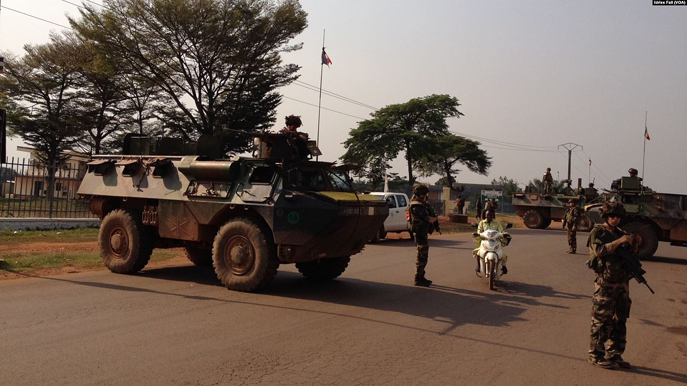

    <h2 class="section-title">{}</h2>
    <ul class="rule-list">
        <li>2023年11月の時点では公式カバレッジは無い</li>
        <li>フランス語とサンゴ語が公用語</li>
        <li>法定通貨としてCFAフランの他にビットコインを使用している</li>
    </ul>

{}
{}
{}
かつて{}領赤道アフリカを構成していた国家のひとつ{{% ref "https://ja.wikipedia.org/wiki/%E3%83%95%E3%83%A9%E3%83%B3%E3%82%B9%E9%A0%98%E8%B5%A4%E9%81%93%E3%82%A2%E3%83%95%E3%83%AA%E3%82%AB" "フランス領赤道アフリカ" %}}。フランス電柱が見つかると思われるが写真が少ない。
{}

{}
{}