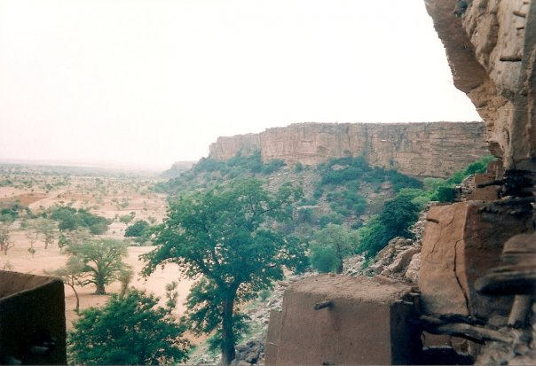

    <h2 class="section-title">{}</h2>
    <ul class="rule-list">
        <li>車は右側通行</li>
        <li>ドメインは.ml</li>
        <li>言語はフランス語と地域固有の言語</li>
        <li>マリでは泥を使った建築物が多く見た目も特徴的{}</li>
        <li>世界遺産である{}・{} ・{}・{}付近にストリートビューが多くこれ以外にも小さな点が複数ある</li>
    </ul>

{}
{}
{}
マリでは泥を使った建築物が多く見た目も特徴的。壁からはヤシの木でできた棒（トロンと呼ばれる）やパイプが突き出していることが多い{}。
{}

{}
日乾しレンガと泥で家ができている。雨が少なく乾燥しており、どの建物も屋根が平らに見える{}。
{}

By <a rel="nofollow" class="external text" href="https://www.flickr.com/people/48600082269@N01">upyernoz</a> from Haverford, USA - <a rel="nofollow" class="external text" href="https://www.flickr.com/photos/upyernoz/6917662/">Timbuktu Street</a>
Uploaded by <a href="//commons.wikimedia.org/wiki/User:AlbertHerring" class="mw-redirect" title="User:AlbertHerring">AlbertHerring</a>, <a href="https://creativecommons.org/licenses/by/2.0" title="Creative Commons Attribution 2.0">CC BY 2.0</a>, <a href="https://commons.wikimedia.org/w/index.php?curid=29240121">Link</a>

{}
都市部から離れた非常に小さな範囲にバンディアガラの断崖がある{}。
{}

{}
{}