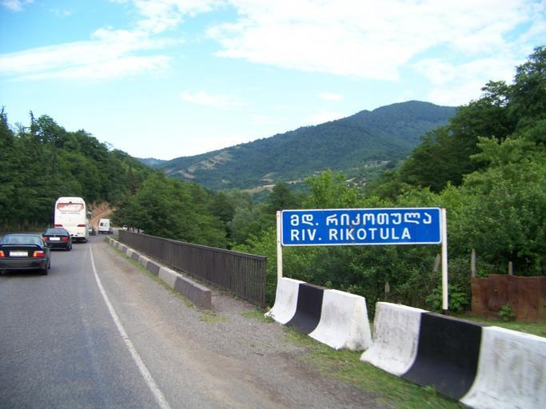
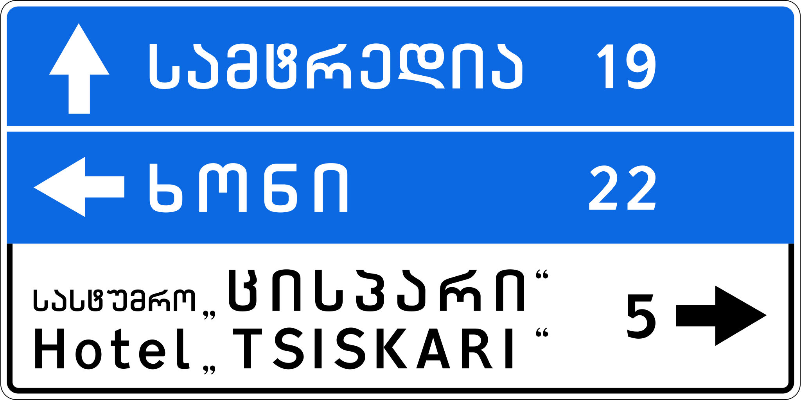
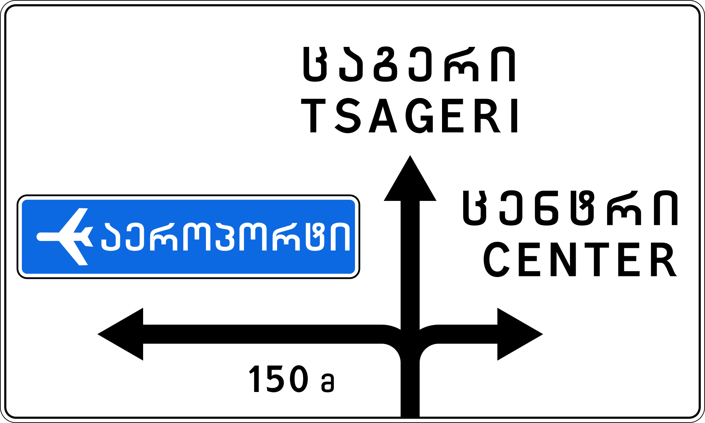
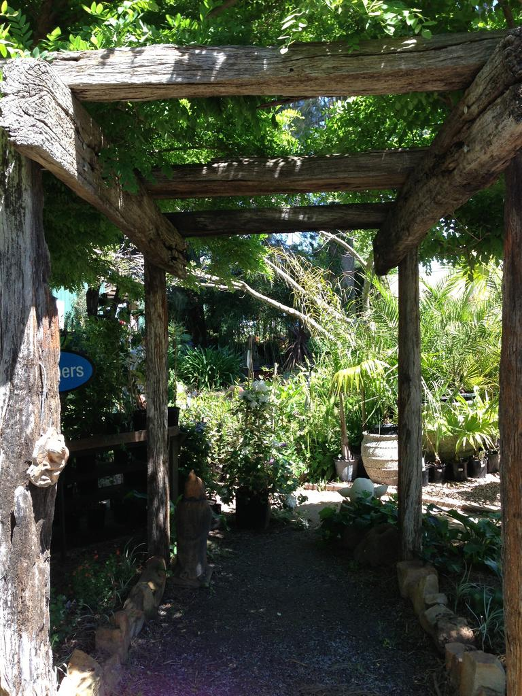
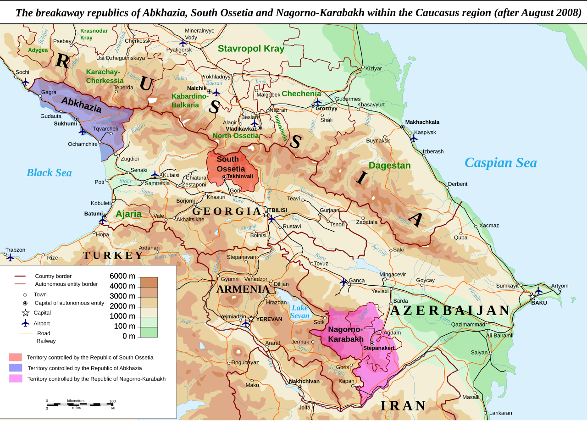
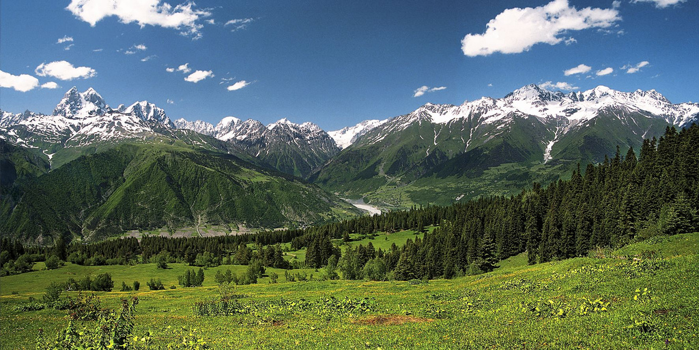

    <h2 class="section-title">{}</h2>
    <ul class="rule-list">
        <li>ドメインは.ge</li>
        <li>ジョージア語（ქართული ენა）が公用語として使われている{}</li>
        <li>庭などにパーゴラがある</li>
    </ul>

{}
{}
{}
ジョージア語（ქართული ენა）が使用されている{}。
{}

{}
白に赤い反射板のボラード{}。
{}

By <a href="//commons.wikimedia.org/w/index.php?title=User:Yuri_Samoylov&amp;action=edit&amp;redlink=1" class="new" title="User:Yuri Samoylov (page does not exist)">Yuri Samoylov</a> - Own work, <a href="https://creativecommons.org/licenses/by-sa/4.0" title="Creative Commons Attribution-Share Alike 4.0">CC BY-SA 4.0</a>, <a href="https://commons.wikimedia.org/w/index.php?curid=148358453">Link</a>

{}
ワイン発祥の地でもあるジョージアでは、家の前にパーゴラ（ブドウを這わせるための鉄骨や木製の棚）があることが多い{}。
{}

{}
{}

    <h2 class="section-title">{}</h2>
    <ul class="rule-list">
        <li>国境に近づくほど急な山が増えるが、南部もゆるやかな起伏は多い
            <ul>
                <li>北{}</li>
                <li>南{}</li>
            </ul>
        </li>
        <li>積乱雲がたまった山・コンクリ道路が見えるのは北部の兆候</li>
    </ul>

{}
{}
{}
ロシアとの国境にはコーカサス山脈が広がっており、近づくほど山は急峻になっていく。
{}

{}
{}
{}
頂上は雲がかかるくらい高い{}。大コーカサス山脈で上空に大気が押し上げられ積乱雲の列が発生し雨が降る。そのため、山脈に近づくほど降水量が多く緑が多い景色になる{}と予想される。また、標高が高い地域ではアスファルトでの舗装が難しく（アスファルトの隙間の水が凍ると膨張しひび割れになる）コンクリ舗装の道が多くなる{}。
{}

{}
{}