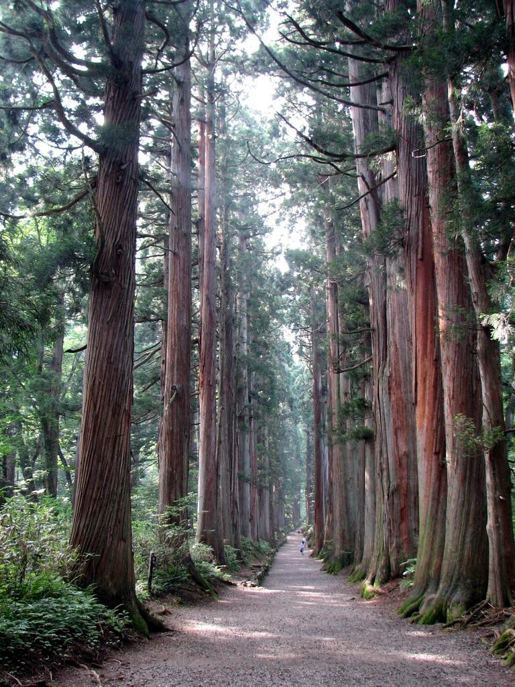
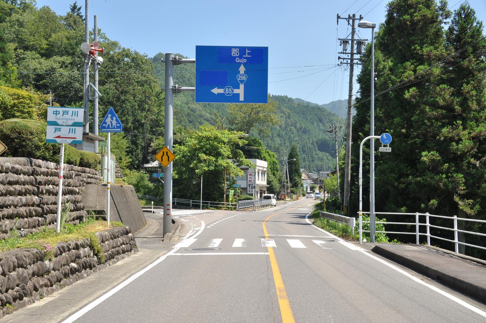
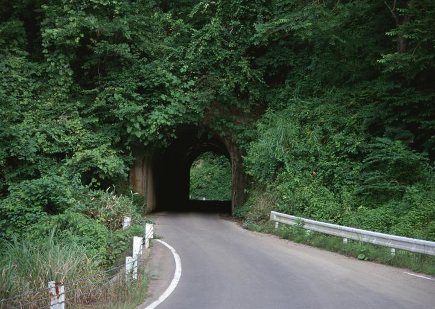
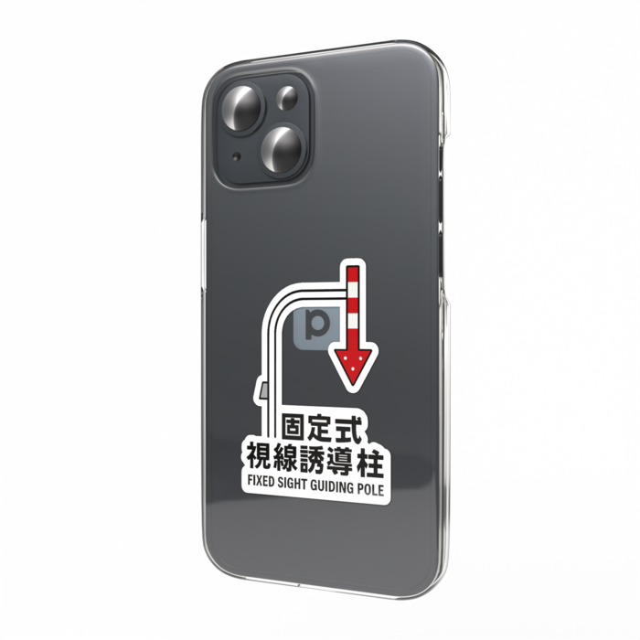
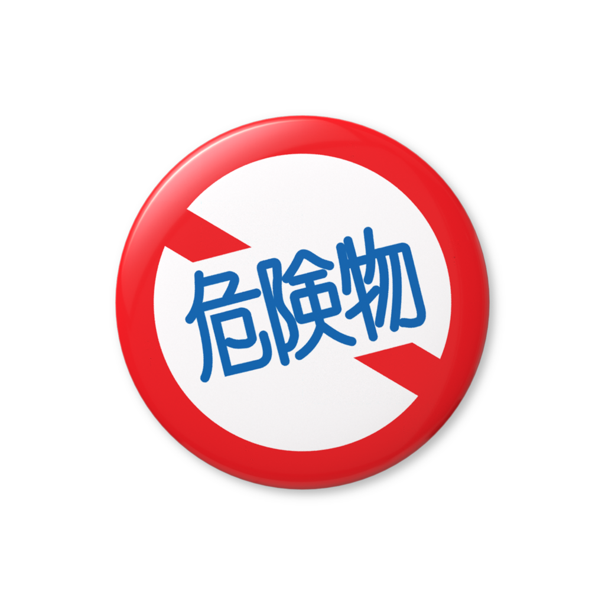
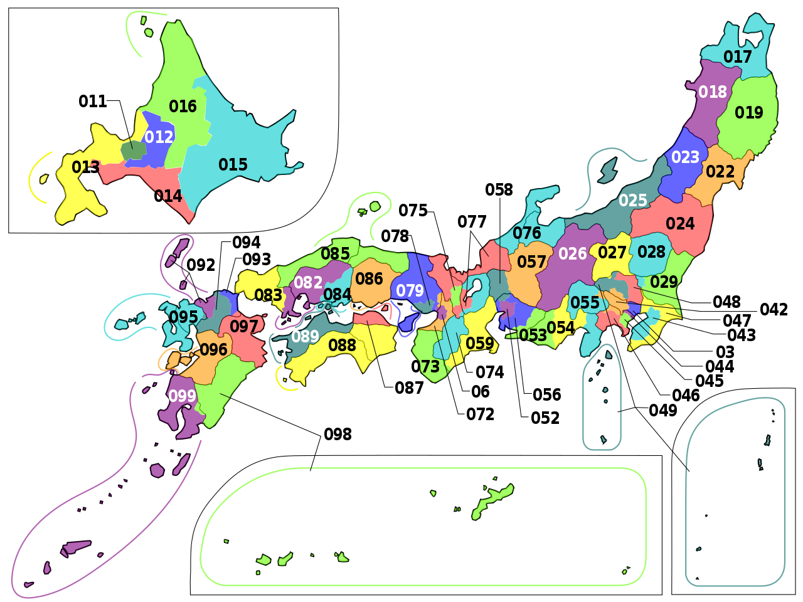
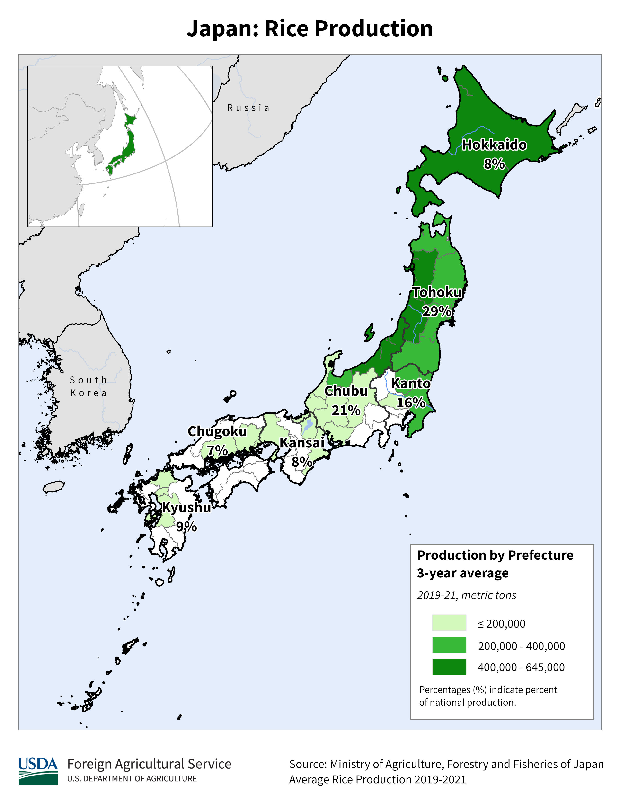

    <h2 class="section-title">{}</h2>
    <ul class="rule-list">
        <li>Language is Japanese</li>
        <li>Domain is .jp</li>
    </ul>
    {}
    {}

{}
When searching for common facility names like "convenience store" on Google Maps, results may be biased toward your home area based on your IP address, so be careful when streaming. The bottom of Google search results may also display a city name based on your IP (see: <a href="../../../web/privacy/">Home > Useful Pages</a>). If you plan to stream, it is strongly recommended to do a test stream beforehand.
{}

{}
{}
{}
Utility poles have vertical stripe patterns{}.
{}

{}
Japanese cedar (Cryptomeria) is almost never found outside Japan. If found elsewhere, it was artificially introduced.
{}

{}
If Japanese cedar is found outside Japan, it is very likely to be in the {}, where it was introduced and cultivated for timber{}{}.
{}

{}
For privacy reasons, the camera is positioned low{}. Also, there are Japanese signs and road markings{}.
{}

{}
Be careful not to confuse the low camera alone with {} (e.g.{}) or {} (e.g.{}).
{}

{}
There are orange reflectors (delineators) on the roadside{}.
{}

{}
There are white guardrails
{}

{}
{}

    <h2>Japan-Related Goods</h2>
        

        
        <!-- 
商品タイトル1
-->
        

        

        
        <!-- 
商品タイトル1
-->
        

    <h2 class="section-title">{}</h2>
    <ul class="rule-list">
        <li>You can roughly determine the region from the telephone area code</li>
        <li>Road markings can sometimes indicate the prefecture</li>
        <li><a href="./tohoku/hokkaido/" class="area-link">Hokkaido</a>
            <ul>
                <li>There is a Seicomart convenience store</li>
                <li>There are snow poles / delineators on the road</li>
                <li>Houses characteristic of cold regions are common
                    <ul>
                        <li>Roofs are flat</li>
                        <li>There are cascade-style garages</li>
                        <li>Houses with kerosene tanks called home tanks are prominent{}</li>
                    </ul>
                </li>
            </ul>
        </li>
        <li><a href="./chugoku/" class="area-link">Chugoku region</a>
            <ul>
                <li>Houses using Sekishu roof tiles have reddish roofs, found mainly in the San'in region centered around Higashi-Hiroshima</li>
                <li>If the guardrails are the color of summer oranges, you are in Yamaguchi Prefecture</li>
            </ul>
        </li>
        <li><a href="./kyusyu/" class="area-link">Kyushu region</a>
            <ul>
                <li>There is a lot of pampas grass (susuki){}</li>
                <li>Signs in Kumamoto have red tape wrapped around them</li>
                <li>Signs in Miyazaki have yellow tape wrapped around them</li>
                <li class="no-evidence" style="opacity:0.4">The vertical stroke of the character 're' in the road marking 'Tomare' (Stop) may differ in length from other regions?</li>
            </ul>
        </li>
        <li><a href="./kyusyu/okinawa/" class="area-link">Okinawa</a>
            <ul>
                <li>Many one-story buildings</li>
                <li>Many white, flat buildings</li>
                <li>There are water tanks on rooftops</li>
                <li>"Ishiganto" is written on walls and other surfaces</li>
            </ul>
        </li>
    </ul>

{}
{}
{}
Area codes form a rough gradient from Sapporo (`011`) to Tokyo (`03`) to Osaka (`06`) to Kagoshima (`099`), so you can determine the approximate location.
{}

<a href="https://commons.wikimedia.org/w/index.php?curid=55479620">By Pekachu, CC0</a>

{}
{}

<blockquote class="twitter-tweet">
都道府県ごとの横断歩道前ダイヤマーク標示一覧(2024/6/14更新) <a href="https://t.co/OOXm01MGmt">pic.twitter.com/OOXm01MGmt</a>
&mdash; Sloor (@Sloor_Mn) <a href="https://twitter.com/Sloor_Mn/status/1801546645823492133?ref_src=twsrc%5Etfw">June 14, 2024</a></blockquote> 

{}
{}

<blockquote class="twitter-tweet">
都道府県ごとの止まれ標示一覧(2023/10/3更新) <a href="https://t.co/WRdX0MeuG3">pic.twitter.com/WRdX0MeuG3</a>
&mdash; Sloor (@Sloor_Mn) <a href="https://twitter.com/Sloor_Mn/status/1709044123741933939?ref_src=twsrc%5Etfw">October 3, 2023</a></blockquote> 

{}
{}

    <h4>Agriculture</h4>
    <ul class="rule-list">
        <li>Rice paddies are less common southwest of the Chubu region{}</li>
    </ul>

{}
{}
{}
Rice paddies are less common southwest of the Chubu region{}
{}

{}
{}

    <h4>Utility Poles and Signs</h4>
    <ul class="rule-list">
        <li>Because power companies and distribution operators differ by region, utility pole logos, plates, and guy-wires have regional characteristics ({})</li>
        <li>Cold regions like Hokkaido and Tohoku have distinctive features
            <ul>
                <li>Traffic lights are sometimes oriented vertically as a snow countermeasure</li>
                <li>Phone booth roofs are sometimes non-flat as a snow countermeasure</li>
                <li class="no-evidence">There are "Stop Line" signs</li>
                <li class="no-evidence">Power lines have anti-galloping dampers{}</li>
            </ul>
        </li>
        <li>Utility pole plates and pole-top shapes differ by region{}{}
            <ul>
                <li class="no-evidence">Horizontal plates are possible in cold regions like Hokuriku and Tohoku</li>
            </ul>
        </li>
        <li>Utility pole guy-wires differ by region{}
        </li>
    </ul>

{}
{}
{}
See {}.
{}

<iframe width="560" height="315" src="https://www.youtube.com/embed/i14tTl6BF7Y?si=BA13VVj9LPKhjIjG" title="YouTube video player" frameborder="0" allow="accelerometer; autoplay; clipboard-write; encrypted-media; gyroscope; picture-in-picture; web-share" referrerpolicy="strict-origin-when-cross-origin" allowfullscreen></iframe>

{}
{}

<blockquote class="twitter-tweet">
先ほどアップした送配電事業者マップですが、一部修正がありましたので、修正して再度アップします。 <a href="https://t.co/W3z6MLmD8l">pic.twitter.com/W3z6MLmD8l</a>
&mdash; 松尾 豪 Go Matsuo (@gomatsuo) <a href="https://twitter.com/gomatsuo/status/1122825684504547329?ref_src=twsrc%5Etfw">April 29, 2019</a></blockquote> 

{}
{}

<iframe width="560" height="315" src="https://www.youtube.com/embed/p9HGPr9-s9E?si=mUC5fcYbf2qEhTC0" title="YouTube video player" frameborder="0" allow="accelerometer; autoplay; clipboard-write; encrypted-media; gyroscope; picture-in-picture; web-share" referrerpolicy="strict-origin-when-cross-origin" allowfullscreen></iframe>

{}
{}

    <h4 class="mb-4">Notable Companies</h4>
    <table class="table table-striped table-bordered">
        <thead class="table-light">
            <tr>
                <th scope="col" class="col-width-2">Company</th>
                <th scope="col" class="col-width-1">Code</th>
                <th scope="col" class="col-width-6">Description</th>
                <th scope="col" class="col-width-05">Financials</th>
                <th scope="col" class="col-width-05">Dividend History</th>
            </tr>
        </thead>
        <tbody class="corp-desc">
            <tr>
                <td>Toyota Motor</td>
                <td>{}</td>
                <td>One of the world's largest automakers. The company with the highest revenue and most employees in Japan.</td>
                <td>{}</td>
                <td>{}</td>
            </tr>
            <tr>
                <td>Tokyo Electron</td>
                <td>{}</td>
                <td>A major semiconductor equipment manufacturer. Holds high market share in coater/developers, and also has significant share in wafer probers and deposition equipment{}.</td>
                <td>{}</td>
                <td>{}</td>
            </tr>
            <tr>
                <td>INPEX</td>
                <td>{}</td>
                <td>Japan's largest oil and natural gas development company. Ranked 564th globally in the Forbes Global 2000 as of 2024.</td>
                <td>{}</td>
                <td>{}</td>
            </tr>
            <tr>
                <td>Ocean Network Express</td>
                <td>-</td>
                <td>A container shipping company jointly established by Kawasaki Kisen, Mitsui O.S.K. Lines, and Nippon Yusen. Ranked 6th globally in container shipping.</td>
                <td>{}</td>
                <td>-</td>
            </tr>
            <tr>
                <td>Shin-Etsu Chemical</td>
                <td>{}</td>
                <td>Japan's largest chemical manufacturer, with exceptionally high profit margins among materials companies. World's No. 1 market share in silicon wafers, photomask substrate materials, and PVC resin. Also holds top global positions in photoresists and silicones -- producing materials essential to daily life.</td>
                <td>{}</td>
                <td>{}</td>
            </tr>
        </tbody>
    </table>

