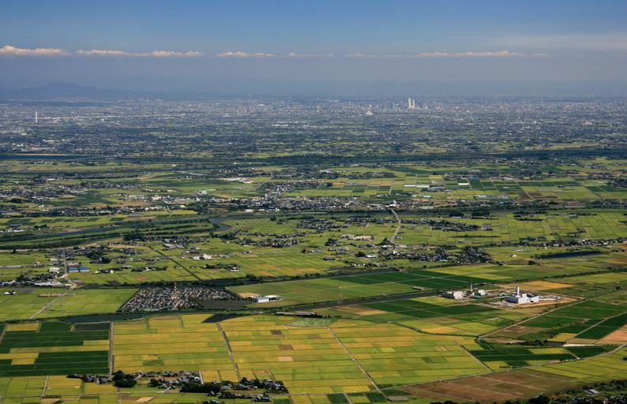
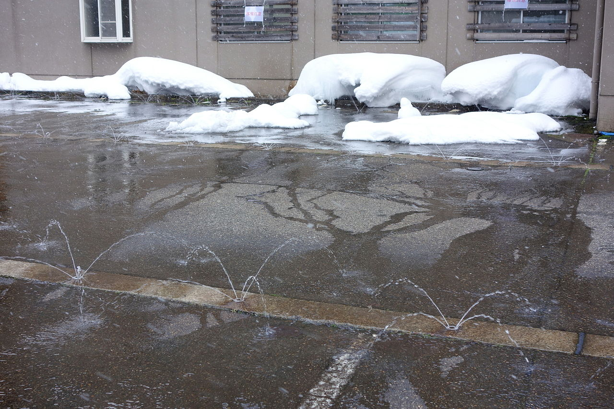
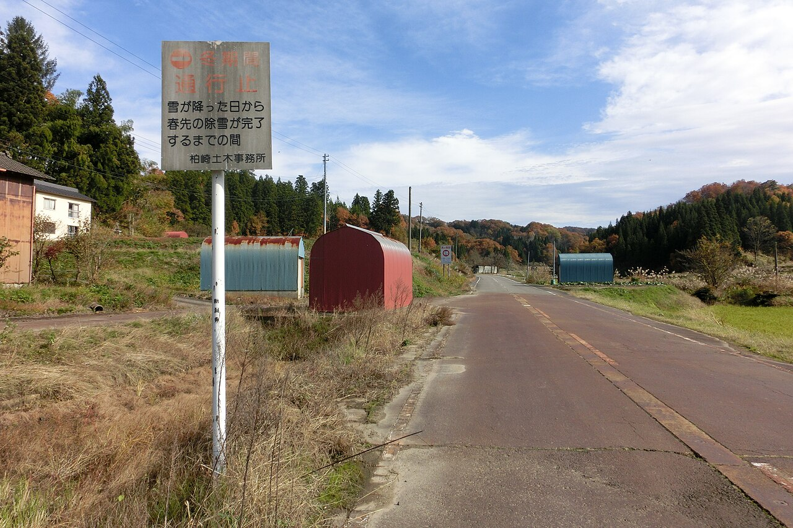
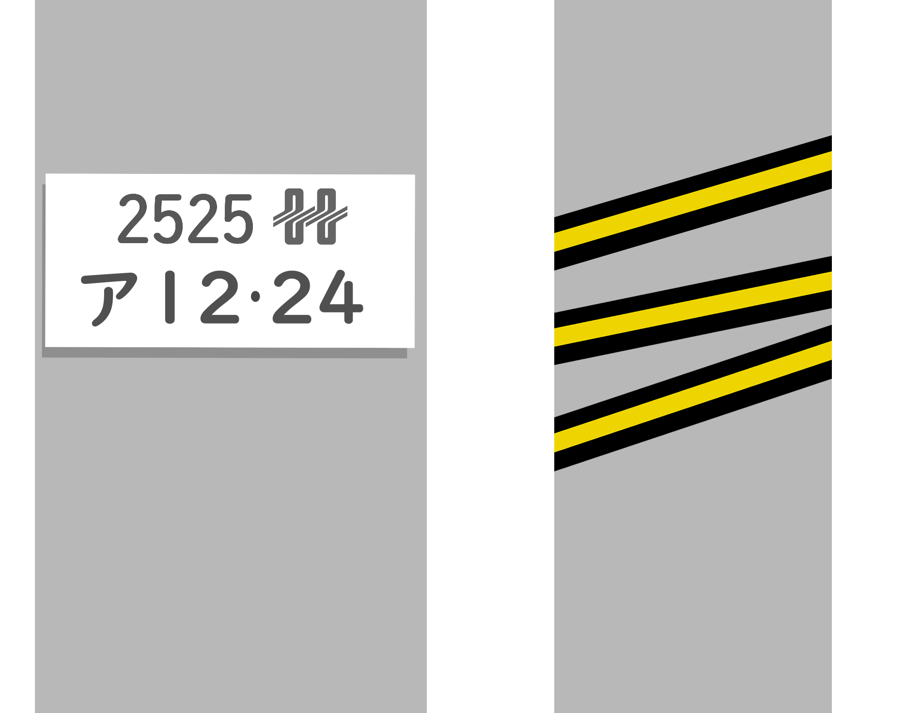

    <h2 class="section-title">全域</h2>
    <ul class="rule-list">
         <li>中部電力のロゴは2020年まで使用されていた</li>
    </ul>

{}
{}
{}
愛知県、岐阜県、三重県、富士川以西の静岡県、長野県では中部電力の電柱やロゴが見つかる。
{}

{}
{}

    <h2 class="section-title">東海</h2>
    <ul class="rule-list">
         <li>愛知県を中心に濃尾平野が広がっており、平坦な景色が広がっている</li>
    </ul>

{}
{}
{}
愛知県を中心に濃尾平野が広がっており、平坦な景色が広がっている。
{}

{}
{}

    <h2 class="section-title">北陸</h2>
    <ul class="rule-list">
         <li>消雪パイプが設置された道路{}や、赤錆で赤茶色に染まった路面が見られる</li>
         <li>北陸電力は電柱にスパイラル型車避表示帯を使用していることがある</li>
    </ul>

{}
{}
{}
長野県北部、山陰、北陸から東北の平野部では雪を解かすための消雪パイプが設置された道路がみつかる{}{{% ref "https://ja.wikipedia.org/wiki/%E6%B6%88%E9%9B%AA%E3%83%91%E3%82%A4%E3%83%97" "消雪パイプ - Wikipedia" %}}。路面の中央付近から水が噴き出している様子や、道路の茶色い着色が目印となる。当初の消雪装置は鋼製だったため赤錆・腐食などが原因で道が赤茶色に染まることがある{}。この色からも北陸の可能性が高くなる。
{}

{}
{}
{}
右図のようなスパイラル型車避表示帯が見られる{}。フクビ化学工業株式会社と北陸電力が共同開発したらしい{{% ref "https://ja.wikipedia.org/wiki/%E3%83%95%E3%82%AF%E3%83%93%E5%8C%96%E5%AD%A6%E5%B7%A5%E6%A5%AD" "フクビ化学工業" %}}。
{}

{}
{}