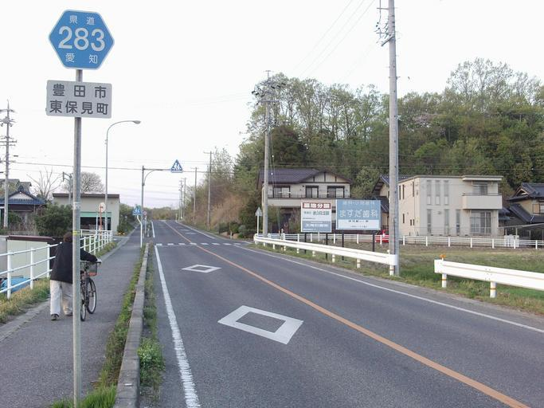
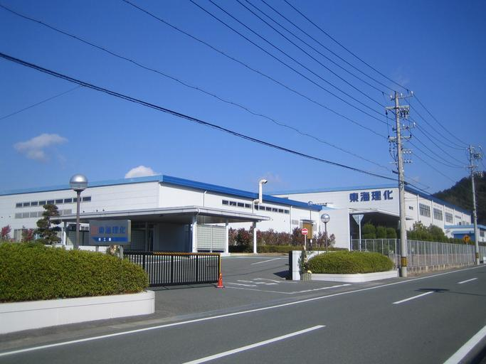
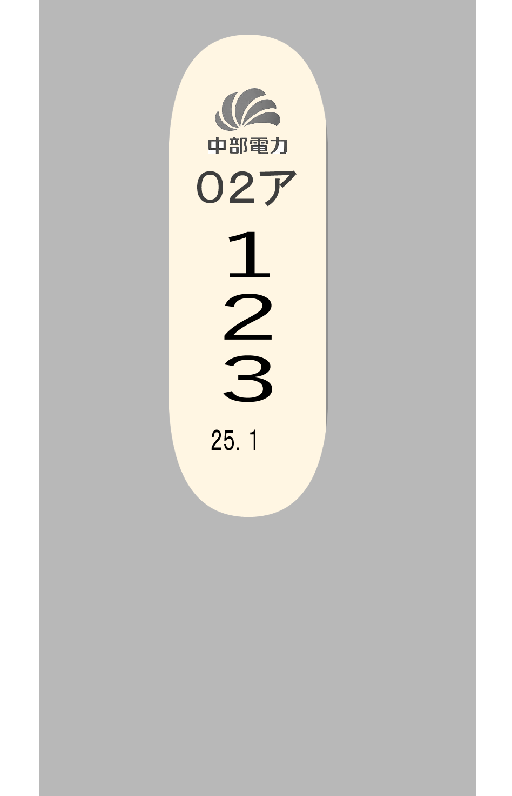
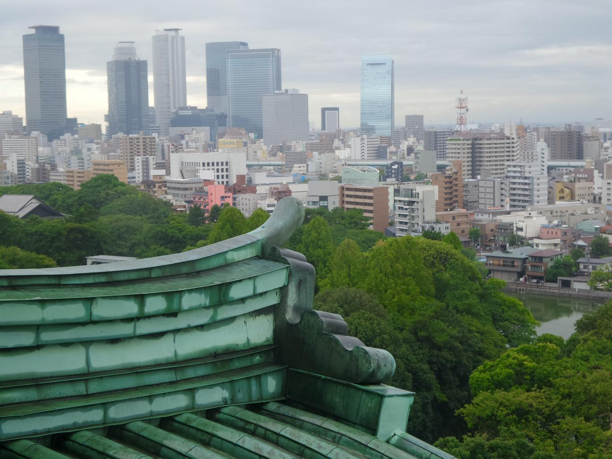
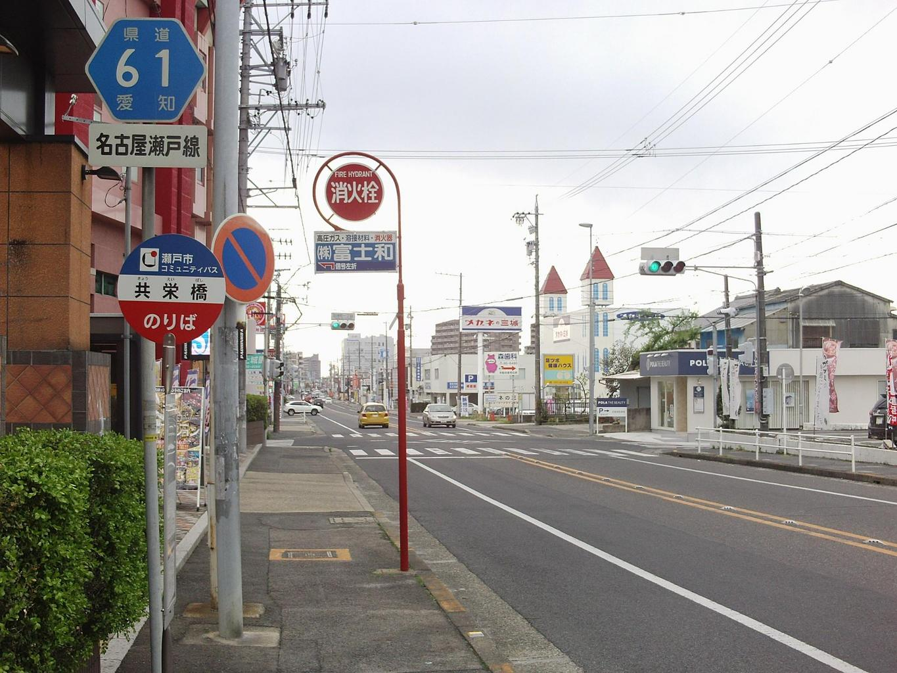
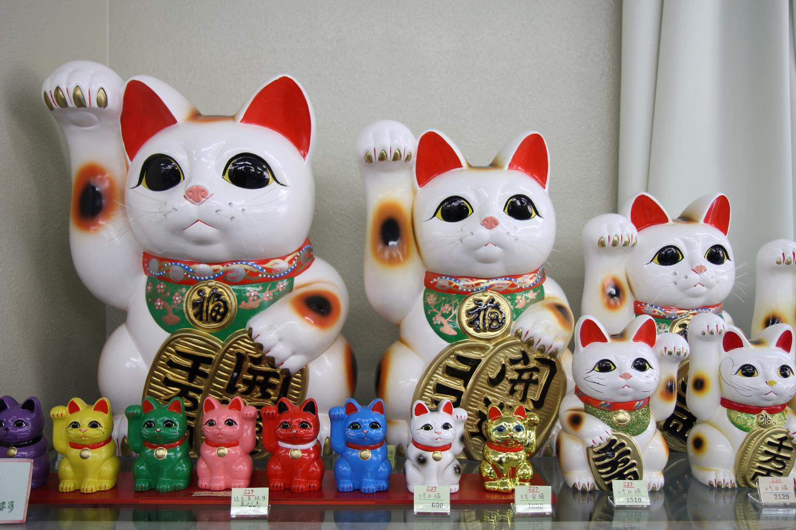
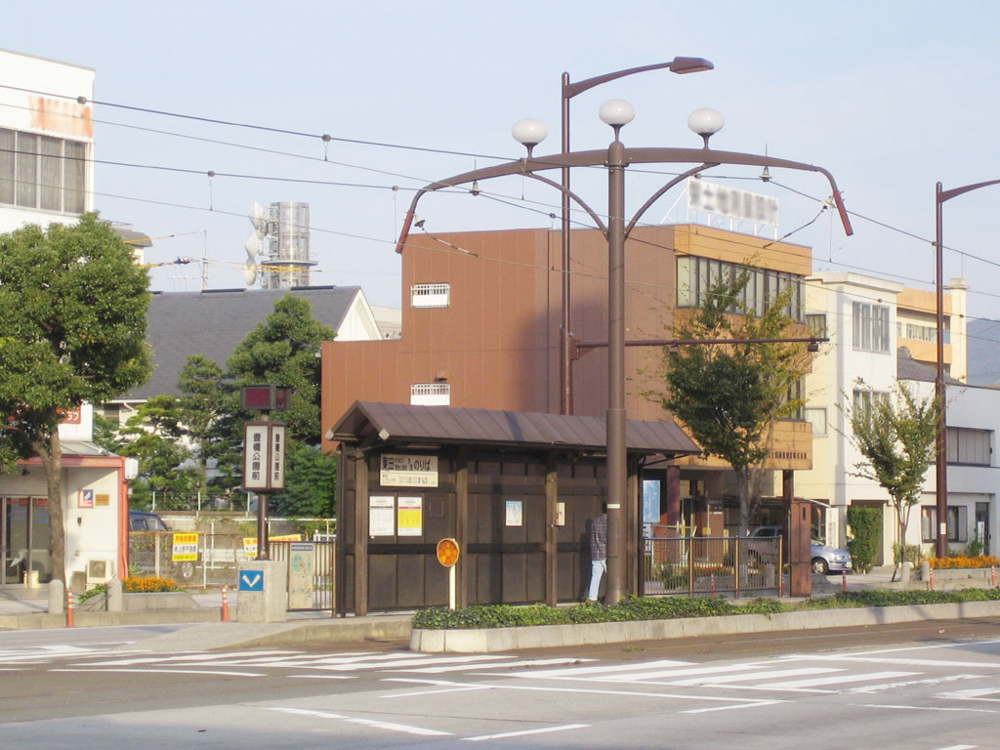

    <h2 class="section-title">全域</h2>
    <ul class="rule-list">
      <li>市外局番は052</li>
        <li>東海で横断歩道の道路標示に切れ目が無いのは愛知県</li>
    </ul>
    {}

{}
{}
{}
♢の線に切れ目がない{}。岐阜・三重・静岡はあることが多い。この横断歩道前ダイヤマーク標示を使用するのは愛知県の他に<a href="../nagano/">長野県</a>・<a href="../../chugoku/yamaguchi/">山口県</a>・<a href="../../kyusyu/kagoshima/">鹿児島県</a>である。
{}

{}
{}
{}
工場の数は日本で一番多い{}。工業出荷額は2位の大阪の倍以上である52兆円にのぼる{}。
{}

{}
{}
{}
愛知県、岐阜県、三重県、富士川以西の静岡県、長野県では中部電力の電柱やロゴが見つかる。
{}

{}
{}

    <h2 class="section-title">都市・町の絞り込み</h2>
    <ul class="rule-list">
        <li>名古屋市は金鯱の名古屋城と、市街を貫く幅100mの久屋大通・若宮大通が目印</li>
        <li>豊田市はトヨタ自動車の企業城下町で、大規模な自動車工場群が広がる</li>
        <li>一宮市はのこぎり屋根（鋸屋根）の毛織物工場が点在する繊維の街</li>
        <li>瀬戸市は瀬戸焼の産地で、窯元の煙突や街なかのやきものが見られる</li>
        <li>常滑市は招き猫と土管坂・やきもの散歩道が特徴のやきものの街</li>
        <li>豊橋市は市内を路面電車（豊橋鉄道市内線）が走る</li>
        <li>半田市はミツカン本社の黒板塀の醸造蔵が半田運河沿いに並ぶ</li>
    </ul>

{}
{}
{}
名古屋市は中京圏の中心都市で、金鯱で知られる名古屋城が目印。戦災復興でつくられた幅100mの久屋大通・若宮大通など、広い街路と高層ビル群が大都市の手がかりになる。
{}

{}
{}
{}
一宮市は毛織物（ウール）の一大産地「尾州」で、採光のための「のこぎり屋根（鋸屋根）」の機屋（はたや）が市内に多数残る。最盛期は全国8000棟超、現在も約2000棟が現存{{% ref "https://ja.wikipedia.org/wiki/%E5%B0%BE%E5%B7%9E" "尾州" %}}。
{}

By <a href="//commons.wikimedia.org/wiki/User:Asturio_Cantabrio" title="User:Asturio Cantabrio">Asturio Cantabrio</a> - Own work, <a href="https://creativecommons.org/licenses/by-sa/4.0" title="Creative Commons Attribution-Share Alike 4.0">CC BY-SA 4.0</a>, <a href="https://commons.wikimedia.org/w/index.php?curid=98061891">Link</a>

{}
{}
{}
瀬戸市は日本六古窯のひとつ瀬戸焼の産地で、陶磁器を指す「せともの」の語源。窯元の煙突や登り窯、街なかのやきものが手がかり{{% ref "https://ja.wikipedia.org/wiki/%E7%80%AC%E6%88%B8%E7%84%BC" "瀬戸焼" %}}。
{}

{}
{}
{}
常滑市は六古窯のひとつ常滑焼の産地で、招き猫の生産量が日本一。土管や焼酎瓶を擁壁に埋め込んだ「土管坂」、窯元が連なる「やきもの散歩道」が特徴{{% ref "https://ja.wikipedia.org/wiki/%E5%B8%B8%E6%BB%91%E7%84%BC" "常滑焼" %}}。
{}

{}
{}
{}
豊橋市の市内には路面電車（豊橋鉄道東田本線・市内線）が走る。名鉄岐阜市内線の廃止後、東海地方で唯一の路面電車{{% ref "https://ja.wikipedia.org/wiki/%E8%B1%8A%E6%A9%8B%E9%89%84%E9%81%93%E6%9D%B1%E7%94%B0%E6%9C%AC%E7%B7%9A" "豊橋鉄道東田本線" %}}。
{}

{}
{}
{}
半田市は酢で知られるミツカン（Mizkan）の創業地・本社所在地。半田運河沿いに黒板塀の醸造蔵が並ぶ景観が特徴{}{{% ref "https://ja.wikipedia.org/wiki/%E5%8D%8A%E7%94%B0%E5%B8%82" "半田市" %}}。
{}

{}
{}
{}

    <h4 class="mb-4">代表的な企業の説明</h4>
    <table class="table table-striped table-bordered">
        <thead class="table-light">
            <tr>
                <th scope="col" class="col-width-2">企業名</th>
                <th scope="col" class="col-width-1">コード</th>
                <th scope="col" class="col-width-6">説明</th>
                <th scope="col" class="col-width-05">決算</th>
                <th scope="col" class="col-width-05">配当履歴</th>
            </tr>
        </thead>
        <tbody class="corp-desc">
            <tr>
                <td>トヨタ自動車</td>
                <td>{}</td>
                <td>世界最大規模の自動車メーカー。日本で一番売上と従業員数が大きい会社。</td>
                <td>{}</td>
                <td>{}</td>
            </tr>
        </tbody>
    </table>

