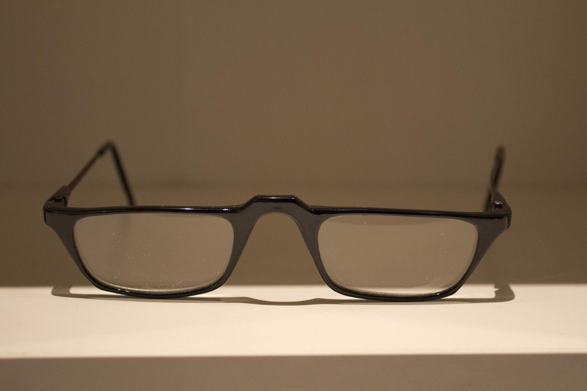
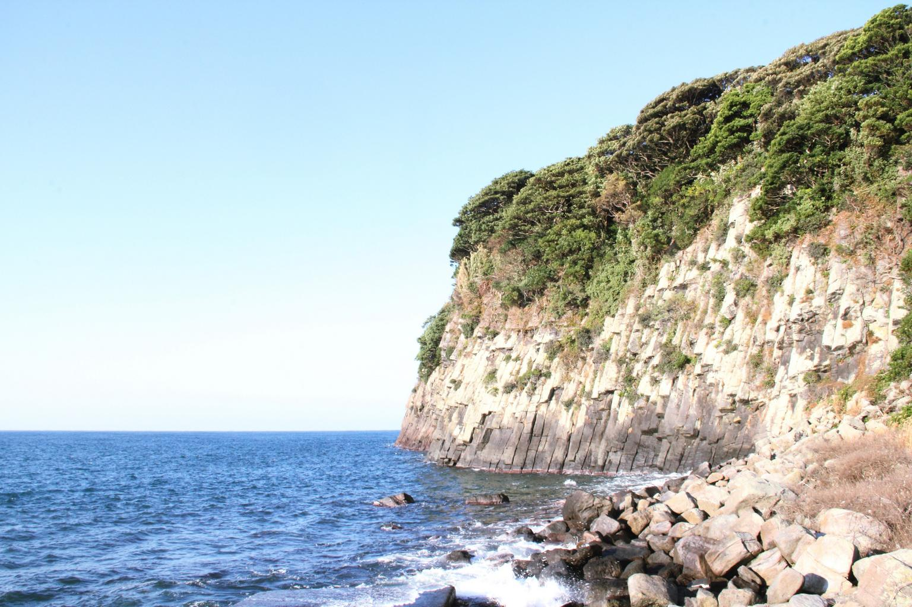
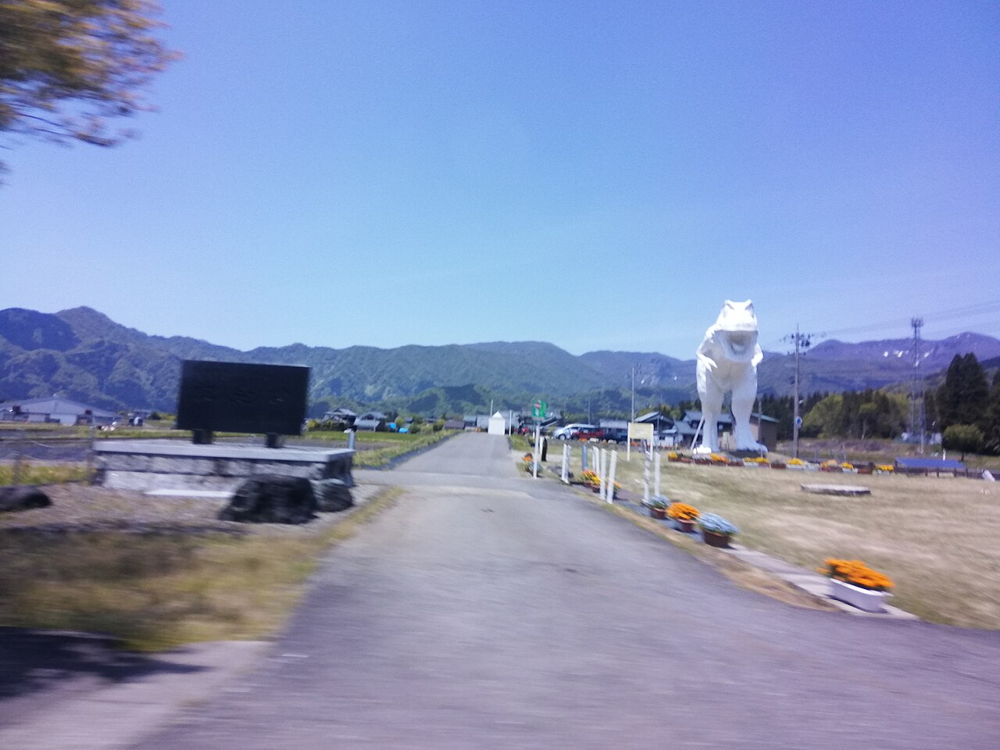

    <h2 class="section-title">全域</h2>
    <ul class="rule-list">
      <li>市外局番は0776</li>
    </ul>
    {}

    <h2 class="section-title">都市・町の絞り込み</h2>
    <ul class="rule-list">
        <li>鯖江市はメガネ（眼鏡フレーム）の一大産地で、眼鏡関連の工場や看板が多い</li>
        <li>坂井市の東尋坊は柱状節理の断崖が約1km続く景勝地</li>
        <li>勝山市は恐竜博物館で知られ、福井県は「恐竜王国」を掲げる</li>
    </ul>

{}
{}
{}
鯖江市はメガネフレームの国内シェア約96%を誇る産地。福井市・越前市・越前町を含む地域で生産され、眼鏡関連の工場や「めがね」の看板が手がかりになる{}{{% ref "https://ja.wikipedia.org/wiki/%E9%AF%96%E6%B1%9F%E5%B8%82" "鯖江市" %}}。
{}

{}
{}
{}
坂井市の東尋坊は、日本海の荒波が削った輝石安山岩の柱状節理の断崖が約1km続く景勝地{{% ref "https://ja.wikipedia.org/wiki/%E6%9D%B1%E5%B0%8B%E5%9D%8A" "東尋坊" %}}。
{}

{}
{}
{}
勝山市の福井県立恐竜博物館は国内最大級の恐竜博物館で、勝山は恐竜化石の産地。県内各地に恐竜のモニュメントが置かれている{{% ref "https://ja.wikipedia.org/wiki/%E7%A6%8F%E4%BA%95%E7%9C%8C%E7%AB%8B%E6%81%90%E7%AB%9C%E5%8D%9A%E7%89%A9%E9%A4%A8" "福井県立恐竜博物館" %}}。恐竜のモニュメントもたまに見つかる{}。
{}

{}
{}

    <h4 class="mb-4">代表的な企業の説明</h4>
    <table class="table table-striped table-bordered">
        <thead class="table-light">
            <tr>
                <th scope="col" class="col-width-2">企業名</th>
                <th scope="col" class="col-width-1">コード</th>
                <th scope="col" class="col-width-7">説明</th>
                <th scope="col" class="col-width-05">決算</th>
                <th scope="col" class="col-width-05">配当履歴</th>
            </tr>
        </thead>
        <tbody class="corp-desc">
            <tr>
                <td>セーレン</td>
                <td>{}</td>
                <td>福井市に本社を置く繊維メーカー。自動車シート用ファブリックで世界トップクラス。デジタルプリント技術「ビスコテックス」を持つ。<a href="https://ja.wikipedia.org/wiki/セーレン" target="_blank">[参]</a></td>
                <td>{}</td>
                <td>{}</td>
            </tr>
            <tr>
                <td>三谷商事</td>
                <td>{}</td>
                <td>福井市に本社を置く独立系商社。建設資材・情報システム・エネルギーの3本柱で、セメント販売で国内有数。<a href="https://ja.wikipedia.org/wiki/三谷商事" target="_blank">[参]</a></td>
                <td>{}</td>
                <td>{}</td>
            </tr>
            <tr>
                <td>日華化学</td>
                <td>{}</td>
                <td>福井市に本社を置く化学メーカー。繊維加工用の界面活性剤で国内トップシェア。業務用ヘアケア製品も手がける。<a href="https://ja.wikipedia.org/wiki/日華化学" target="_blank">[参]</a></td>
                <td>{}</td>
                <td>{}</td>
            </tr>
        </tbody>
    </table>

