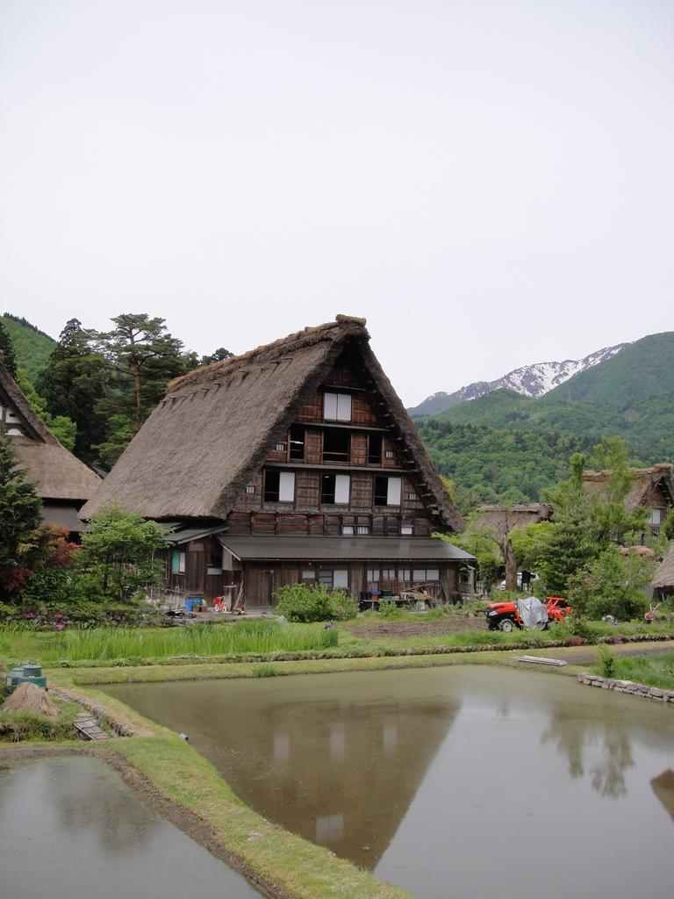
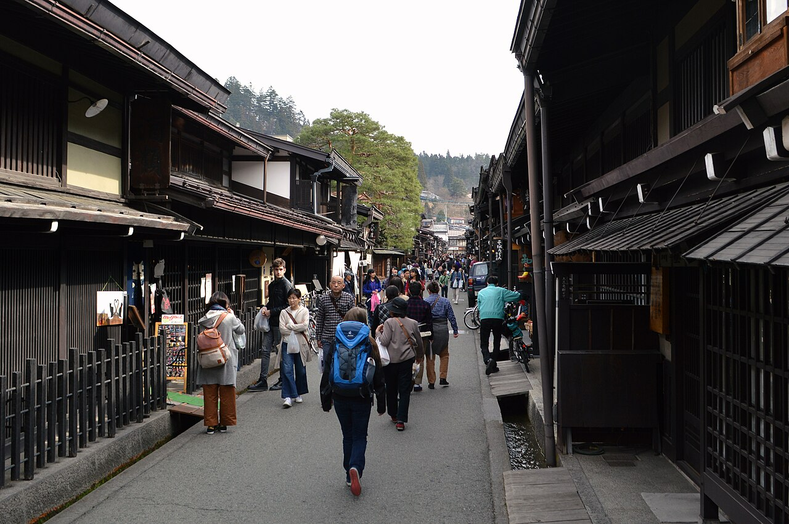
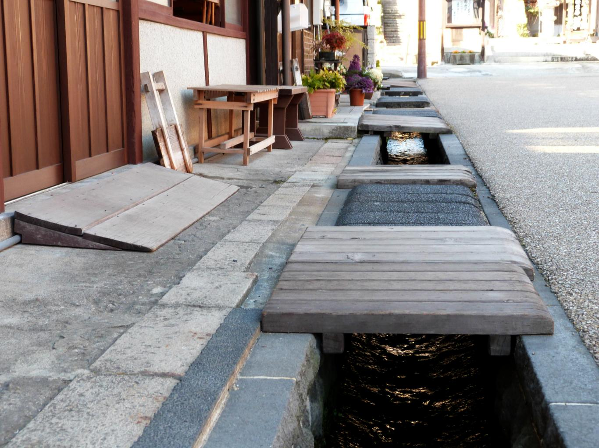

    <h2 class="section-title">全域</h2>
    <ul class="rule-list">
      <li>市外局番は058</li>
    </ul>
    {}

    <h2 class="section-title">都市・町の絞り込み</h2>
    <ul class="rule-list">
        <li>関市は刃物の街で家庭用刃物の出荷額は国内シェア約55%{}</li>
        <li>白川郷の合掌造りは1995年にユネスコ世界遺産に登録された急勾配の茅葺き屋根の集落</li>
        <li>飛騨地方の高山市は出格子の町家が連なる「さんまち」の古い町並み</li>
        <li>美濃市は屋根の両端に「うだつ」を上げた商家が並ぶ町並み</li>
        <li>郡上市の郡上八幡は用水路や水舟など街なかの水路網が特徴</li>
    </ul>

{}
{}
{}
関市は刃物の街で、家庭用刃物の出荷額は国内シェア約55%{}{}。独ゾーリンゲン・英シェフィールドと並ぶ世界三大刃物産地の一つ。
{}

<a href="//commons.wikimedia.org/wiki/User:Hide-sp" title="User:Hide-sp">Hide-sp</a> - 投稿者自身による著作物, <a href="http://creativecommons.org/licenses/by-sa/3.0/" title="Creative Commons Attribution-Share Alike 3.0">CC 表示-継承 3.0</a>, <a href="https://commons.wikimedia.org/w/index.php?curid=3141374">リンク</a>による

{}
{}
{}
白川郷（白川村）の合掌造りは急勾配の茅葺き屋根が特徴で、1995年にユネスコ世界遺産に登録{}。豪雪地帯のため屋根勾配が非常に急で、周囲は山に囲まれた集落。
{}

{}
{}
{}
高山市は面積日本一の市（約2,177km²、東京都とほぼ同じ）{}{{% ref "https://ja.wikipedia.org/wiki/%E9%AB%98%E5%B1%B1%E5%B8%82" "高山市" %}}。中心部の「さんまち」は出格子の町家が連なる古い町並みで、飛騨牛・酒蔵の杉玉も目印になる。
{}

{}
{}
{}
美濃市は防火のため屋根の両端に「うだつ」を上げた商家が並ぶ町並みと美濃和紙の産地{{% ref "https://ja.wikipedia.org/wiki/%E7%BE%8E%E6%BF%83%E5%92%8C%E7%B4%99" "美濃和紙" %}}。手すき和紙「本美濃紙」はユネスコ無形文化遺産（2014年）。
{}

{}
{}
{}
郡上市の郡上八幡は城下町で、用水路や水舟（みずぶね）{}など街なかの水路網が特徴{}。日本三大盆踊りの一つ「郡上おどり」や、食品サンプル発祥の地で全国生産シェアが高いことでも知られる{{% ref "https://ja.wikipedia.org/wiki/%E9%83%A1%E4%B8%8A%E5%B8%82" "郡上市" %}}。
{}

{}
{}

    <h4 class="mb-4">代表的な企業の説明</h4>
    <table class="table table-striped table-bordered">
        <thead class="table-light">
            <tr>
                <th scope="col" class="col-width-2">企業名</th>
                <th scope="col" class="col-width-1">コード</th>
                <th scope="col" class="col-width-7">説明</th>
                <th scope="col" class="col-width-05">決算</th>
                <th scope="col" class="col-width-05">配当履歴</th>
            </tr>
        </thead>
        <tbody class="corp-desc">
            <tr>
                <td>イビデン</td>
                <td>{}</td>
                <td>セラミックス製品の製造に強味があり、とりわけ半導体パッケージ基板の世界シェア50%。</td>
                <td>{}</td>
                <td>{}</td>
            </tr>
            <tr>
                <td>セイノーホールディングス </td>
                <td>{}</td>
                <td>特別積合せ貨物運送{{% ref "https://ja.wikipedia.org/wiki/%E7%89%B9%E5%88%A5%E7%A9%8D%E5%90%88%E3%81%9B%E8%B2%A8%E7%89%A9%E9%81%8B%E9%80%81" "特別積合せ" %}}では業界4位だが、BtoBではシェアが高い。倉庫数に対して車輛保有数が多い{}。</td>
                <td>{}</td>
                <td>{}</td>
            </tr>
            <tr>
                <td>バロー </td>
                <td>{}</td>
                <td>東海地方を拠点とするスーパーマーケットチェーン。</td>
                <td>{}</td>
                <td>{}</td>
            </tr>
        </tbody>
    </table>

