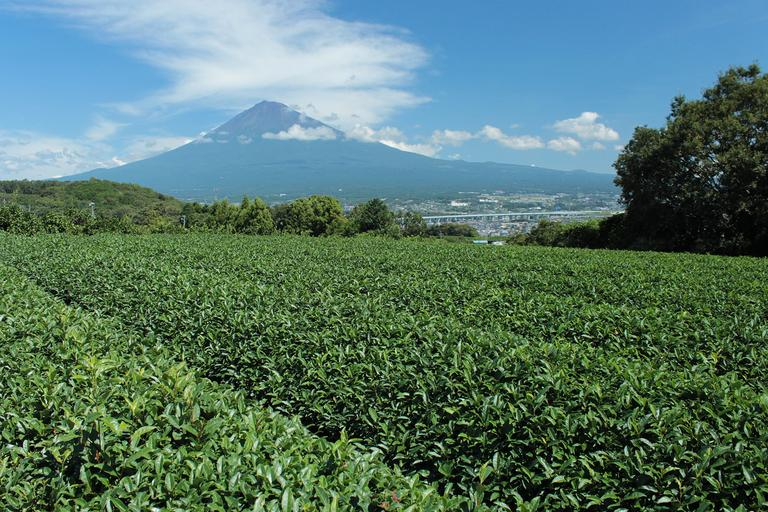

    <h2 class="section-title">全域</h2>
    <ul class="rule-list">
      <li>市外局番は054</li>
        <li>お茶の生産が多い</li>
    </ul>
    {}

{}
{}
{}
お茶の生産が多いが、近年は{}とほぼ同じ生産量となっている。
{}

{}
{}
{}
愛知県、岐阜県、三重県、富士川以西の静岡県、長野県では中部電力の電柱やロゴが見つかる。
{}

{}
{}

    <h2 class="section-title">都市・町の絞り込み</h2>
    <ul class="rule-list">
        <li>富士市・富士宮市は製紙の街で、工場の煙突越しに富士山が見える</li>
        <li>浜松市はヤマハ・カワイなど楽器とオートバイ産業の街</li>
        <li>牧之原・島田など県中部には広大な茶畑が広がる</li>
        <li>静岡市は徳川家ゆかりの駿府城がある県都</li>
        <li>熱海市は海に面した斜面にホテルが立ち並ぶ温泉リゾート</li>
    </ul>

{}
{}
{}
富士市・富士宮市は富士山の伏流水を生かした製紙・パルプの一大産地で、製紙工場の煙突と富士山が同時に見える景観が特徴{{% ref "https://ja.wikipedia.org/wiki/%E5%AF%8C%E5%A3%AB%E5%B8%82" "富士市" %}}。
{}

{}
{}
{}
{}
浜松市はヤマハ・河合楽器・ローランドなど楽器メーカーが集まる「音楽の街」で、スズキ・ホンダゆかりのオートバイ産業の街でもある{{% ref "https://ja.wikipedia.org/wiki/%E6%B5%9C%E6%9D%BE%E5%B8%82" "浜松市" %}}。
{}

{}
{}
{}
{}
牧之原台地を中心に、島田・菊川・掛川など県中部には日本有数の広大な茶園が広がる{{% ref "https://ja.wikipedia.org/wiki/%E7%89%A7%E4%B9%8B%E5%8E%9F%E5%8F%B0%E5%9C%B0" "牧之原台地" %}}。
{}

{}
{}
{}
{}
静岡市は徳川家康が晩年を過ごした駿府城の城下町として発展した県都{{% ref "https://ja.wikipedia.org/wiki/%E9%A7%BF%E5%BA%9C%E5%9F%8E" "駿府城" %}}。
{}

{}
{}
{}

    <h4 class="mb-4">代表的な企業の説明</h4>
    <table class="table table-striped table-bordered">
        <thead class="table-light">
            <tr>
                <th scope="col" class="col-width-2">企業名</th>
                <th scope="col" class="col-width-1">コード</th>
                <th scope="col" class="col-width-7">説明</th>
                <th scope="col" class="col-width-05">決算</th>
                <th scope="col" class="col-width-05">配当履歴</th>
            </tr>
        </thead>
        <tbody class="corp-desc">
            <tr>
                <td>ヤマハ</td>
                <td>{}</td>
                <td>楽器事業ではピアノ生産量で世界シェア1位。スポーツ用品、自動車部品、半導体部品なども手掛ける。二輪部門は独立しヤマハ発動機となった。</td>
                <td>{}</td>
                <td>{}</td>
            </tr>
            <tr>
                <td>ヤマハ発動機</td>
                <td>{}</td>
                <td>船外機やウォータービークルの販売台数で世界1位。二輪では世界４位のシェア。</td>
                <td>{}</td>
                <td>{}</td>
            </tr>
        </tbody>
    </table>

