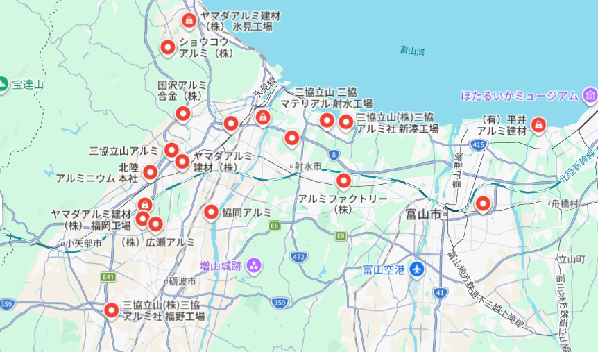

    
県の特徴

    <ul>
        <li>「くすりの富山」として知られ、江戸時代から続く配置薬業（置き薬）が有名<a href="https://ja.wikipedia.org/wiki/富山の売薬" target="_blank">[参]</a></li>
        <li>黒部ダムをはじめとする水力発電が豊富で、アルミ産業など電力多消費型産業が発達<a href="https://ja.wikipedia.org/wiki/黒部ダム" target="_blank">[参]</a></li>
    </ul>

    <h2 class="section-title">全域</h2>
    <ul class="rule-list">
        <li>豊富な水力発電を背景にアルミ産業が集積している</li>
        <li>300年以上の歴史を持つ「薬都」として知られ、製薬工場が多い</li>
    </ul>
    {}

{}
{}
{}
富山県は豊富な水力発電を背景にアルミ産業が発展し、高岡市・射水市・小矢部市・砺波市を中心に三協立山アルミ・ヤマダアルミ建材・北陸アルミニウム・広瀬アルミなど多数のアルミ関連工場が集積している。富山県西部でアルミ工場や建材工場が見えたら富山の可能性が高い。
{}

{}
{}

    <h4 class="mb-4">代表的な企業の説明</h4>
    <table class="table table-striped table-bordered">
        <thead class="table-light">
            <tr>
                <th scope="col" class="col-width-2">企業名</th>
                <th scope="col" class="col-width-1">コード</th>
                <th scope="col" class="col-width-7">説明</th>
                <th scope="col" class="col-width-05">決算</th>
                <th scope="col" class="col-width-05">配当履歴</th>
            </tr>
        </thead>
        <tbody class="corp-desc">
            <tr>
                <td>CKサンエツ</td>
                <td>{}</td>
                <td>日本最大の黄銅製品メーカー。カメラレンズマウントリング（レンズとボディの接合部品）で世界シェア約90%を誇るニッチトップ企業。高岡市・砺波市に工場がある。</td>
                <td>{}</td>
                <td>{}</td>
            </tr>
            <tr>
                <td>ゴールドウイン</td>
                <td>{}</td>
                <td>The North Face・Helly Hansen・Canterburyなどの日本独占ライセンシー。小矢部市の繊維工場が発祥で、自社R&D施設「Goldwin Tech Lab」を持つ。</td>
                <td>{}</td>
                <td>{}</td>
            </tr>
            <tr>
                <td>三協立山</td>
                <td>{}</td>
                <td>アルミ建材（サッシ・カーテンウォール）で日本トップ3。富山西部に12工場が集中しており、全国の窓やドアに「三協アルミ」ブランドが見られる。</td>
                <td>{}</td>
                <td>{}</td>
            </tr>
            <tr>
                <td>ダイト</td>
                <td>{}</td>
                <td>原薬（API）から製剤まで一貫製造できる日本唯一の上場製薬企業。富山300年の「薬都」の伝統を代表する企業で、売上の約8割がジェネリック医薬品。</td>
                <td>{}</td>
                <td>{}</td>
            </tr>
        </tbody>
    </table>

