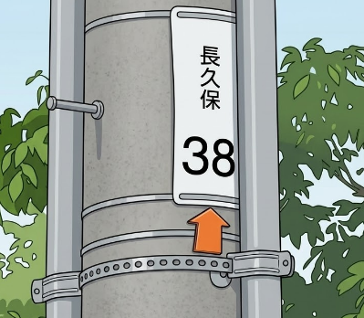

    <h2 class="section-title">全域</h2>
    <ul class="rule-list">
        <li>石州瓦を用いた家が東広島を中心に山陰地方にあり屋根が赤色っぽい</li>
        <li>電柱にオレンジ色の昇降表示札（矢印）が見られる</li>
    </ul>

{}
{}
{}
石州瓦は島根県の石見地方で生産されている粘土瓦。山陰地方で広く使われていて、赤茶色であるのが特徴的。島根・広島を中心に多く利用されている。
{}

<iframe width="560" height="315" src="https://www.youtube.com/embed/p39GXc3C0Co?si=VasSAla-Mtp063zt" title="YouTube video player" frameborder="0" allow="accelerometer; autoplay; clipboard-write; encrypted-media; gyroscope; picture-in-picture; web-share" referrerpolicy="strict-origin-when-cross-origin" allowfullscreen></iframe>

{}
{}
{}
中国電力の管轄エリアではオレンジ色の昇降表示札（矢印マーク）が電柱に取り付けられていることがある。この矢印は作業員が電柱に昇る際の目印として使用されている。
{}

{}
{}
