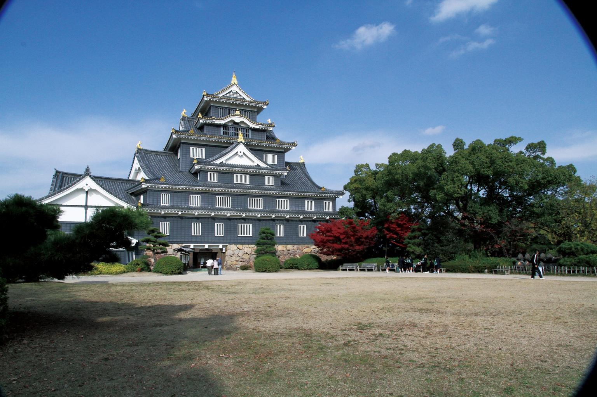
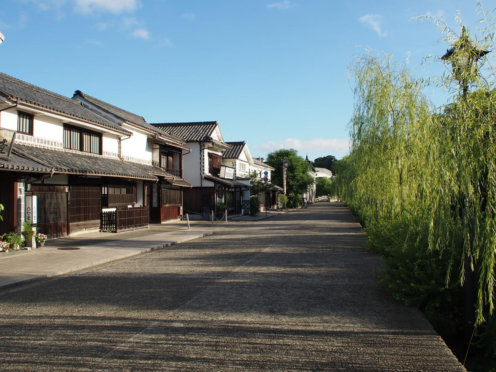
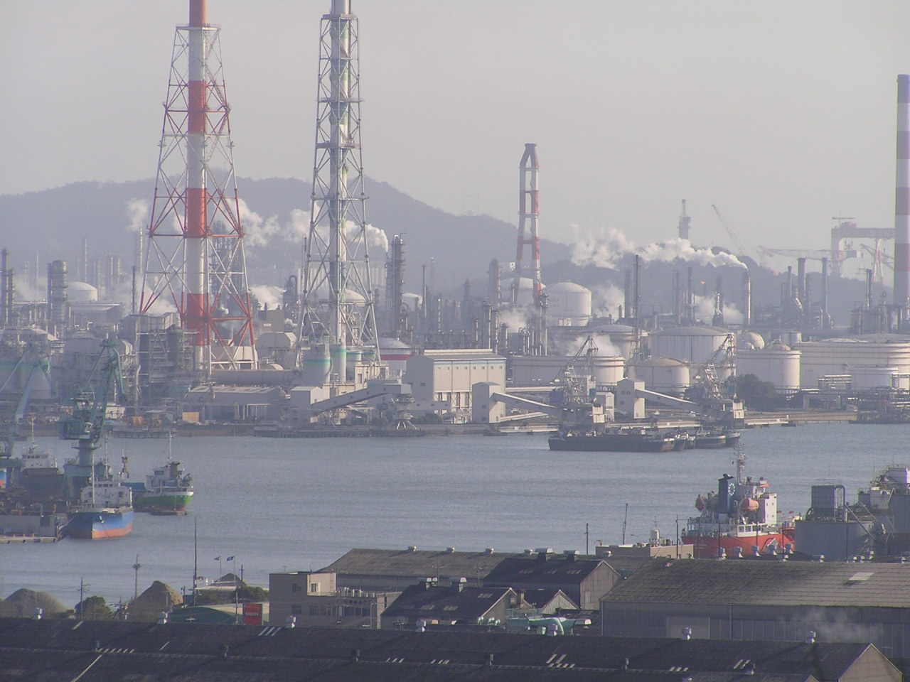

    <h2 class="section-title">全域</h2>
    <ul class="rule-list">
      <li>市外局番は086</li>
    </ul>
    {}

    <h2 class="section-title">都市・町の絞り込み</h2>
    <ul class="rule-list">
        <li>倉敷市は白壁の美観地区と、児島のジーンズ・水島のコンビナートで知られる</li>
        <li>岡山市は後楽園と岡山城がある県都</li>
    </ul>

{}
{}
{}
岡山市は日本三名園のひとつ後楽園と、黒い天守の岡山城（烏城）がある県都。桃太郎伝説の地としても知られる。
{}

{}
{}
{}
倉敷市は白壁と蔵が並ぶ美観地区で知られ、児島は国産ジーンズ発祥の地、水島には製鉄・石油化学のコンビナートがある{{% ref "https://ja.wikipedia.org/wiki/%E5%80%89%E6%95%B7%E5%B8%82" "倉敷市" %}}。
{}

{}
{}
{}
倉敷市南部の水島コンビナートは、埋立地に製鉄・石油精製・石油化学が集積する西日本有数の工業地帯{{% ref "https://ja.wikipedia.org/wiki/%E6%B0%B4%E5%B3%B6%E3%82%B3%E3%83%B3%E3%83%93%E3%83%8A%E3%83%BC%E3%83%88" "水島コンビナート" %}}。
{}

{}
{}

    <h4 class="mb-4">代表的な企業の説明</h4>
    <table class="table table-striped table-bordered">
        <thead class="table-light">
            <tr>
                <th scope="col" class="col-width-2">企業名</th>
                <th scope="col" class="col-width-1">コード</th>
                <th scope="col" class="col-width-7">説明</th>
                <th scope="col" class="col-width-05">決算</th>
                <th scope="col" class="col-width-05">配当履歴</th>
            </tr>
        </thead>
        <tbody class="corp-desc">
            <tr>
                <td>クラレ</td>
                <td>{}</td>
                <td>倉敷市発祥の化学メーカー。人工皮革「クラリーノ」や光学用ポバールフィルムで世界トップシェア。<a href="https://ja.wikipedia.org/wiki/クラレ" target="_blank">[参]</a></td>
                <td>{}</td>
                <td>{}</td>
            </tr>
            <tr>
                <td>中国銀行</td>
                <td>{}</td>
                <td>岡山市に本店を置く岡山県最大の地方銀行。ちゅうぎんフィナンシャルグループ傘下。県内預金シェアトップ。<a href="https://ja.wikipedia.org/wiki/中国銀行_(日本)" target="_blank">[参]</a></td>
                <td>{}</td>
                <td>{}</td>
            </tr>
            <tr>
                <td>萩原工業</td>
                <td>{}</td>
                <td>倉敷市に本社を置く合成樹脂加工メーカー。ブルーシートで国内トップシェア。フラットヤーン技術に強み。<a href="https://ja.wikipedia.org/wiki/萩原工業" target="_blank">[参]</a></td>
                <td>{}</td>
                <td>{}</td>
            </tr>
        </tbody>
    </table>

