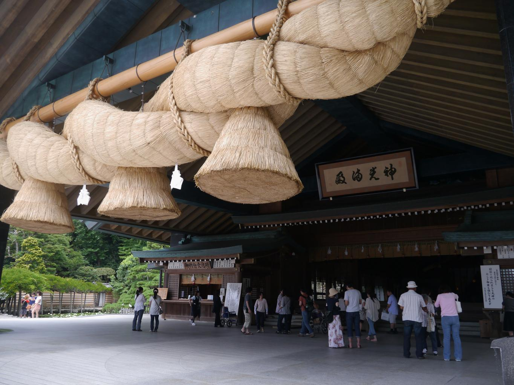
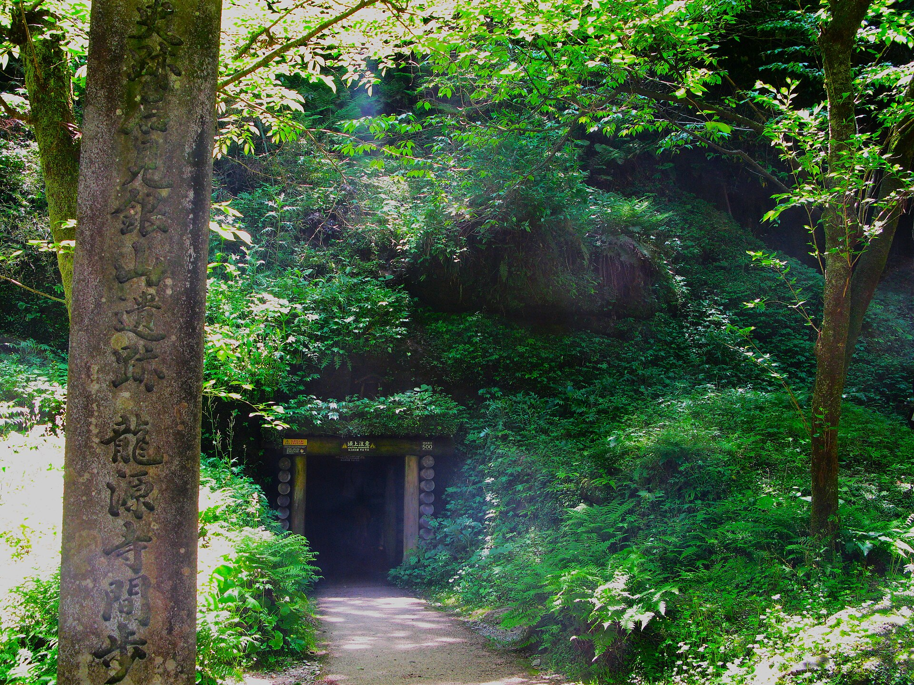
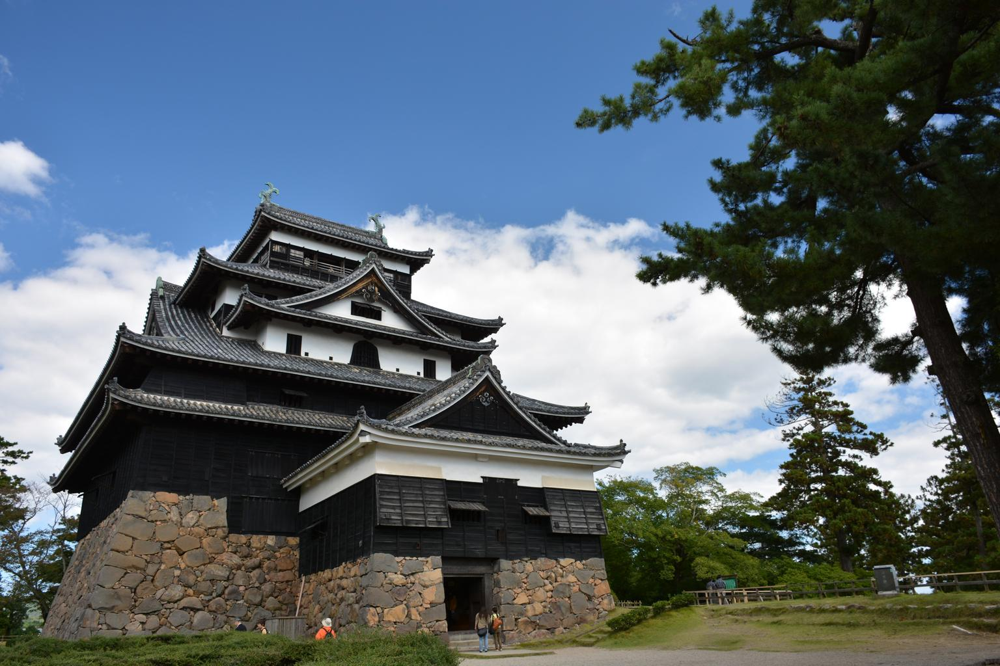

    <h2 class="section-title">全域</h2>
    <ul class="rule-list">
      <li>市外局番は0852</li>
    </ul>
    {}

    <h2 class="section-title">都市・町の絞り込み</h2>
    <ul class="rule-list">
        <li>出雲市の出雲大社は大注連縄で知られる縁結びの古社</li>
        <li>大田市の石見銀山は世界遺産の銀鉱山遺跡と町並み</li>
        <li>松江市は現存天守の国宝・松江城と宍道湖の城下町</li>
    </ul>

{}
{}
{}
出雲市の出雲大社は大きな注連縄で知られる縁結びの古社で、門前には神門通りの町並みが広がる{{% ref "https://ja.wikipedia.org/wiki/%E5%87%BA%E9%9B%B2%E5%A4%A7%E7%A4%BE" "出雲大社" %}}。
{}

{}
{}
{}
大田市の石見銀山は16〜17世紀に栄えた銀鉱山で、坑道（間歩）や大森地区の町並みが世界文化遺産{{% ref "https://ja.wikipedia.org/wiki/%E7%9F%B3%E8%A6%8B%E9%8A%80%E5%B1%B1" "石見銀山" %}}。
{}

{}
{}
{}
松江市は宍道湖畔の城下町で、現存十二天守のひとつ国宝・松江城がある{{% ref "https://ja.wikipedia.org/wiki/%E6%9D%BE%E6%B1%9F%E5%9F%8E" "松江城" %}}。
{}

{}
{}

    <h4 class="mb-4">代表的な企業の説明</h4>
    <table class="table table-striped table-bordered">
        <thead class="table-light">
            <tr>
                <th scope="col" class="col-width-2">企業名</th>
                <th scope="col" class="col-width-1">コード</th>
                <th scope="col" class="col-width-7">説明</th>
                <th scope="col" class="col-width-05">決算</th>
                <th scope="col" class="col-width-05">配当履歴</th>
            </tr>
        </thead>
        <tbody class="corp-desc">
            <tr>
                <td>島根銀行</td>
                <td>{}</td>
                <td>松江市に本店を置く第二地方銀行。島根県を中心に地域密着型の営業を展開。SBIグループと資本業務提携。<a href="https://ja.wikipedia.org/wiki/島根銀行" target="_blank">[参]</a></td>
                <td>{}</td>
                <td>{}</td>
            </tr>
            <tr>
                <td>山陰合同銀行</td>
                <td>{}</td>
                <td>松江市に本店を置く山陰地方最大の地方銀行。島根・鳥取両県でトップシェア。ごうぎんとして親しまれる。<a href="https://ja.wikipedia.org/wiki/山陰合同銀行" target="_blank">[参]</a></td>
                <td>{}</td>
                <td>{}</td>
            </tr>
            <tr>
                <td>田部</td>
                <td>非上場</td>
                <td>雲南市に本拠を置く山陰地方屈指の名家・企業グループ。たたら製鉄・山林経営の歴史を持ち、現在は林業・不動産等を展開。<a href="https://ja.wikipedia.org/wiki/田部家" target="_blank">[参]</a></td>
                <td></td>
                <td></td>
            </tr>
        </tbody>
    </table>

