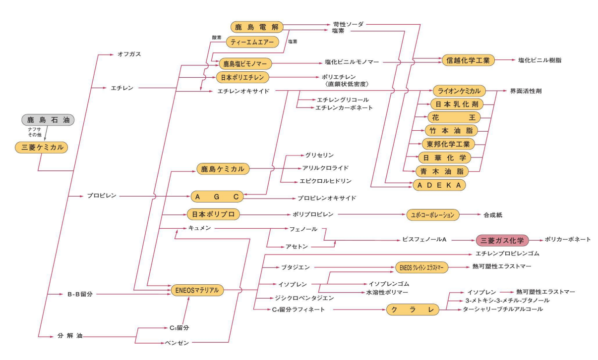

    
県の特徴

    <ul>
        <li>日立市は日立製作所の創業地で、電機・重工業の企業城下町<a href="https://ja.wikipedia.org/wiki/日立市#工業" target="_blank">[参]</a></li>
        <li>鹿島臨海工業地帯は石油化学・鉄鋼のコンビナートが立地<a href="https://ja.wikipedia.org/wiki/鹿島臨海工業地帯" target="_blank">[参]</a></li>
    </ul>

    <h2 class="section-title">全域</h2>
    <ul class="rule-list">
    </ul>
    {}

    <h2 class="section-title">{}</h2>
    <ul class="rule-list">
        <li>鹿島市～神栖市の海沿いには石油化学系の企業が集中している</li>
    </ul>

{}
{}
{}
三菱ケミカルコンビナートが構成され、三菱ケミカルが生成するエチレンやプロピレンを材料として使用する企業が集中して立地している{}{}。
{}

{}
{}

    <h4 class="mb-4">代表的な企業の説明</h4>
    <table class="table table-striped table-bordered">
        <thead class="table-light">
            <tr>
                <th scope="col" class="col-width-2">企業名</th>
                <th scope="col" class="col-width-1">コード</th>
                <th scope="col" class="col-width-7">説明</th>
                <th scope="col" class="col-width-05">決算</th>
                <th scope="col" class="col-width-05">配当履歴</th>
            </tr>
        </thead>
        <tbody class="corp-desc">
            <tr>
                <td>日立製作所</td>
                <td>{}</td>
                <td>日立市の銅山用モーター修理工場から創業した総合電機メーカー。売上高10兆円超の日本最大級の製造業。<a href="https://ja.wikipedia.org/wiki/日立製作所" target="_blank">[参]</a></td>
                <td>{}</td>
                <td>{}</td>
            </tr>
            <tr>
                <td>ケーズホールディングス</td>
                <td>{}</td>
                <td>水戸市に本社を置く家電量販店チェーン。「がんばらない経営」で知られ、全国に500店舗以上を展開。<a href="https://ja.wikipedia.org/wiki/ケーズホールディングス" target="_blank">[参]</a></td>
                <td>{}</td>
                <td>{}</td>
            </tr>
            <tr>
                <td>カスミ</td>
                <td>非上場（イオン傘下）</td>
                <td>つくば市に本社を置くスーパーマーケットチェーン。茨城県を中心に北関東で約190店舗展開。現在はユナイテッド・スーパーマーケット・ホールディングス傘下。<a href="https://ja.wikipedia.org/wiki/カスミ" target="_blank">[参]</a></td>
                <td></td>
                <td></td>
            </tr>
        </tbody>
    </table>

