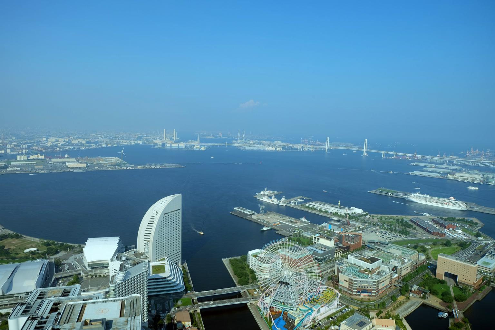
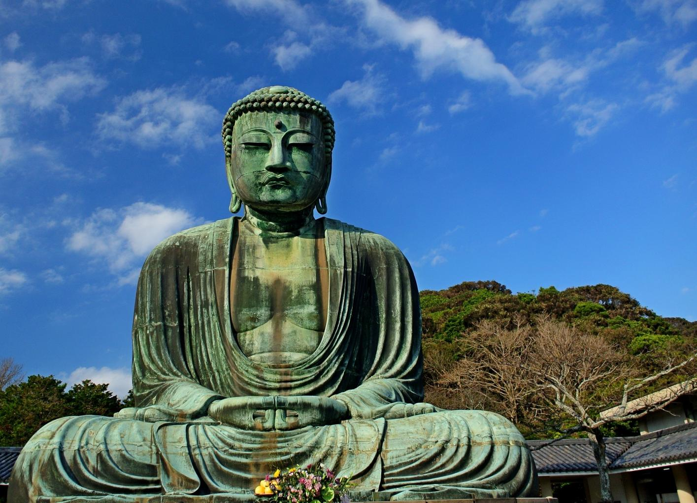
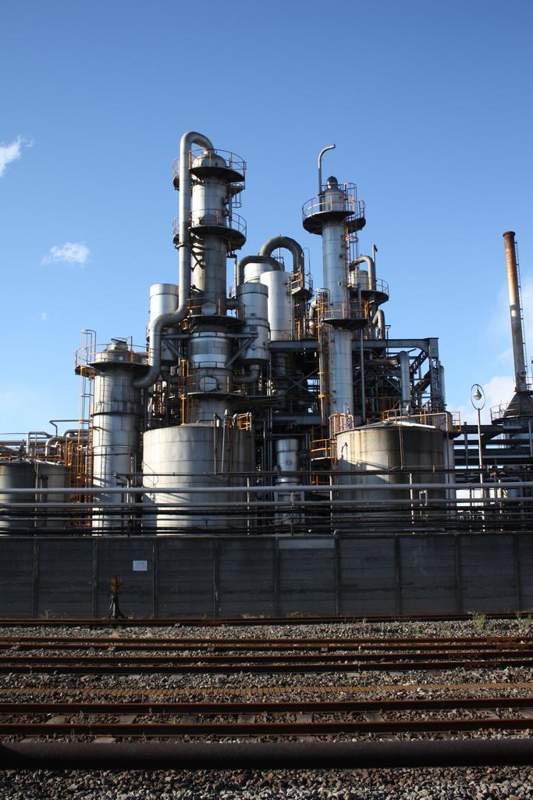
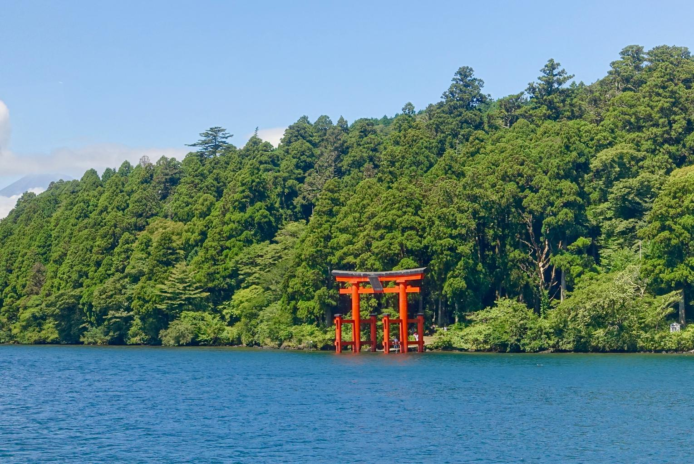

    <h2 class="section-title">全域</h2>
    <ul class="rule-list">
      <li>市外局番は045</li>
    </ul>
    {}

    <h2 class="section-title">都市・町の絞り込み</h2>
    <ul class="rule-list">
        <li>横浜市はみなとみらいや港・中華街がある日本最大級の市</li>
        <li>鎌倉市は大仏や寺社が残る古都で、海と丘に囲まれる</li>
        <li>川崎市は東京湾岸に京浜工業地帯のコンビナート・工場が連なる</li>
        <li>箱根町は芦ノ湖・温泉・山岳の観光地</li>
    </ul>

{}
{}
{}
横浜市はみなとみらいの高層ビル群、横浜港、中華街などを擁する人口最大の市{{% ref "https://ja.wikipedia.org/wiki/%E6%A8%AA%E6%B5%9C%E5%B8%82" "横浜市" %}}。
{}

{}
{}
{}
鎌倉市は鎌倉大仏や鶴岡八幡宮など寺社が残る古都で、海と丘に囲まれた地形が特徴{{% ref "https://ja.wikipedia.org/wiki/%E9%8E%8C%E5%80%89%E5%B8%82" "鎌倉市" %}}。
{}

{}
{}
{}
川崎市の臨海部は京浜工業地帯の中核で、製鉄・石油化学のコンビナートが連なり工場夜景で知られる{{% ref "https://ja.wikipedia.org/wiki/%E5%B7%9D%E5%B4%8E%E5%B8%82" "川崎市" %}}。
{}

{}
{}
{}
箱根町は芦ノ湖・大涌谷・温泉郷で知られる山岳観光地で、登山鉄道やロープウェイが通る{{% ref "https://ja.wikipedia.org/wiki/%E7%AE%B1%E6%A0%B9" "箱根" %}}。
{}

{}
{}

    <h4 class="mb-4">代表的な企業の説明</h4>
    <table class="table table-striped table-bordered">
        <thead class="table-light">
            <tr>
                <th scope="col" class="col-width-2">企業名</th>
                <th scope="col" class="col-width-1">コード</th>
                <th scope="col" class="col-width-7">説明</th>
                <th scope="col" class="col-width-05">決算</th>
                <th scope="col" class="col-width-05">配当履歴</th>
            </tr>
        </thead>
        <tbody class="corp-desc">
            <tr>
                <td>小田原エンジニアリング</td>
                <td>{}</td>
                <td>モーター用巻線設備で最大手のメーカー。小田原エンジニアリングとNITTOKUの国内メーカーで世界市場の５割以上を占めている。</td>
                <td>{}</td>
                <td>{}</td>
            </tr>
            <tr>
                <td>千代田化工建設</td>
                <td>{}</td>
                <td>大規模プラントのEPC契約{}業務をする建設・エンジニアリング会社。とくに日本のLNG受入基地の半数以上は千代田化工建設によるもの。国外実績については事業紹介ページ参照{}。</td>
                <td>{}</td>
                <td>{}</td>
            </tr>
            <tr>
                <td>マツキヨココカラ&カンパニー</td>
                <td>{}</td>
                <td>ココカラファイングループとマツモトキヨシグループが2021年頃までに経営統合した。国内はおよそ3400店を展開している{}。</td>
                <td>-</td>
                <td>{}</td>
            </tr>
            <tr>
                <td>タツノ</td>
                <td>-</td>
                <td>ガソリン計量機の日本におけるシェアは6割を超え、世界シェア３位。国内２位はおそらく{}のLPG大手、岩谷産業（が買収したトキコシステムソリューションズ）だが正確なデータが無いため不明。</td>
                <td>-</td>
                <td>-</td>
            </tr>
            <tr>
                <td>ニューフレアテクノロジー&カンパニー</td>
                <td>-</td>
                <td>東芝デバイス&ストレージのグループ会社、電子ビームマスク描画装置の世界シェア90%{}。</td>
                <td>-</td>
                <td>-</td>
            </tr>
        </tbody>
    </table>

