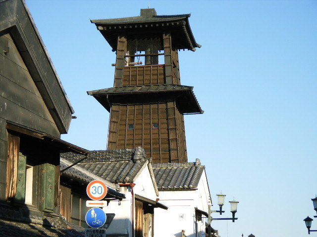
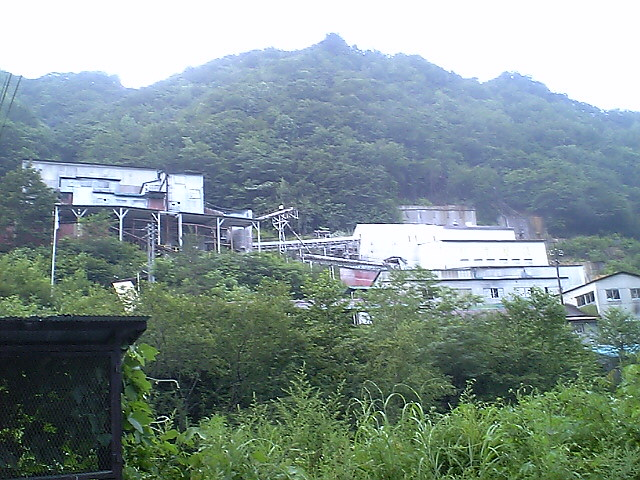
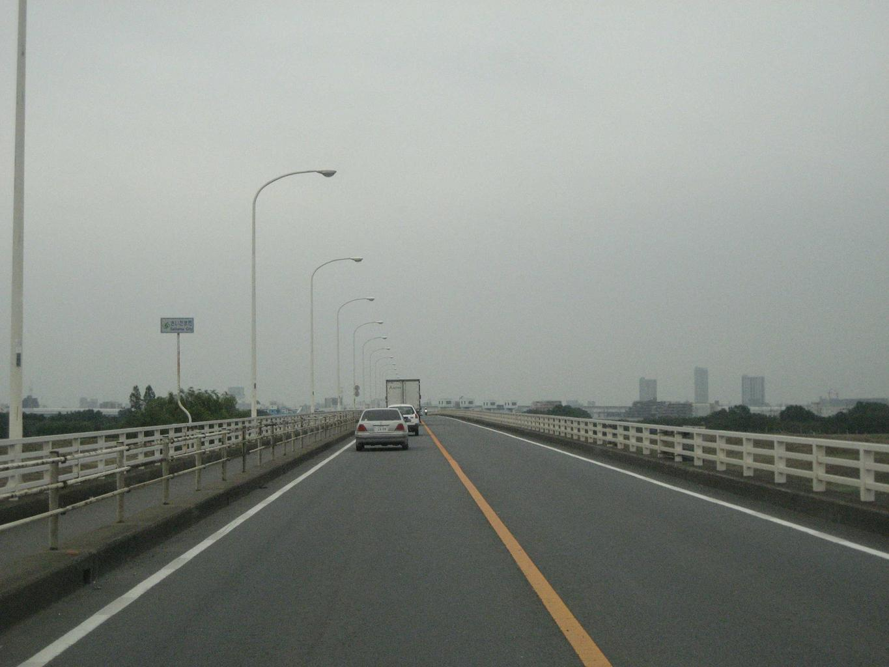

    <h2 class="section-title">全域</h2>
    <ul class="rule-list">
      <li>市外局番は048</li>
        <li>消防水利施設のマーキングがオレンジ色の線で示されている</li>
    </ul>
    {}

{}
{}
{}
埼玉の消防水利施設のマーキング方法は他の県と異なり、オレンジ色の線が引かれている{}。
{}

{}
{}

    <h2 class="section-title">都市・町の絞り込み</h2>
    <ul class="rule-list">
        <li>川越市は蔵造りの町並みと時の鐘が残る「小江戸」</li>
        <li>秩父市は山に囲まれた盆地で、武甲山の石灰石採掘とセメント工場が目印</li>
        <li>川口市は鋳物の街として発展した工業都市</li>
        <li>さいたま市は大宮・浦和を中心とする県都で、関東平野の住宅・市街地が広がる</li>
    </ul>

{}
{}
{}
川越市は黒い蔵造りの商家と「時の鐘」が残る城下町で、「小江戸」と呼ばれる{{% ref "https://ja.wikipedia.org/wiki/%E5%B7%9D%E8%B6%8A%E5%B8%82" "川越市" %}}。
{}

{}
{}
{}
秩父市は山に囲まれた盆地で、石灰石を産する武甲山と、それを原料とするセメント工場が街のシンボル{{% ref "https://ja.wikipedia.org/wiki/%E7%A7%A9%E7%88%B6%E5%B8%82" "秩父市" %}}。
{}

{}
{}
{}
川口市は古くから鋳物の街として発展した工業都市で、近年は再開発で住宅都市化も進む{{% ref "https://ja.wikipedia.org/wiki/%E5%B7%9D%E5%8F%A3%E5%B8%82" "川口市" %}}。
{}

{}
{}
{}
{}
さいたま市は大宮・浦和を中心とする県都で、関東平野に住宅地と市街地が広がる。大宮は鉄道の要衝（鉄道博物館がある）。
{}

{}
{}

    <h4 class="mb-4">代表的な企業の説明</h4>
    <table class="table table-striped table-bordered">
        <thead class="table-light">
            <tr>
                <th scope="col" class="col-width-2">企業名</th>
                <th scope="col" class="col-width-1">コード</th>
                <th scope="col" class="col-width-7">説明</th>
                <th scope="col" class="col-width-05">決算</th>
                <th scope="col" class="col-width-05">配当履歴</th>
            </tr>
        </thead>
        <tbody class="corp-desc">
            <tr>
                <td>しまむら</td>
                <td>{}</td>
                <td>さいたま市に本社を置く衣料品チェーン。低価格帯の衣料品販売で全国約2,200店舗を展開する業界大手。<a href="https://ja.wikipedia.org/wiki/しまむら" target="_blank">[参]</a></td>
                <td>{}</td>
                <td>{}</td>
            </tr>
            <tr>
                <td>武蔵野銀行</td>
                <td>{}</td>
                <td>さいたま市に本店を置く埼玉県の地方銀行。県内に約100支店を持つ。<a href="https://ja.wikipedia.org/wiki/武蔵野銀行" target="_blank">[参]</a></td>
                <td>{}</td>
                <td>{}</td>
            </tr>
            <tr>
                <td>ベルク</td>
                <td>{}</td>
                <td>鶴ヶ島市に本社を置くスーパーマーケットチェーン。埼玉県を地盤に関東で約130店舗を展開。<a href="https://ja.wikipedia.org/wiki/ベルク_(企業)" target="_blank">[参]</a></td>
                <td>{}</td>
                <td>{}</td>
            </tr>
        </tbody>
    </table>

