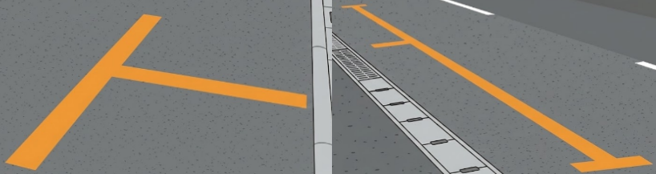

    <h2 class="section-title">全域</h2>
    <ul class="rule-list">
        <li>消防水利施設のマーキングがオレンジ色の線で示されている</li>
    </ul>
    {}

{}
{}
{}
埼玉の消防水利施設のマーキング方法は他の県と異なり、オレンジ色の線が引かれている{}。
{}

{}
{}

    <h4 class="mb-4">代表的な企業の説明</h4>
    <table class="table table-striped table-bordered">
        <thead class="table-light">
            <tr>
                <th scope="col" class="col-width-2">企業名</th>
                <th scope="col" class="col-width-1">コード</th>
                <th scope="col" class="col-width-7">説明</th>
                <th scope="col" class="col-width-05">決算</th>
                <th scope="col" class="col-width-05">配当履歴</th>
            </tr>
        </thead>
        <tbody class="corp-desc">
            <tr>
                <td>しまむら</td>
                <td>{}</td>
                <td>さいたま市に本社を置く衣料品チェーン。低価格帯の衣料品販売で全国約2,200店舗を展開する業界大手。<a href="https://ja.wikipedia.org/wiki/しまむら" target="_blank">[参]</a></td>
                <td>{}</td>
                <td>{}</td>
            </tr>
            <tr>
                <td>武蔵野銀行</td>
                <td>{}</td>
                <td>さいたま市に本店を置く埼玉県の地方銀行。県内に約100支店を持つ。<a href="https://ja.wikipedia.org/wiki/武蔵野銀行" target="_blank">[参]</a></td>
                <td>{}</td>
                <td>{}</td>
            </tr>
            <tr>
                <td>ベルク</td>
                <td>{}</td>
                <td>鶴ヶ島市に本社を置くスーパーマーケットチェーン。埼玉県を地盤に関東で約130店舗を展開。<a href="https://ja.wikipedia.org/wiki/ベルク_(企業)" target="_blank">[参]</a></td>
                <td>{}</td>
                <td>{}</td>
            </tr>
        </tbody>
    </table>

