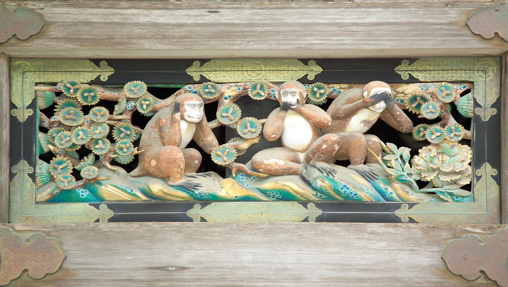
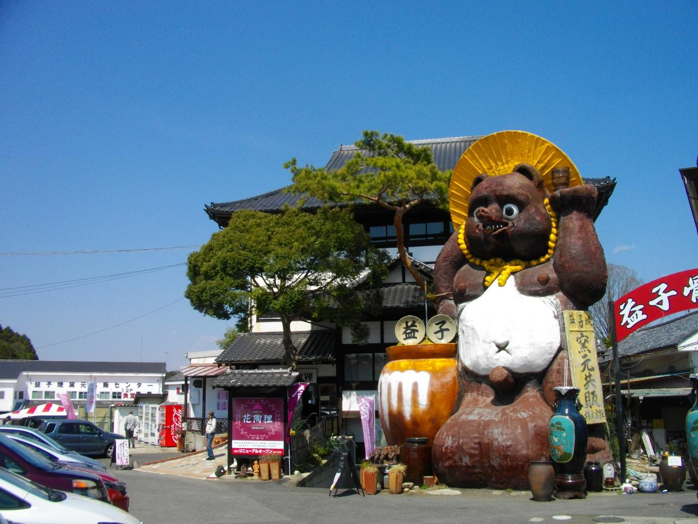
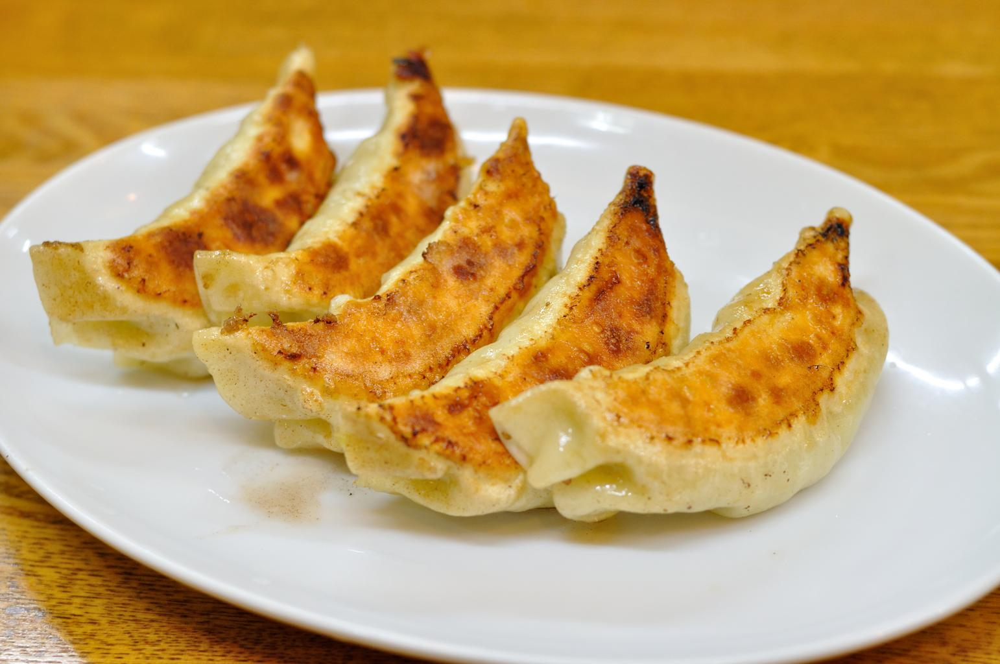

    <h2 class="section-title">全域</h2>
    <ul class="rule-list">
      <li>市外局番は028</li>
    </ul>
    {}

    <h2 class="section-title">都市・町の絞り込み</h2>
    <ul class="rule-list">
        <li>日光市は日光東照宮と中禅寺湖・いろは坂で知られる山岳観光地</li>
        <li>益子町は益子焼の産地で、窯元やギャラリーが点在</li>
        <li>宇都宮市は餃子の街として知られる北関東の県都</li>
        <li>足利市は足利学校と織物の歴史を持つ街</li>
    </ul>

{}
{}
{}
日光市は徳川家康をまつる日光東照宮（世界遺産）の門前町で、いろは坂・中禅寺湖・華厳の滝など山岳観光地が広がる{{% ref "https://ja.wikipedia.org/wiki/%E6%97%A5%E5%85%89%E6%9D%B1%E7%85%A7%E5%AE%AE" "日光東照宮" %}}。
{}

{}
{}
{}
益子町は陶器「益子焼」の産地で、窯元・登り窯・陶器店が点在する{{% ref "https://ja.wikipedia.org/wiki/%E7%9B%8A%E5%AD%90%E7%84%BC" "益子焼" %}}。
{}

{}
{}
{}
宇都宮市は「餃子の街」として知られる北関東の県都で、2023年に次世代型路面電車（LRT）が開業した{{% ref "https://ja.wikipedia.org/wiki/%E5%AE%87%E9%83%BD%E5%AE%AE%E5%B8%82" "宇都宮市" %}}。
{}

{}
{}

    <h4 class="mb-4">代表的な企業の説明</h4>
    <table class="table table-striped table-bordered">
        <thead class="table-light">
            <tr>
                <th scope="col" class="col-width-2">企業名</th>
                <th scope="col" class="col-width-1">コード</th>
                <th scope="col" class="col-width-7">説明</th>
                <th scope="col" class="col-width-05">決算</th>
                <th scope="col" class="col-width-05">配当履歴</th>
            </tr>
        </thead>
        <tbody class="corp-desc">
            <tr>
                <td>マニー</td>
                <td>{}</td>
                <td>宇都宮市に本社を置く医療機器メーカー。手術用縫合針で世界シェア約20%、眼科用ナイフで世界トップクラス。<a href="https://ja.wikipedia.org/wiki/マニー" target="_blank">[参]</a></td>
                <td>{}</td>
                <td>{}</td>
            </tr>
            <tr>
                <td>栃木銀行</td>
                <td>{}</td>
                <td>宇都宮市に本店を置く第二地方銀行。栃木県を地盤に営業展開。<a href="https://ja.wikipedia.org/wiki/栃木銀行" target="_blank">[参]</a></td>
                <td>{}</td>
                <td>{}</td>
            </tr>
            <tr>
                <td>レオン自動機</td>
                <td>{}</td>
                <td>宇都宮市に本社を置く食品加工機械メーカー。包あん機（餡を包む機械）で世界トップシェアを持ち、世界中のパン・菓子工場で使用される。<a href="https://ja.wikipedia.org/wiki/レオン自動機" target="_blank">[参]</a></td>
                <td>{}</td>
                <td>{}</td>
            </tr>
        </tbody>
    </table>

