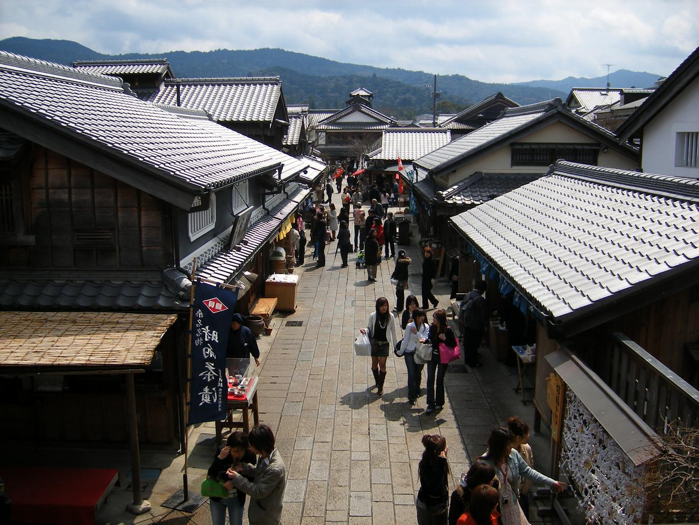
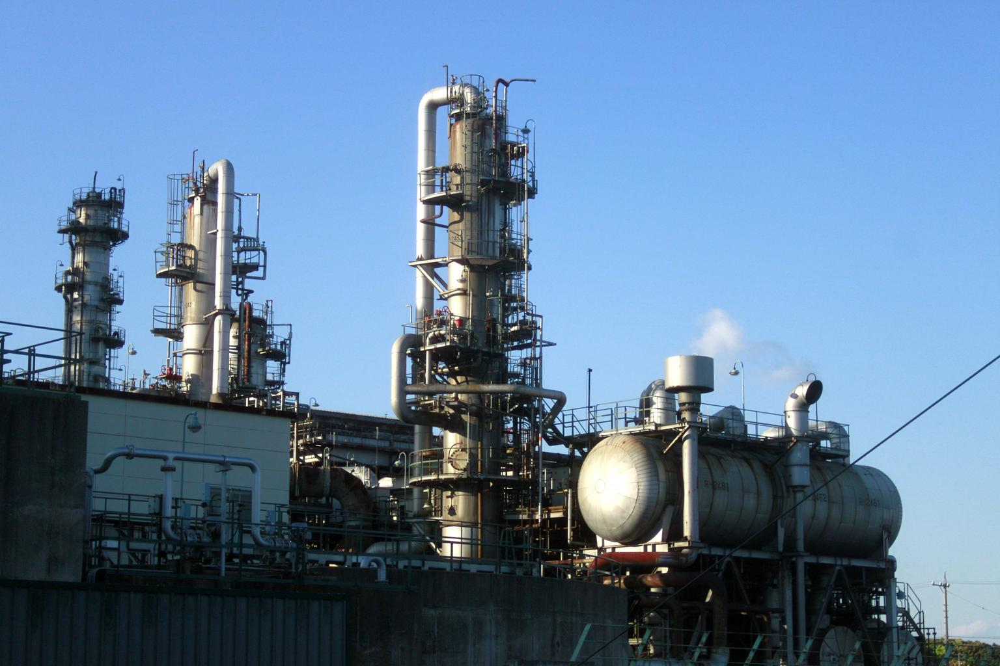

    <h2 class="section-title">全域</h2>
    <ul class="rule-list">
      <li>市外局番は059</li>
    </ul>
    {}

    <h2 class="section-title">都市・町の絞り込み</h2>
    <ul class="rule-list">
        <li>伊勢市は伊勢神宮とおはらい町・おかげ横丁の門前町</li>
        <li>四日市市は石油化学コンビナートが広がる工業都市</li>
        <li>鈴鹿市は鈴鹿サーキットとホンダの工場がある</li>
        <li>志摩・鳥羽は英虞湾のリアス海岸で真珠養殖が盛ん</li>
    </ul>

{}
{}
{}
伊勢市は伊勢神宮（内宮・外宮）の門前町で、おはらい町・おかげ横丁の切妻妻入りの町家が並ぶ{{% ref "https://ja.wikipedia.org/wiki/%E4%BC%8A%E5%8B%A2%E7%A5%9E%E5%AE%AE" "伊勢神宮" %}}。
{}

{}
{}
{}
四日市市は伊勢湾岸に石油化学コンビナートが広がる工業都市で、工場夜景でも知られる{{% ref "https://ja.wikipedia.org/wiki/%E5%9B%9B%E6%97%A5%E5%B8%82%E5%B8%82" "四日市市" %}}。
{}

{}
{}
{}
鈴鹿市はF1日本GPでも知られる鈴鹿サーキットと、ホンダの主力工場がある自動車・モータースポーツの街{{% ref "https://ja.wikipedia.org/wiki/%E9%88%B4%E9%B9%BF%E3%82%B5%E3%83%BC%E3%82%AD%E3%83%83%E3%83%88" "鈴鹿サーキット" %}}。
{}

{}
{}
{}
{}
志摩市・鳥羽市の英虞湾は入り組んだリアス海岸で、真珠（アコヤ真珠）養殖のいかだが浮かぶ{{% ref "https://ja.wikipedia.org/wiki/%E8%8B%B1%E8%99%9E%E6%B9%BE" "英虞湾" %}}。
{}

{}
{}
{}

    <h4 class="mb-4">代表的な企業の説明</h4>
    <table class="table table-striped table-bordered">
        <thead class="table-light">
            <tr>
                <th scope="col" class="col-width-2">企業名</th>
                <th scope="col" class="col-width-1">コード</th>
                <th scope="col" class="col-width-7">説明</th>
                <th scope="col" class="col-width-05">決算</th>
                <th scope="col" class="col-width-05">配当履歴</th>
            </tr>
        </thead>
        <tbody class="corp-desc">
            <tr>
                <td>百五銀行</td>
                <td>{}</td>
                <td>津市に本店を置く三重県最大の地方銀行。県内預金シェアトップ。<a href="https://ja.wikipedia.org/wiki/百五銀行" target="_blank">[参]</a></td>
                <td>{}</td>
                <td>{}</td>
            </tr>
            <tr>
                <td>井村屋グループ</td>
                <td>{}</td>
                <td>津市に本社を置く食品メーカー。「あずきバー」で知られ、年間約3億本を販売。肉まん・あんまんでも国内トップクラス。<a href="https://ja.wikipedia.org/wiki/井村屋グループ" target="_blank">[参]</a></td>
                <td>{}</td>
                <td>{}</td>
            </tr>
            <tr>
                <td>東ソー</td>
                <td>{}</td>
                <td>四日市市に主力工場を持つ総合化学メーカー。塩ビ樹脂・苛性ソーダで国内トップクラス。<a href="https://ja.wikipedia.org/wiki/東ソー" target="_blank">[参]</a></td>
                <td>{}</td>
                <td>{}</td>
            </tr>
        </tbody>
    </table>

