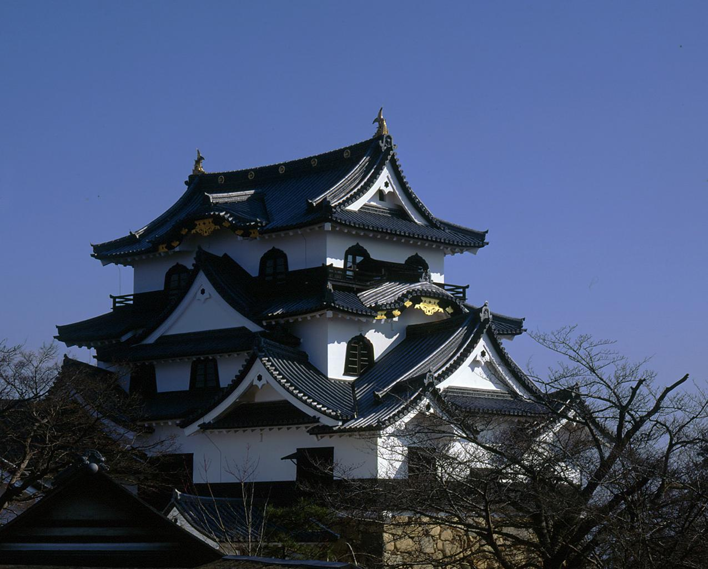
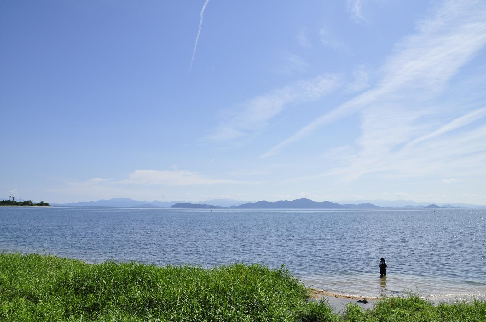

    <h2 class="section-title">全域</h2>
    <ul class="rule-list">
      <li>市外局番は077</li>
    </ul>
    {}

    <h2 class="section-title">都市・町の絞り込み</h2>
    <ul class="rule-list">
        <li>彦根市は現存天守の国宝・彦根城が目印</li>
        <li>甲賀市信楽は信楽焼の産地で、たぬきの置物が並ぶ窯元の街</li>
        <li>県の中央に琵琶湖が広がり、湖岸の景観が手がかりになる</li>
    </ul>

{}
{}
{}
彦根市は琵琶湖東岸の城下町で、現存十二天守のひとつ国宝・彦根城が目印{{% ref "https://ja.wikipedia.org/wiki/%E5%BD%A6%E6%A0%B9%E5%9F%8E" "彦根城" %}}。
{}

{}
{}
{}
甲賀市の信楽は日本六古窯のひとつ信楽焼の産地で、店先に並ぶたぬきの置物や登り窯が特徴{}{{% ref "https://ja.wikipedia.org/wiki/%E4%BF%A1%E6%A5%BD%E7%84%BC" "信楽焼" %}}。
{}

{}
{}
{}
県の中央に日本最大の湖琵琶湖が広がり、湖岸の道路・葦原・対岸の山並みが位置の手がかりになる{{% ref "https://ja.wikipedia.org/wiki/%E7%90%B5%E7%90%B6%E6%B9%96" "琵琶湖" %}}。
{}

{}
{}

    <h4 class="mb-4">代表的な企業の説明</h4>
    <table class="table table-striped table-bordered">
        <thead class="table-light">
            <tr>
                <th scope="col" class="col-width-2">企業名</th>
                <th scope="col" class="col-width-1">コード</th>
                <th scope="col" class="col-width-7">説明</th>
                <th scope="col" class="col-width-05">決算</th>
                <th scope="col" class="col-width-05">配当履歴</th>
            </tr>
        </thead>
        <tbody class="corp-desc">
            <tr>
                <td>日本電気硝子</td>
                <td>{}</td>
                <td>大津市に本社を置く特殊ガラスメーカー。液晶ディスプレイ用ガラス基板で世界トップクラス。<a href="https://ja.wikipedia.org/wiki/日本電気硝子" target="_blank">[参]</a></td>
                <td>{}</td>
                <td>{}</td>
            </tr>
            <tr>
                <td>平和堂</td>
                <td>{}</td>
                <td>彦根市に本社を置くスーパーマーケットチェーン。滋賀県で圧倒的なシェアを持ち、「アル・プラザ」「フレンドマート」を展開。<a href="https://ja.wikipedia.org/wiki/平和堂" target="_blank">[参]</a></td>
                <td>{}</td>
                <td>{}</td>
            </tr>
            <tr>
                <td>タカラバイオ</td>
                <td>{}</td>
                <td>草津市に本社を置くバイオテクノロジー企業。遺伝子工学用試薬で国内トップ。タカラホールディングスの子会社。<a href="https://ja.wikipedia.org/wiki/タカラバイオ" target="_blank">[参]</a></td>
                <td>{}</td>
                <td>{}</td>
            </tr>
        </tbody>
    </table>

