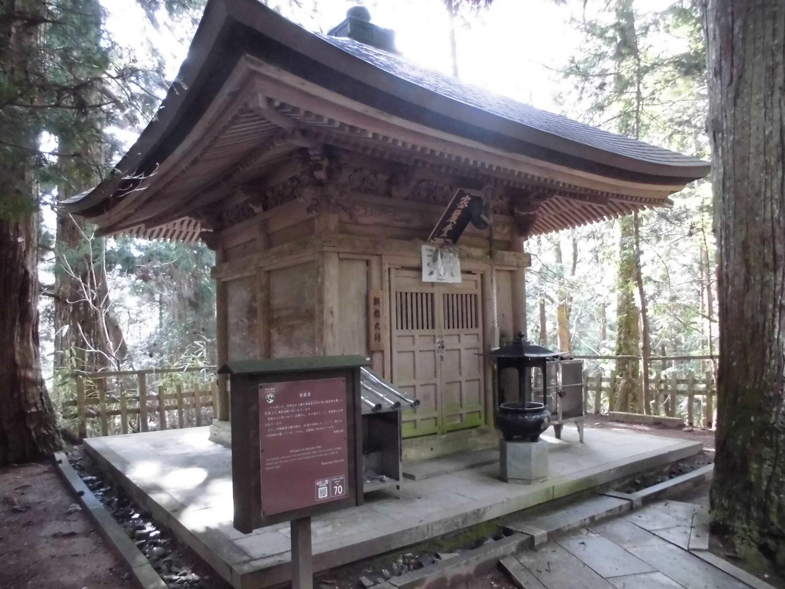
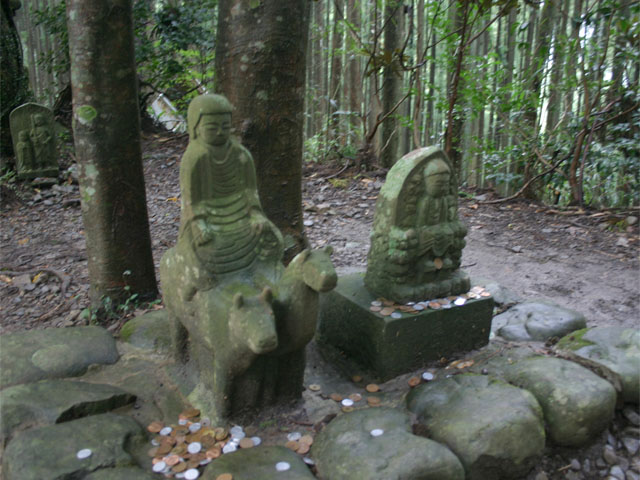
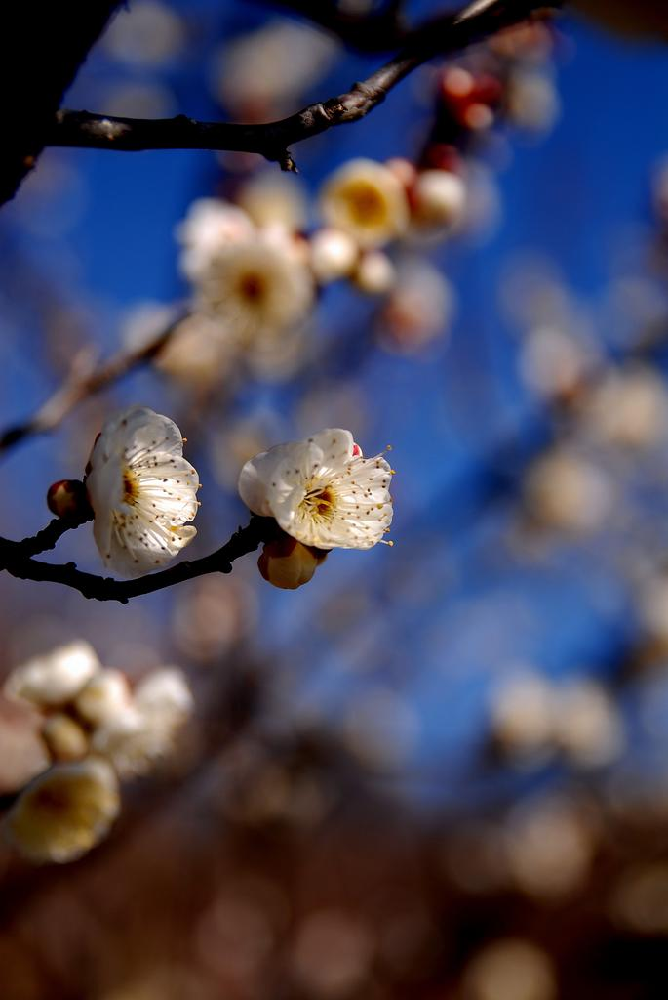
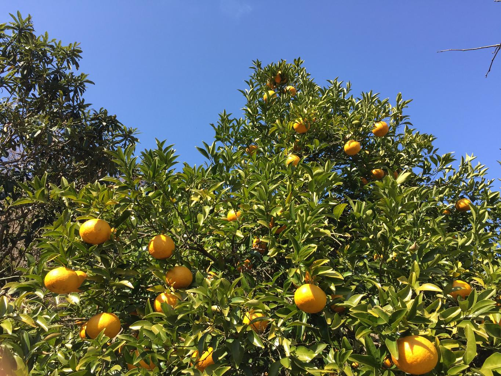

    <h2 class="section-title">全域</h2>
    <ul class="rule-list">
      <li>市外局番は073</li>
    </ul>
    {}

    <h2 class="section-title">都市・町の絞り込み</h2>
    <ul class="rule-list">
        <li>高野町の高野山は山上に寺院が集まる真言宗の聖地（世界遺産）</li>
        <li>田辺・新宮など熊野地方は熊野古道と熊野三山の参詣道が通る</li>
        <li>みなべ町・田辺市は梅（南高梅）の日本一の産地</li>
        <li>有田・海南など県北部は温暖な気候を生かしたみかんの産地</li>
    </ul>

{}
{}
{}
高野町の高野山は標高約800mの山上に多数の寺院が集まる真言宗の聖地で、世界遺産「紀伊山地の霊場と参詣道」の一部{{% ref "https://ja.wikipedia.org/wiki/%E9%AB%98%E9%87%8E%E5%B1%B1" "高野山" %}}。
{}

{}
{}
{}
田辺市・新宮市など熊野地方には熊野古道と熊野三山（本宮・速玉・那智）を結ぶ参詣道が通り、深い山林と渓谷が広がる{{% ref "https://ja.wikipedia.org/wiki/%E7%86%8A%E9%87%8E%E5%8F%A4%E9%81%93" "熊野古道" %}}。
{}

{}
{}
{}
みなべ町・田辺市は梅の名産地で、ブランド梅「南高梅」を中心に斜面一面の梅林が広がる{{% ref "https://ja.wikipedia.org/wiki/%E5%8D%97%E9%AB%98%E6%A2%85" "南高梅" %}}。
{}

{}
{}
{}
有田市・海南市など県北部は、温暖な気候を生かした有田みかんの産地で、斜面一面にみかん畑が広がる。
{}

{}
{}

    <h4 class="mb-4">代表的な企業の説明</h4>
    <table class="table table-striped table-bordered">
        <thead class="table-light">
            <tr>
                <th scope="col" class="col-width-2">企業名</th>
                <th scope="col" class="col-width-1">コード</th>
                <th scope="col" class="col-width-7">説明</th>
                <th scope="col" class="col-width-05">決算</th>
                <th scope="col" class="col-width-05">配当履歴</th>
            </tr>
        </thead>
        <tbody class="corp-desc">
            <tr>
                <td>紀陽銀行</td>
                <td>{}</td>
                <td>和歌山市に本店を置く和歌山県最大の地方銀行。県内預金シェアトップ。<a href="https://ja.wikipedia.org/wiki/紀陽銀行" target="_blank">[参]</a></td>
                <td>{}</td>
                <td>{}</td>
            </tr>
            <tr>
                <td>オークワ</td>
                <td>{}</td>
                <td>和歌山市に本社を置くスーパーマーケットチェーン。和歌山・大阪・三重を中心に約150店舗を展開。<a href="https://ja.wikipedia.org/wiki/オークワ" target="_blank">[参]</a></td>
                <td>{}</td>
                <td>{}</td>
            </tr>
            <tr>
                <td>島精機製作所</td>
                <td>{}</td>
                <td>和歌山市に本社を置くコンピューター横編機メーカー。ホールガーメント（無縫製ニット）技術で世界をリードする。<a href="https://ja.wikipedia.org/wiki/島精機製作所" target="_blank">[参]</a></td>
                <td>{}</td>
                <td>{}</td>
            </tr>
        </tbody>
    </table>

