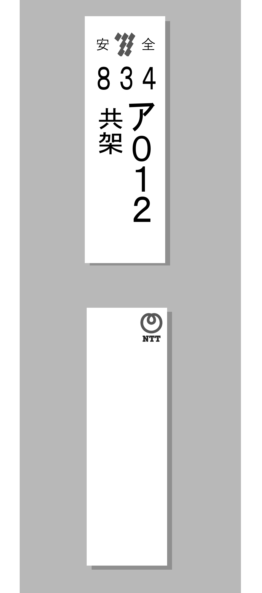
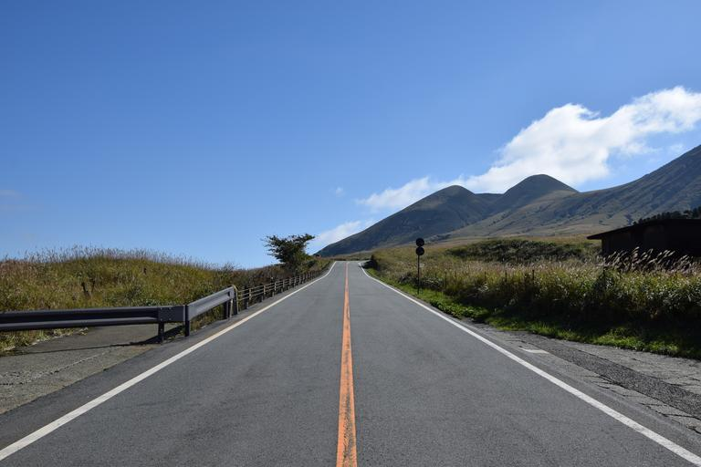

    <h2 class="section-title">全域</h2>
    <ul class="rule-list">
        <li>九州電力のロゴが見つかる</li>
        <li>ススキが多い{}</li>
    </ul>

{}
{}
{}
九州電力の電柱プレートが見つかる。九州電力のロゴがわかりやすい。
{}

{}
{}
{}
道端にススキが生えているイメージがある。
{}

{}
{}