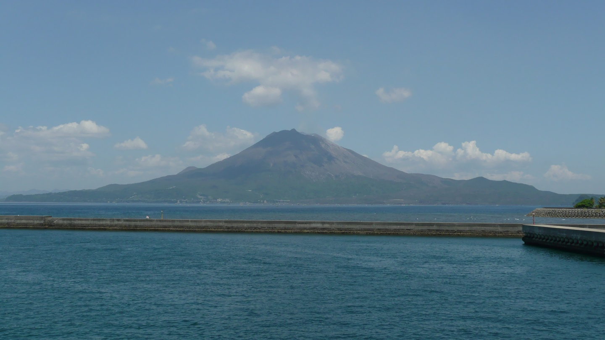
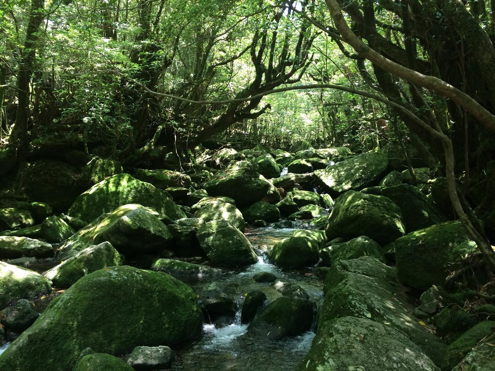
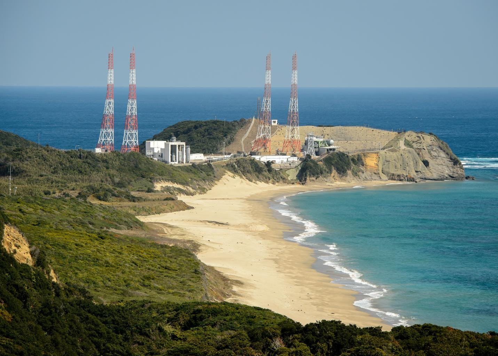

    <h2 class="section-title">全域</h2>
    <ul class="rule-list">
      <li>市外局番は099</li>
        <li>茶の生産は2023年時点で日本一であり、茶畑が多い</li>
        <li>克灰袋（こくはいぶくろ）の捨て場所が街中にある</li>
        <li>横断歩道前のダイヤマーク標示が他県と異なる形状をしている</li>
    </ul>
    {}

{}
{}
{}
お茶の生産が静岡とほぼ同率か、もしくは日本一{}。
{}

{}
{}
{}
桜島の火山灰を回収するための克灰袋（こくはいぶくろ）の捨て場所が街中にある。
{}

{}
{}
{}
この横断歩道前ダイヤマーク標示を使用するのは鹿児島県の他に<a href="../../chubu/nagano/">長野県</a>・<a href="../../chubu/aichi/">愛知県</a>・<a href="../../chugoku/yamaguchi/">山口県</a>である。
{}

{}
{}
{}
九州電力の電柱プレートが見つかる。
{}

{}
{}

    <h2 class="section-title">都市・町の絞り込み</h2>
    <ul class="rule-list">
        <li>鹿児島市は桜島を望む県都で、火山灰が積もることがある</li>
        <li>指宿市はイーブイ系列のマンホールが見つかる</li>
        <li>屋久島は屋久杉と多雨の原生林で知られる世界自然遺産の島</li>
        <li>種子島にはロケット発射場（種子島宇宙センター）がある</li>
    </ul>

{}
{}
{}
鹿児島市は錦江湾に浮かぶ活火山・桜島を望む県都で、桜島は噴煙を上げ、市街にも火山灰が降ることがある{{% ref "https://ja.wikipedia.org/wiki/%E6%A1%9C%E5%B3%B6" "桜島" %}}。
{}

{}
{}
{}
イーブイ好きな指宿市ではイーブイ系列のマンホールが見つかる{}。イーブイ系列を独占するのはずるいので分けてほしい。
{}

Totti - 投稿者自身による作品, <a href="http://creativecommons.org/licenses/by-sa/3.0" title="Creative Commons Attribution-Share Alike 3.0">CC 表示-継承 3.0</a>, <a href="https://ja.wikipedia.org/w/index.php?curid=4180467">リンク</a>による

{}
{}
{}
屋久島は樹齢千年を超える屋久杉と多雨の原生林で知られる世界自然遺産の島で、急峻な山が海から立ち上がる{{% ref "https://ja.wikipedia.org/wiki/%E5%B1%8B%E4%B9%85%E5%B3%B6" "屋久島" %}}。
{}

{}
{}
{}
種子島には日本最大級のロケット発射場・種子島宇宙センターがあり、サトウキビ畑の広がる平坦な島{{% ref "https://ja.wikipedia.org/wiki/%E7%A8%AE%E5%AD%90%E5%B3%B6" "種子島" %}}。
{}

{}
{}

    <h4 class="mb-4">代表的な企業の説明</h4>
    <table class="table table-striped table-bordered">
        <thead class="table-light">
            <tr>
                <th scope="col" class="col-width-2">企業名</th>
                <th scope="col" class="col-width-1">コード</th>
                <th scope="col" class="col-width-7">説明</th>
                <th scope="col" class="col-width-05">決算</th>
                <th scope="col" class="col-width-05">配当履歴</th>
            </tr>
        </thead>
        <tbody class="corp-desc">
            <tr>
                <td>住友金属鉱山</td>
                <td>{}</td>
                <td>日本において商業的規模の操業が行われている唯一の金鉱山である菱刈鉱山を運営する。</td>
                <td>{}</td>
                <td>{}</td>
            </tr>
            <tr>
                <td>宇宙航空研究開発機構（JAXA）</td>
                <td>-</td>
                <td>航空宇宙開発政策を担う国立研究開発法人。※企業ではありません</td>
                <td>-</td>
                <td>-</td>
            </tr>
        </tbody>
    </table>

