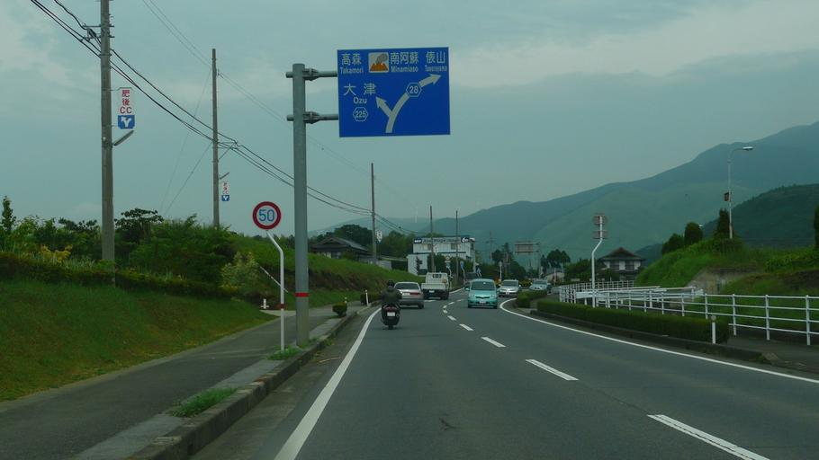
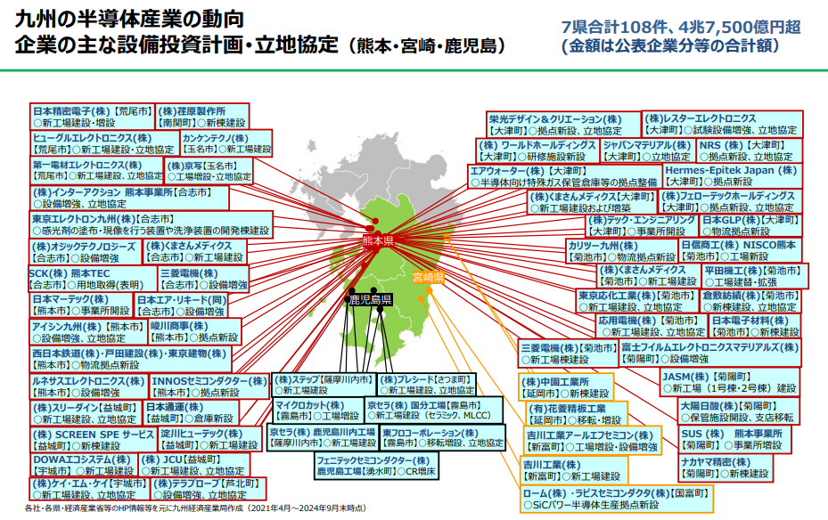

    <h2 class="section-title">全域</h2>
    <ul class="rule-list">
      <li>市外局番は096</li>
        <li>熊本の標識には赤いテープが巻いてある</li>
        <li>この県にしかない止まれ道路標示のデザインがある</li>
    </ul>
    {}

{}
{}
{}
標識や看板の支柱に赤いテープが巻いてある{}。
{}

{}
{}
{}
独自デザインの止まれ。「ま」の穴に注目。
{}

{}
{}

    <h2 class="section-title">{}</h2>
    <ul class="rule-list">
        <li>熊本県菊陽町を中心に半導体企業の進出が進んでいる</li>
    </ul>

{}
{}
{}
TSMCの進出をきっかけに、半導体関連企業が非常に多く進出している{}{}。
{}

{}
{}

    <h2 class="section-title">都市・町の絞り込み</h2>
    <ul class="rule-list">
        <li>熊本市は黒い熊本城が目印の県都</li>
        <li>阿蘇市・南阿蘇は世界最大級のカルデラと草原が広がる</li>
        <li>菊陽町・合志市には半導体工場（TSMC等）が進出</li>
        <li>天草は教会と橋で結ばれた島々（天草諸島）が広がる</li>
    </ul>

{}
{}
{}
熊本市は黒い下見板張りの熊本城を中心とする県都で、市内には路面電車が走る{{% ref "https://ja.wikipedia.org/wiki/%E7%86%8A%E6%9C%AC%E5%9F%8E" "熊本城" %}}。
{}

{}
{}
{}
{}
阿蘇市・南阿蘇は世界最大級のカルデラで、中央に活火山の阿蘇山、周囲に外輪山と草原（草千里）が広がる{{% ref "https://ja.wikipedia.org/wiki/%E9%98%BF%E8%98%87%E5%B1%B1" "阿蘇山" %}}。
{}

{}
{}
{}
{}
水俣市は不知火海に面した化学工業の街で、四大公害病の歴史を持ち、現在は環境再生に取り組む{{% ref "https://ja.wikipedia.org/wiki/%E6%B0%B4%E4%BF%A3%E5%B8%82" "水俣市" %}}。
{}

{}
{}
{}

    <h4 class="mb-4">代表的な企業の説明</h4>
    <table class="table table-striped table-bordered">
        <thead class="table-light">
            <tr>
                <th scope="col" class="col-width-2">企業名</th>
                <th scope="col" class="col-width-1">コード</th>
                <th scope="col" class="col-width-7">説明</th>
                <th scope="col" class="col-width-05">決算</th>
                <th scope="col" class="col-width-05">配当履歴</th>
            </tr>
        </thead>
        <tbody class="corp-desc">
            <tr>
                <td>Japan Advanced Semiconductor Manufacturing（JASM）</td>
                <td>-</td>
                <td>世界最大の半導体ファウンドリである{}のTSMCが熊本県に設立した子会社。ロジック半導体（40nm, 28nm/22nm, 16nm/12nm, 7nm/6nm）の生産を行う予定{}。</td>
                <td>{{% corplink "https://www.tsmc.com/static/japanese/careers/jasm/about-jasm.html#:~:text=%E3%80%8CJapan%20Advanced%20Semiconductor%20Manufacturing%E6%A0%AA%E5%BC%8F,%E3%81%AB%E8%A8%AD%E7%AB%8B%E3%81%97%E3%81%9F%E5%AD%90%E4%BC%9A%E7%A4%BE%E3%81%A7%E3%81%99%E3%80%82" %}}</td>
                <td>-</td>
            </tr>
            <tr>
                <td>荏原製作所</td>
                <td>{}</td>
                <td>水や資源向けのポンプを製造する大手メーカー。とりわけ肥料プラント向けの高圧アンモニアポンプは100%のシェアを持つ。</td>
                <td>{}</td>
                <td>{}</td>
            </tr>
            <tr>
                <td>富士フィルムエレクトロニクスマテリアルズ</td>
                <td>{}</td>
                <td>リソグラフィ材料やイメージセンサ―向け材料の製造を行う。</td>
                <td>{}</td>
                <td>{}</td>
            </tr>
            <tr>
 