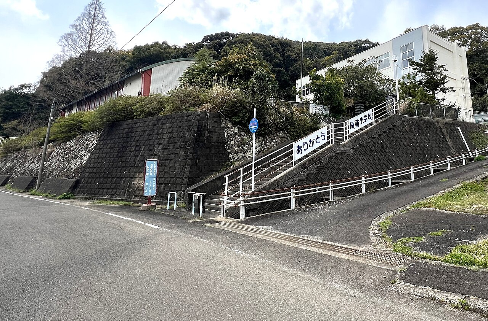
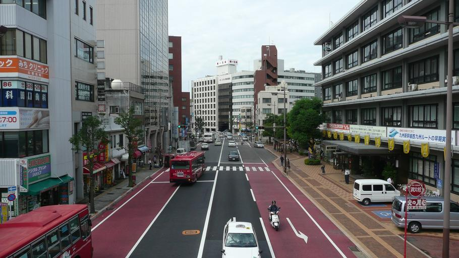

    <h2 class="section-title">全域</h2>
    <ul class="rule-list">
      <li>斜面が多い</li>
      <li>自転車を保有している家庭が少ない</li>
    </ul>
    {}

{}
{}
{}
斜面が多く、小学校などは高台にあることが多い。斜面移送システムがある場所も{}。
{}

{}
{}
{}
斜面が多い長崎では自転車を日常的に使うシーンは少ない{}。家に自転車が無かったり{}、店前の駐輪場も無いことが多い。バイクの方がむしろ多いかもしれない。
{}

{}
{}

    <h2 class="section-title">{}</h2>
    <ul class="rule-list">
      <li>原付（二輪等）の駐輪場が多い</li>
    </ul>

{}
{}
{}
自転車の保有台数は日本一少ない一方、ひとりあたりの原付の保有数は非常に多い。駐輪場ではなく『二輪等』駐輪場がメインであり、原付やバイクの方が多く止められていることも少なくない{}。
{}

{}
{}

    <h4 class="mb-4">代表的な企業の説明</h4>
    <table class="table table-striped table-bordered">
        <thead class="table-light">
            <tr>
                <th scope="col" class="col-width-2">企業名</th>
                <th scope="col" class="col-width-1">コード</th>
                <th scope="col" class="col-width-7">説明</th>
                <th scope="col" class="col-width-05">決算</th>
                <th scope="col" class="col-width-05">配当履歴</th>
            </tr>
        </thead>
        <tbody class="corp-desc">
            <tr>
                <td>十八親和銀行</td>
                <td>{}</td>
                <td>長崎市に本店を置く長崎県最大の地方銀行。ふくおかフィナンシャルグループ傘下。十八銀行と親和銀行が合併して誕生。<a href="https://ja.wikipedia.org/wiki/十八親和銀行" target="_blank">[参]</a></td>
                <td>{}</td>
                <td>{}</td>
            </tr>
            <tr>
                <td>リンガーハット</td>
                <td>{}</td>
                <td>長崎市に発祥を持つ外食チェーン。長崎ちゃんぽん専門店「リンガーハット」を全国展開。国産野菜100%使用。<a href="https://ja.wikipedia.org/wiki/リンガーハット" target="_blank">[参]</a></td>
                <td>{}</td>
                <td>{}</td>
            </tr>
            <tr>
                <td>福砂屋</td>
                <td>非上場</td>
                <td>長崎市に本社を置くカステラの老舗。1624年創業で400年の歴史を持つ。手作りカステラの代表的ブランド。<a href="https://ja.wikipedia.org/wiki/福砂屋" target="_blank">[参]</a></td>
                <td></td>
                <td></td>
            </tr>
        </tbody>
    </table>

