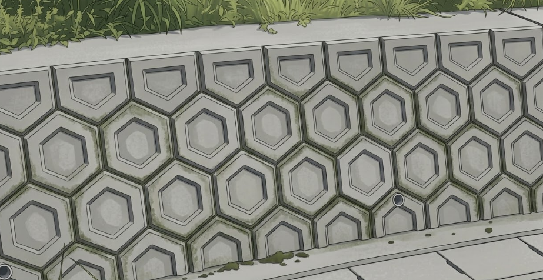

    <h2 class="section-title">全域</h2>
    <ul class="rule-list">
      <li>市外局番は0952</li>
        <li>佐賀と{}では六角形の擁壁が見られる</li>
        <li>佐賀～{}の平野部では日本で最大規模のクリークが広がっている</li>
    </ul>
    {}

{}
{}
{}
擁壁の形が６角形の地域は全国的に珍しく、佐賀や宮崎以外ではほとんど見つからない{}。
{}

{}
{}
{}
佐賀平野にはクリークと呼ばれる水路網が広がっており、特徴的な景観を形成している{}。
{}

 <small>By <a href="https://commons.wikimedia.org/wiki/User:Peka">Peka</a> - Own work, <a href="https://creativecommons.org/licenses/by-sa/4.0">CC BY-SA 4.0</a></small>

{}
{}

    <h2 class="section-title">都市・町の絞り込み</h2>
    <ul class="rule-list">
        <li>有田町は有田焼の産地で、磁器の窯元とトンバイ塀が残る</li>
        <li>唐津市は唐津焼と唐津城、虹の松原の城下町</li>
        <li>佐賀市は有明海の干拓地が広がり、バルーンフェスタで知られる</li>
        <li>伊万里市は伊万里焼の積出港として栄えた焼き物の街</li>
    </ul>

{}
{}
{}
有田町は日本磁器発祥の地で、有田焼の窯元が集まる。窯道具を再利用した「トンバイ塀」の路地が残る{{% ref "https://ja.wikipedia.org/wiki/%E6%9C%89%E7%94%B0%E7%84%BC" "有田焼" %}}。
{}

{}
{}
{}
{}
唐津市は唐津焼と唐津城、白砂青松の虹の松原で知られる玄界灘沿いの城下町{{% ref "https://ja.wikipedia.org/wiki/%E5%94%90%E6%B4%A5%E5%B8%82" "唐津市" %}}。
{}

{}
{}
{}

    <h4 class="mb-4">代表的な企業の説明</h4>
    <table class="table table-striped table-bordered">
        <thead class="table-light">
            <tr>
                <th scope="col" class="col-width-2">企業名</th>
                <th scope="col" class="col-width-1">コード</th>
                <th scope="col" class="col-width-7">説明</th>
                <th scope="col" class="col-width-05">決算</th>
                <th scope="col" class="col-width-05">配当履歴</th>
            </tr>
        </thead>
        <tbody class="corp-desc">
            <tr>
                <td>佐賀銀行</td>
                <td>{}</td>
                <td>佐賀市に本店を置く佐賀県最大の地方銀行。県内預金シェアトップ。<a href="https://ja.wikipedia.org/wiki/佐賀銀行" target="_blank">[参]</a></td>
                <td>{}</td>
                <td>{}</td>
            </tr>
            <tr>
                <td>久光製薬</td>
                <td>{}</td>
                <td>鳥栖市に本社を置く製薬企業。「サロンパス」で知られる外用消炎鎮痛剤のトップメーカー。<a href="https://ja.wikipedia.org/wiki/久光製薬" target="_blank">[参]</a></td>
                <td>{}</td>
                <td>{}</td>
            </tr>
            <tr>
                <td>戸上電機製作所</td>
                <td>{}</td>
                <td>佐賀市に本社を置く電力機器メーカー。配電盤・開閉器など電力インフラ機器で高いシェアを持つ。<a href="https://ja.wikipedia.org/wiki/戸上電機製作所" target="_blank">[参]</a></td>
                <td>{}</td>
                <td>{}</td>
            </tr>
        </tbody>
    </table>

