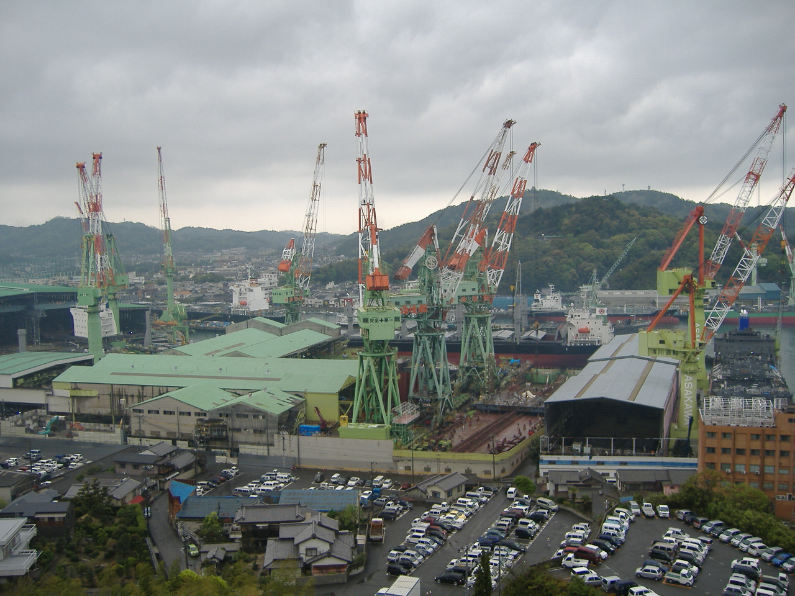
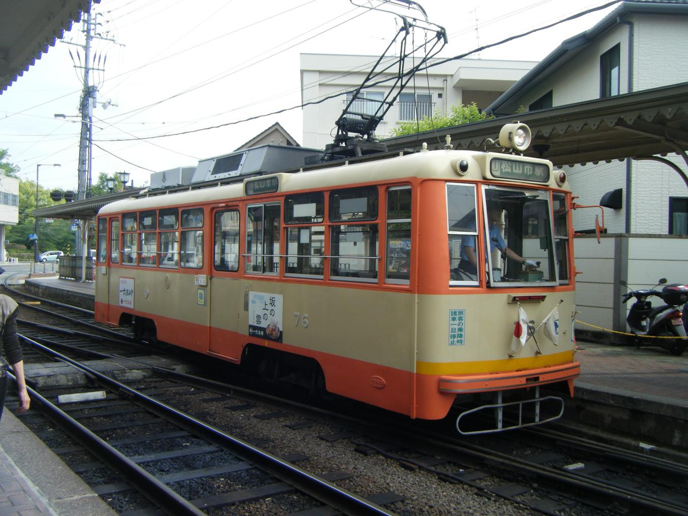
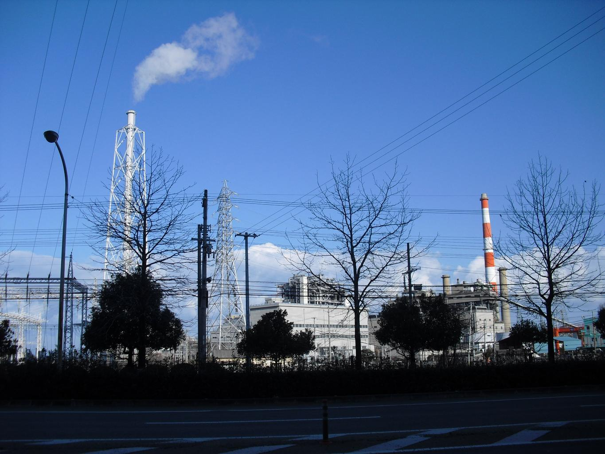
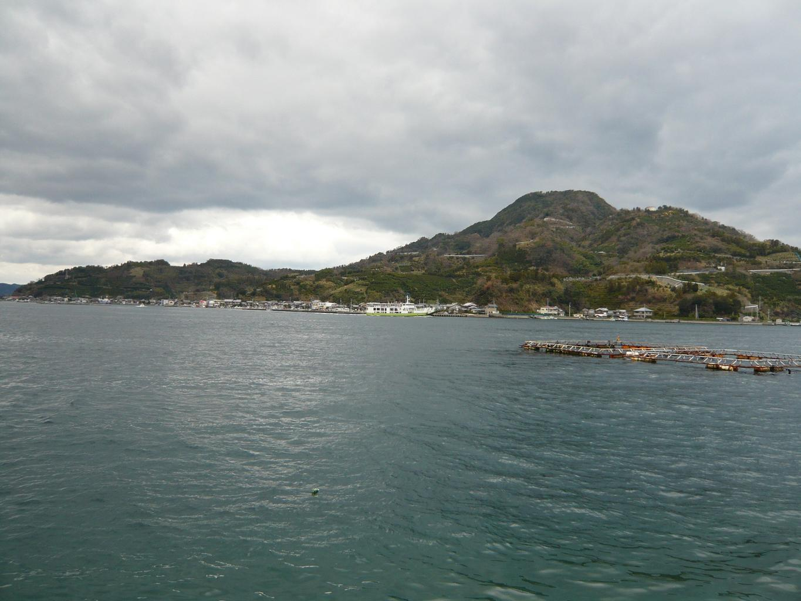

    <h2 class="section-title">全域</h2>
    <ul class="rule-list">
      <li>市外局番は089</li>
    </ul>
    {}

    <h2 class="section-title">都市・町の絞り込み</h2>
    <ul class="rule-list">
        <li>今治市はタオルの国内一の産地で、造船も盛ん</li>
        <li>松山市は道後温泉と松山城があり、市内を路面電車が走る</li>
        <li>新居浜市は別子銅山で発展した住友グループ発祥の工業都市</li>
        <li>宇和島など南予はリアス海岸で、真珠・養殖が盛ん</li>
    </ul>

{}
{}
{}
今治市は生産量日本一のタオル産地で、国産タオルの過半を占める。造船・海運も盛んで今治城がある{{% ref "https://ja.wikipedia.org/wiki/%E4%BB%8A%E6%B2%BB%E3%82%BF%E3%82%AA%E3%83%AB" "今治タオル" %}}。
{}

{}
{}
{}
松山市は道後温泉と松山城で知られる四国最大の都市で、市内には伊予鉄道の路面電車が走る{{% ref "https://ja.wikipedia.org/wiki/%E9%81%93%E5%BE%8C%E6%B8%A9%E6%B3%89" "道後温泉" %}}。
{}

{}
{}
{}
新居浜市は江戸期に開かれた別子銅山で発展した住友グループ発祥の地で、化学・金属の工場が集まる{{% ref "https://ja.wikipedia.org/wiki/%E5%88%A5%E5%AD%90%E9%8A%85%E5%B1%B1" "別子銅山" %}}。
{}

{}
{}
{}
宇和島市など南予はリアス海岸で、宇和海では真珠やマダイの養殖が盛ん。宇和島城の城下町でもある。
{}

{}
{}

    <h4 class="mb-4">代表的な企業の説明</h4>
    <table class="table table-striped table-bordered">
        <thead class="table-light">
            <tr>
                <th scope="col" class="col-width-2">企業名</th>
                <th scope="col" class="col-width-1">コード</th>
                <th scope="col" class="col-width-7">説明</th>
                <th scope="col" class="col-width-05">決算</th>
                <th scope="col" class="col-width-05">配当履歴</th>
            </tr>
        </thead>
        <tbody class="corp-desc">
            <tr>
                <td>住友金属鉱山</td>
                <td>{}</td>
                <td>新居浜市に発祥を持つ非鉄金属メーカー。別子銅山の歴史から始まり、ニッケル製錬で世界有数。住友グループの源流企業。<a href="https://ja.wikipedia.org/wiki/住友金属鉱山" target="_blank">[参]</a></td>
                <td>{}</td>
                <td>{}</td>
            </tr>
            <tr>
                <td>大王製紙</td>
                <td>{}</td>
                <td>四国中央市に本社を置く製紙メーカー。「エリエール」ブランドの家庭紙で知られ、新聞用紙・印刷用紙も製造。<a href="https://ja.wikipedia.org/wiki/大王製紙" target="_blank">[参]</a></td>
                <td>{}</td>
                <td>{}</td>
            </tr>
            <tr>
                <td>伊予銀行</td>
                <td>{}</td>
                <td>松山市に本店を置く愛媛県最大の地方銀行。いよぎんホールディングス傘下。四国でもトップクラスの規模。<a href="https://ja.wikipedia.org/wiki/伊予銀行" target="_blank">[参]</a></td>
                <td>{}</td>
                <td>{}</td>
            </tr>
        </tbody>
    </table>

