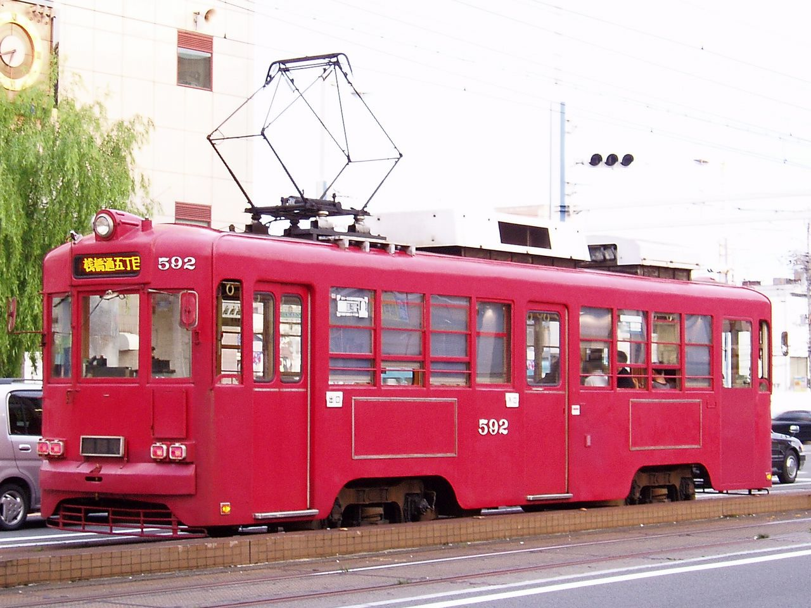
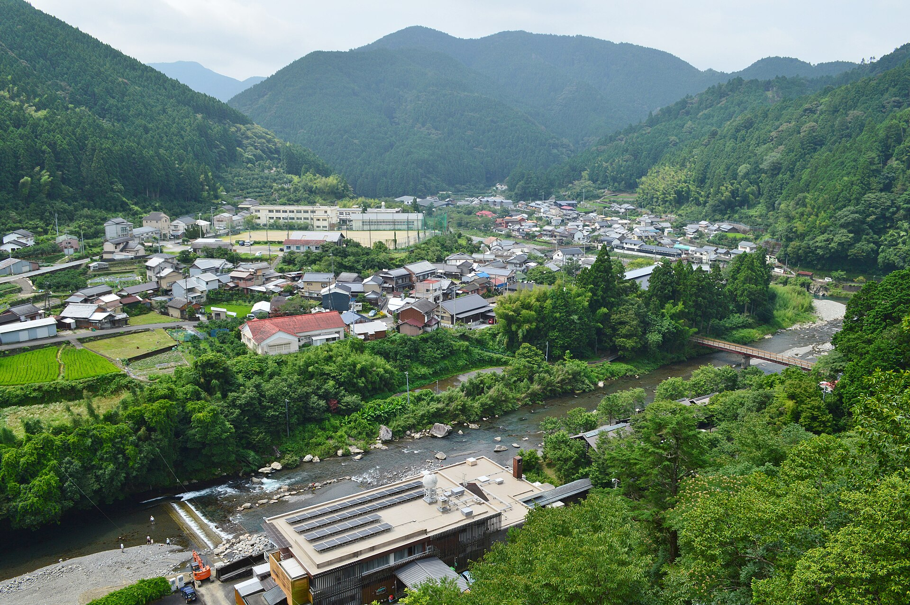

    <h2 class="section-title">全域</h2>
    <ul class="rule-list">
      <li>市外局番は088</li>
    </ul>
    {}

    <h2 class="section-title">都市・町の絞り込み</h2>
    <ul class="rule-list">
        <li>高知市は路面電車が走り、はりまや橋・高知城がある県都</li>
        <li>四万十市の四万十川は沈下橋で知られる清流</li>
        <li>室戸岬・足摺岬は太平洋に突き出す岬で、黒潮の荒い海岸が広がる</li>
        <li>馬路村など山間部は柚子・林業が盛ん</li>
    </ul>

{}
{}
{}
高知市はとさでん交通の路面電車が走り、はりまや橋・現存天守の高知城がある県都{{% ref "https://ja.wikipedia.org/wiki/%E9%AB%98%E7%9F%A5%E5%B8%82" "高知市" %}}。
{}

{}
{}
{}
四万十市などを流れる四万十川は「日本最後の清流」と呼ばれ、欄干のない「沈下橋」が架かる{{% ref "https://ja.wikipedia.org/wiki/%E5%9B%9B%E4%B8%87%E5%8D%81%E5%B7%9D" "四万十川" %}}。
{}

{}
{}
{}
室戸岬・足摺岬は太平洋に突き出す岬で、黒潮の荒波が打ち寄せる岩礁海岸と灯台が特徴{{% ref "https://ja.wikipedia.org/wiki/%E5%AE%A4%E6%88%B8%E5%B2%AC" "室戸岬" %}}。
{}

{}
{}
{}
馬路村など県東部の山間部は、急峻な山に囲まれた柚子の産地・林業の村で、深い谷沿いに小さな集落が点在する。
{}

{}
{}

    <h4 class="mb-4">代表的な企業の説明</h4>
    <table class="table table-striped table-bordered">
        <thead class="table-light">
            <tr>
                <th scope="col" class="col-width-2">企業名</th>
                <th scope="col" class="col-width-1">コード</th>
                <th scope="col" class="col-width-7">説明</th>
                <th scope="col" class="col-width-05">決算</th>
                <th scope="col" class="col-width-05">配当履歴</th>
            </tr>
        </thead>
        <tbody class="corp-desc">
            <tr>
                <td>技研製作所</td>
                <td>{}</td>
                <td>高知市に本社を置く建設機械メーカー。無振動・無騒音の圧入工法「サイレントパイラー」で世界的に知られる。<a href="https://ja.wikipedia.org/wiki/技研製作所" target="_blank">[参]</a></td>
                <td>{}</td>
                <td>{}</td>
            </tr>
            <tr>
                <td>四国銀行</td>
                <td>{}</td>
                <td>高知市に本店を置く高知県最大の地方銀行。県内預金シェアトップ。よんぎんとして親しまれる。<a href="https://ja.wikipedia.org/wiki/四国銀行" target="_blank">[参]</a></td>
                <td>{}</td>
                <td>{}</td>
            </tr>
            <tr>
                <td>旭食品</td>
                <td>非上場</td>
                <td>高知市に本社を置く食品卸売業。四国最大手の食品卸で、四国・中国・九州地方を中心に事業展開。<a href="https://ja.wikipedia.org/wiki/旭食品" target="_blank">[参]</a></td>
                <td></td>
                <td></td>
            </tr>
        </tbody>
    </table>

