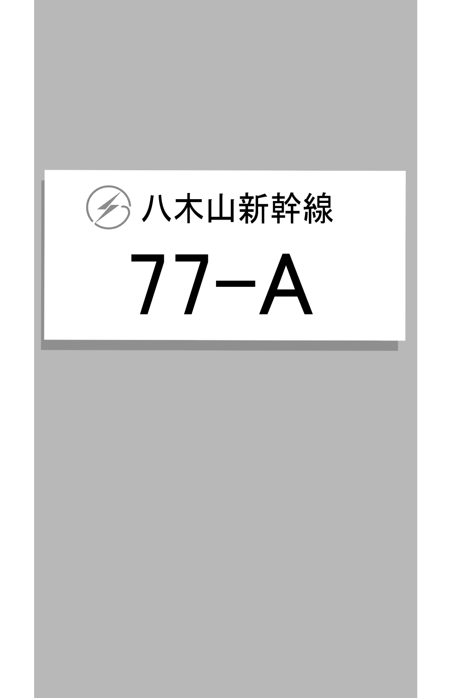

    <h2 class="section-title">全域</h2>
    <ul class="rule-list">
        <li>寒い地域特有の家が多い（特に北海道）
            <ul>
                <li>ホームタンクと呼ばれる灯油タンクのある家が目立つ{}</li>
                <li>雪が多い地域ほど室外機は地面に直接おかれないことが多くなる</li>
                <li>カスケード型のガレージがある</li>
            </ul>
        </li>
        <li>東北電力や北海道電力のロゴが見つかる</li>
    </ul>

{}
{}
{}
ホームタンクと呼ばれる灯油タンクのある家が目立つ{}。
{}

By Ka23 13 - Own work, <a href="https://creativecommons.org/licenses/by-sa/4.0" title="Creative Commons Attribution-Share Alike 4.0">CC BY-SA 4.0</a>, <a href="https://commons.wikimedia.org/w/index.php?curid=142923992">Link</a>

{}
{}
{}
横向きのプレートは東北電力、たまに黄色いプレートがついているものは北海道電力。
{}

{}
{}
