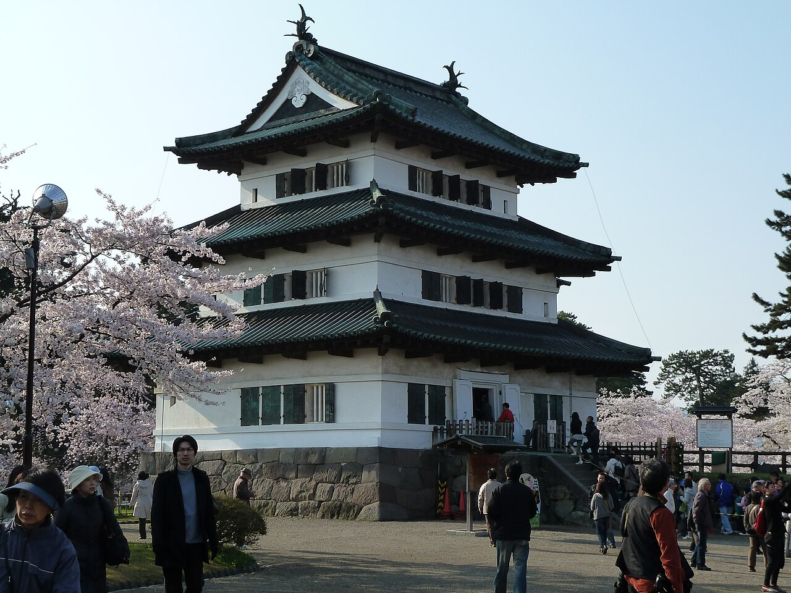
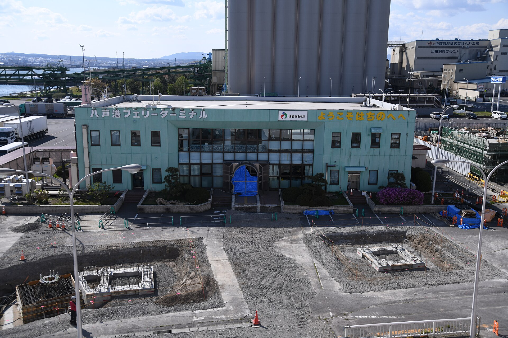

    <h2 class="section-title">全域</h2>
    <ul class="rule-list">
      <li>市外局番は017</li>
        <li>りんごを模ったオブジェや看板が多い</li>
        <li>ユニバースというスーパーがある</li>
    </ul>
    {}

{}
{}
{}
りんごの生産量日本一。果樹園＋雪国特有の屋根の傾斜がある場合は青森周辺の可能性が高まる。りんごが描かれた看板なども多い{}。
{}

{}
{}
{}
青森・岩手・秋田にはユニバースというスーパーマーケットが展開している{{% ref "https://ja.wikipedia.org/wiki/%E3%83%A6%E3%83%8B%E3%83%90%E3%83%BC%E3%82%B9_(%E3%82%B9%E3%83%BC%E3%83%91%E3%83%BC%E3%83%9E%E3%83%BC%E3%82%B1%E3%83%83%E3%83%88)" "ユニバース" %}}。
{}

By <a href="//commons.wikimedia.org/wiki/User:%E6%8E%AC%E8%8C%B6" title="User:掬茶">掬茶</a> - Own work, <a href="https://creativecommons.org/licenses/by-sa/4.0" title="Creative Commons Attribution-Share Alike 4.0">CC BY-SA 4.0</a>, <a href="https://commons.wikimedia.org/w/index.php?curid=122261812">Link</a>

{}
{}

    <h2 class="section-title">都市・町の絞り込み</h2>
    <ul class="rule-list">
        <li>弘前市は弘前城とりんご畑で知られる津軽の城下町</li>
        <li>津軽地方は岩木山麓を中心にりんご畑が広がる日本一のりんご産地</li>
        <li>八戸市は水産とセメント・製紙の工場が集まる港湾都市</li>
        <li>六ヶ所村は核燃料サイクル施設、下北半島は原子力関連施設が立地</li>
        <li>青森市はねぶた祭で知られる本州最北の県都</li>
    </ul>

{}
{}
{}
弘前市は弘前城の城下町で、岩木山麓に広がるりんご畑が特徴。青森県はりんご生産量日本一{{% ref "https://ja.wikipedia.org/wiki/%E5%BC%98%E5%89%8D%E5%B8%82" "弘前市" %}}。
{}

{}
{}
{}
八戸市はイカなどの水産業と、セメント・製紙などの工場が集まる港湾工業都市{{% ref "https://ja.wikipedia.org/wiki/%E5%85%AB%E6%88%B8%E5%B8%82" "八戸市" %}}。
{}

{}
{}
{}
下北半島の六ヶ所村には核燃料サイクル施設（再処理工場・備蓄基地）があり、大間町には大間原発が立地する{{% ref "https://ja.wikipedia.org/wiki/%E5%85%AD%E3%83%B6%E6%89%80%E6%9D%91" "六ヶ所村" %}}。
{}

{}
{}
{}

    <h4 class="mb-4">代表的な企業の説明</h4>
    <table class="table table-striped table-bordered">
        <thead class="table-light">
            <tr>
                <th scope="col" class="col-width-2">企業名</th>
                <th scope="col" class="col-width-1">コード</th>
                <th scope="col" class="col-width-7">説明</th>
                <th scope="col" class="col-width-05">決算</th>
                <th scope="col" class="col-width-05">配当履歴</th>
            </tr>
        </thead>
        <tbody class="corp-desc">
            <tr>
                <td>むつ小川原石油備蓄</td>
                <td>{}</td>
                <td>ENEOSのグループ会社。日本の石油需要の10日分以上を備蓄している。独立行政法人石油天然ガス・金属鉱物資源機構が保有し運営を受託する形を取っている。</td>
                <td>{}</td>
                <td>{}</td>
            </tr>
            <tr>
                <td>日本原燃</td>
                <td>-</td>
                <td>原子燃料サイクル・濃縮ウラン製造など、原発関連事業を行う。非上場。</td>
                <td>-</td>
                <td>-</td>
            </tr>
            <tr>
                <td>プライフーズ</td>
                <td>-</td>
                <td>三井物産系列の食肉加工業者{}。</td>
                <td>-</td>
                <td>-</td>
            </tr>
        </tbody>
    </table>

