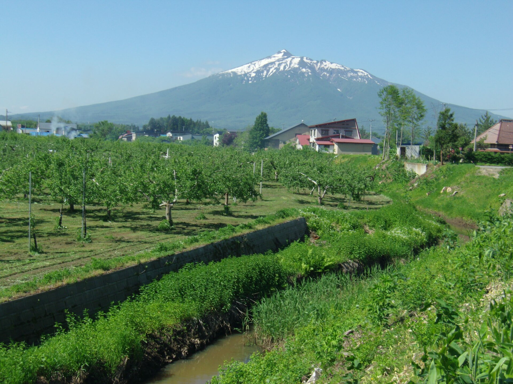

    <h2 class="section-title">全域</h2>
    <ul class="rule-list">
        <li>りんごを模ったオブジェや看板が多い</li>
    </ul>
    {}

{}
{}
{}
りんごの生産量日本一。果樹園＋雪国特有の屋根の傾斜がある場合は青森周辺の可能性が高まる。りんごが描かれた看板なども多い{}。
{}

{}
{}

    <h4 class="mb-4">代表的な企業の説明</h4>
    <table class="table table-striped table-bordered">
        <thead class="table-light">
            <tr>
                <th scope="col" class="col-width-2">企業名</th>
                <th scope="col" class="col-width-1">コード</th>
                <th scope="col" class="col-width-7">説明</th>
                <th scope="col" class="col-width-05">決算</th>
                <th scope="col" class="col-width-05">配当履歴</th>
            </tr>
        </thead>
        <tbody class="corp-desc">
            <tr>
                <td>むつ小川原石油備蓄</td>
                <td>{}</td>
                <td>ENEOSのグループ会社。日本の石油需要の10日分以上を備蓄している。独立行政法人石油天然ガス・金属鉱物資源機構が保有し運営を受託する形を取っている。</td>
                <td>{}</td>
                <td>{}</td>
            </tr>
            <tr>
                <td>日本原燃</td>
                <td>-</td>
                <td>原子燃料サイクル・濃縮ウラン製造など、原発関連事業を行う。非上場。</td>
                <td>-</td>
                <td>-</td>
            </tr>
            <tr>
                <td>プライフーズ</td>
                <td>-</td>
                <td>三井物産系列の食肉加工業者{}。</td>
                <td>-</td>
                <td>-</td>
            </tr>
        </tbody>
    </table>

