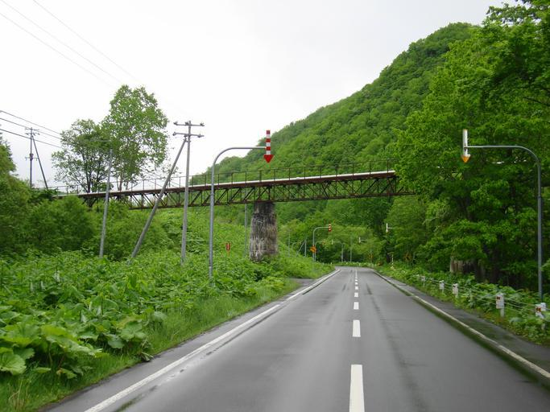
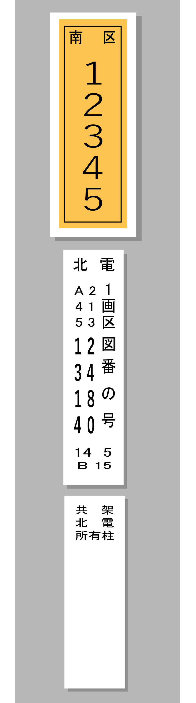
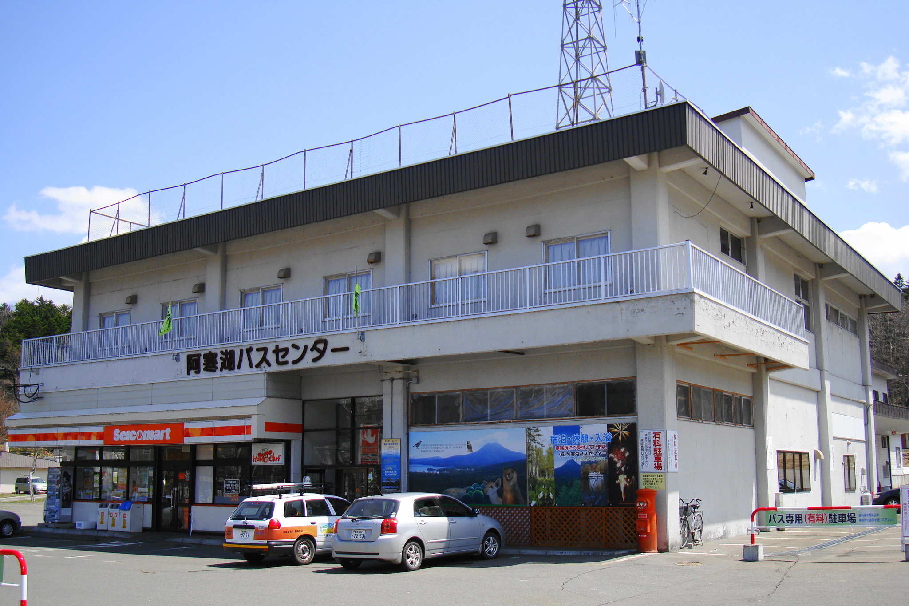
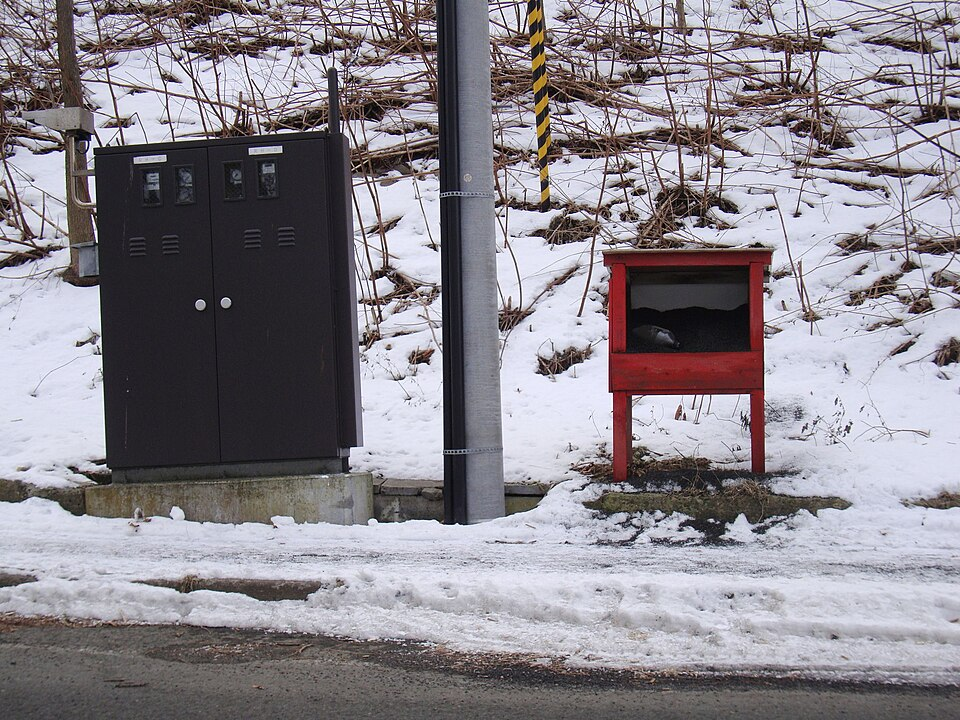
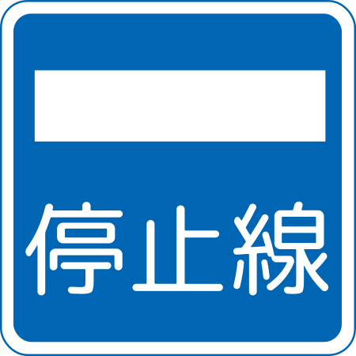
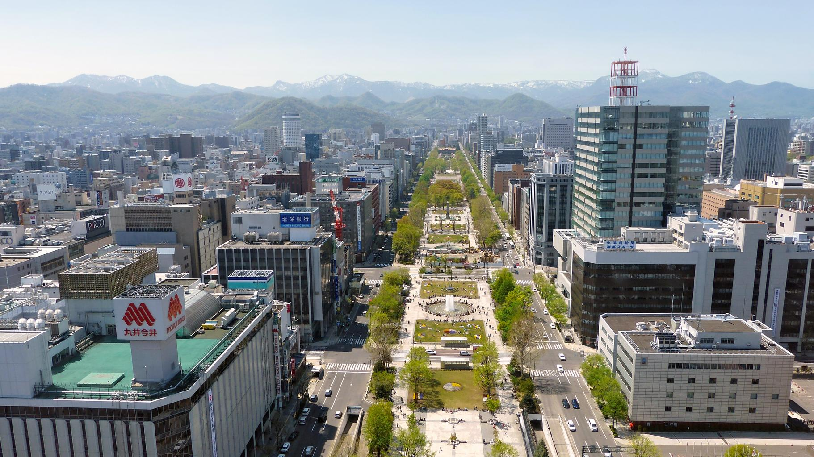
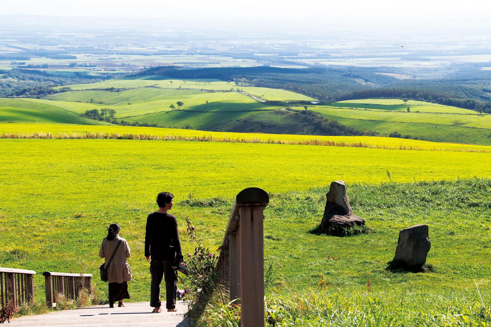

    <h2 class="section-title">全域</h2>
    <ul class="rule-list">
      <li>市外局番は011</li>
        <li>道路に視線誘導標がある</li>
        <li>コンビニにセイコーマートがある</li>
        <li>道路にスノーポールがある</li>
        <li>寒い地域特有の家が多い
            <ul>
                <li>屋根が平ら</li>
                <li>カスケード型のガレージがある</li>
                <li>ホームタンクと呼ばれる灯油タンクのある家が目立つ{}</li>
            </ul>
        </li>
    </ul>
    {}

{}
{}
{}
雪が多い地域は道路の上に矢印（固定式視線誘導柱）がある。北海道以外でも雪が多い地域に同じものがある{}ので他の要素と合わせて北海道と判断する。
{}

{}
{}

{}
道端にフキが大量に生えていることがある。フキ自体は全国で見られるが、大量に生えているのは北海道以外あまりない。
{}

{}
{}
{}
左側に大き目の数字が並んだレイアウト。見分けはつきやすい{}。
{}

{}
{}
{}
コンビニはセイコーマートが特徴的。
{}

{}
{}

{}
北海道には灯油タンク（ホームタンクと呼ばれる４９０㍑灯油が保存できるタンク）が家の外にある。屋根からの雪下ろしをしなくても大丈夫なように工夫された、遠くからみるとまっ平な屋根に見えるスノーダクト屋根・フラットルーフ屋根が多い。また、誰もいない場所に雪が自然に落ちるように設計された屋根も多い。屋根の上の雪を下すためのはしごも見えるはず。車庫は耐久性の高いカスケードガレージが使われていることがある{}。
{}

By <a href="//commons.wikimedia.org/wiki/User:Sgroey" title="User:Sgroey">Sgroey</a> - Own work, <a href="https://creativecommons.org/licenses/by-sa/4.0" title="Creative Commons Attribution-Share Alike 4.0">CC BY-SA 4.0</a>, <a href="https://commons.wikimedia.org/w/index.php?curid=115473171">Link</a>

{}
{}

{}
交差点付近に砂箱があることも。路面が滑りにくくなるようにするための砂が入っている{}。ご当地砂箱もあるらしい（<a href="https://tokukita.jp/gotouchineta/hokkaido-sunabako.html">出典</a>）。
{}

{}
{}

{}
北海道以外であまり見られない標識もあるかも{}？
{}

{}
{}

    <h2 class="section-title">都市・町の絞り込み</h2>
    <ul class="rule-list">
        <li>苫小牧市は製紙の街で、大規模な製紙工場と港がある</li>
        <li>札幌市は碁盤の目状の街路が広がる北海道最大の都市</li>
        <li>室蘭市は製鉄と港湾の街で、白鳥大橋が架かる工業都市</li>
        <li>帯広・十勝平野は防風林に区切られた広大な畑作地帯で直線道路が続く</li>
        <li>函館市は函館山と坂・五稜郭で知られる港町</li>
    </ul>

{}
{}
{}
苫小牧市は王子製紙発祥の製紙の街で、大規模な製紙工場と掘込式の苫小牧港がある{{% ref "https://ja.wikipedia.org/wiki/%E8%8B%AB%E5%B0%8F%E7%89%A7%E5%B8%82" "苫小牧市" %}}。紙の原料となる巨大な木材置き場やチップヤード{}があれば確定だろう。飼料メーカー倉庫{}や物流センター{}、重化学系の工場{}も集積している。
{}

{}
{}
{}
札幌市は碁盤の目状の街路が広がる北海道最大の都市で、大通公園やテレビ塔、雪景色が手がかり。
{}

{}
{}
{}
室蘭市は鉄鋼（日本製鉄）と石油・港湾の工業都市で、製鉄所がある{}{{% ref "https://ja.wikipedia.org/wiki/%E5%AE%A4%E8%98%AD%E5%B8%82" "室蘭市" %}}。白鳥大橋も有名{}。平野が狭く農業よりも工業が集積しているので特徴的。
{}

{}
{}
{}
帯広市を中心とする十勝平野は、防風林（カラマツ等）に区切られた広大な畑作地帯{}で、まっすぐな農道が続く{{% ref "https://ja.wikipedia.org/wiki/%E5%8D%81%E5%8B%9D%E5%B9%B3%E9%87%8E" "十勝平野" %}}。
{}

{}
{}
{}
函館市は函館山からの夜景、坂と西洋館、五稜郭{}で知られる道南の港町{{% ref "https://ja.wikipedia.org/wiki/%E5%87%BD%E9%A4%A8%E5%B8%82" "函館市" %}}。
{}

{}
{}

    <h4 class="mb-4">代表的な企業の説明</h4>
    <table class="table table-striped table-bordered">
        <thead class="table-