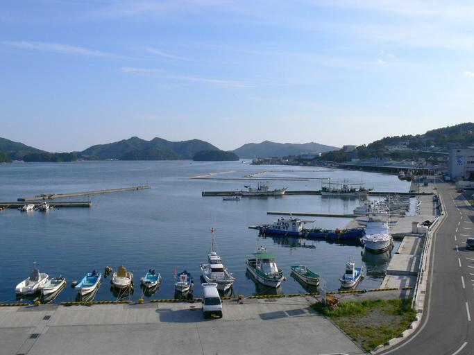
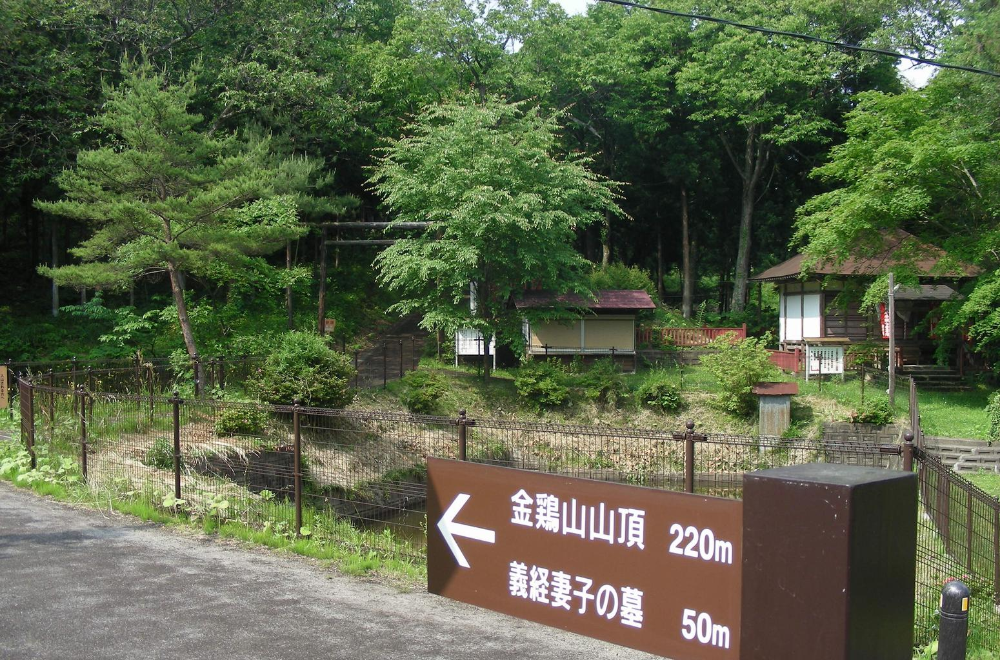

    <h2 class="section-title">全域</h2>
    <ul class="rule-list">
      <li>市外局番は019</li>
      <li>MAIYAというスーパーマーケットチェーンは岩手にしかない</li>
    </ul>
    {}

{}
{}
{}
MAIYAは岩手にしかない{}。2011年には東日本大震災により被害を受けたものの、現在も営業を続けている{}。
{}

By <a href="//commons.wikimedia.org/wiki/User:Morio" title="User:Morio">Morio</a> - Own work, <a href="https://creativecommons.org/licenses/by-sa/4.0" title="Creative Commons Attribution-Share Alike 4.0">CC BY-SA 4.0</a>, <a href="https://commons.wikimedia.org/w/index.php?curid=145950838">Link</a>

{}
{}

    <h2 class="section-title">都市・町の絞り込み</h2>
    <ul class="rule-list">
        <li>釜石市は近代製鉄発祥の地（橋野鉄鉱山は世界遺産）で製鉄所がある</li>
        <li>三陸海岸（宮古・大船渡）は入り組んだリアス海岸と漁港が連なる</li>
        <li>平泉町は中尊寺金色堂など世界遺産の仏教遺跡が残る</li>
    </ul>

{}
{}
{}
釜石市は近代製鉄発祥の地で、橋野鉄鉱山は「明治日本の産業革命遺産」の世界遺産{{% ref "https://ja.wikipedia.org/wiki/%E9%87%9C%E7%9F%B3%E5%B8%82" "釜石市" %}}。製鉄について現在は鉄鉱石から鉄を取り出す「高炉」や、炭素量を調整して鋼にする「転炉」といった上流工程は釜石で行っておらず、特殊鋼線材の圧延・製造を中心に取り扱っている{}。
{}

By <a href="//commons.wikimedia.org/wiki/User:Opqr" title="User:Opqr">Opqr</a> - Own work, <a href="https://creativecommons.org/licenses/by-sa/4.0" title="Creative Commons Attribution-Share Alike 4.0">CC BY-SA 4.0</a>, <a href="https://commons.wikimedia.org/w/index.php?curid=35808954">Link</a>

{}
{}
{}
宮古・釜石・大船渡など三陸海岸は、入り組んだリアス海岸と漁港が連なる{{% ref "https://ja.wikipedia.org/wiki/%E4%B8%89%E9%99%B8%E6%B5%B7%E5%B2%B8" "三陸海岸" %}}。津波を防ぐための大規模な堤防が見つかる{}。
{}

{}
{}
{}
平泉町は中尊寺金色堂・毛越寺など奥州藤原氏ゆかりの仏教遺跡が残り、世界文化遺産に登録{}{{% ref "https://ja.wikipedia.org/wiki/%E5%B9%B3%E6%B3%89" "平泉" %}}。
{}

{}
{}

    <h4 class="mb-4">代表的な企業の説明</h4>
    <table class="table table-striped table-bordered">
        <thead class="table-light">
            <tr>
                <th scope="col" class="col-width-2">企業名</th>
                <th scope="col" class="col-width-1">コード</th>
                <th scope="col" class="col-width-7">説明</th>
                <th scope="col" class="col-width-05">決算</th>
                <th scope="col" class="col-width-05">配当履歴</th>
            </tr>
        </thead>
        <tbody class="corp-desc">
            <tr>
                <td>岩手銀行</td>
                <td>{}</td>
                <td>岩手県を地盤とする地方銀行。盛岡市に本店を置き、県内最大の金融機関。<a href="https://ja.wikipedia.org/wiki/岩手銀行" target="_blank">[参]</a></td>
                <td>{}</td>
                <td>{}</td>
            </tr>
            <tr>
                <td>薬王堂ホールディングス</td>
                <td>{}</td>
                <td>岩手県発祥のドラッグストアチェーン。東北地方で300店舗以上を展開。<a href="https://ja.wikipedia.org/wiki/薬王堂" target="_blank">[参]</a></td>
                <td>{}</td>
                <td>{}</td>
            </tr>
            <tr>
                <td>北日本銀行</td>
                <td>{}</td>
                <td>盛岡市に本店を置く第二地方銀行。岩手県を中心に営業展開。<a href="https://ja.wikipedia.org/wiki/北日本銀行" target="_blank">[参]</a></td>
                <td>{}</td>
                <td>{}</td>
            </tr>
        </tbody>
    </table>

