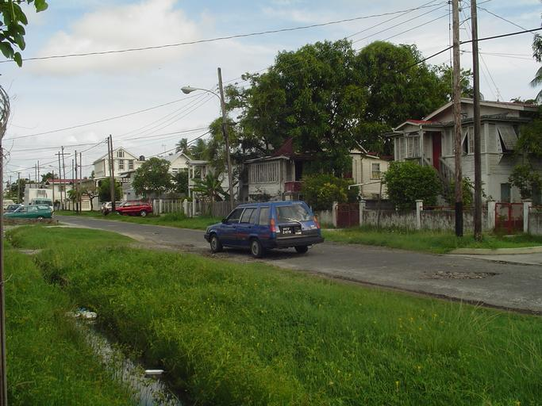
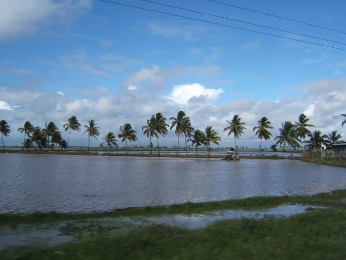

    <h2 class="section-title">{}</h2>
    <ul class="rule-list">
        <li class="no-evidence">公式ストリートビューは無い</li>
    </ul>

{}
{}

{}
黒いナンバープレート{}。
{}

{}
主な農業はコメであり、東側を中心に水田が見つかるはず{}。写真はガイアナのとある水田。
{}

{}
旧{}植民地であり、公用語は英語。
{}

{}
{}
