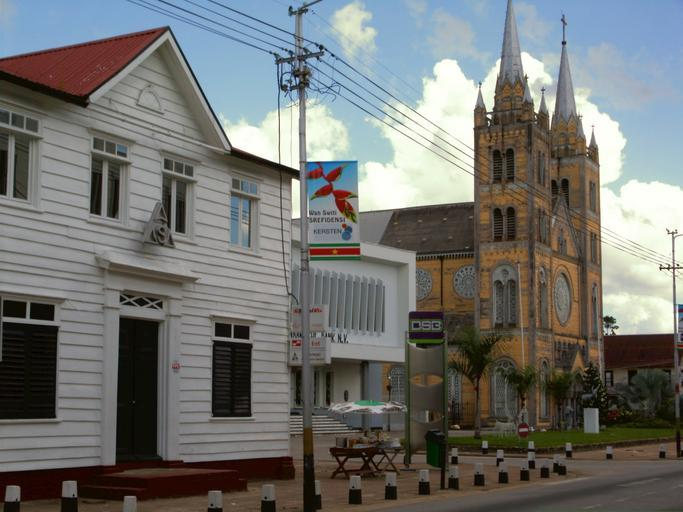

    <h2 class="section-title">{}</h2>
    <ul class="rule-list">
        <li class="no-evidence">公式ストリートビューは無い</li>
        <li>公用語はオランダ語</li>
    </ul>

{}
{}

{}
木造の白い板材で作られた壁を持つ家が多いように見える{}。
{}

{}
{}から独立した地域であり、標識はオランダと同じように縁まで色が塗られている{}。ナンバープレートもオランダと同じく黄色が多い{}。
{}

<iframe src="https://www.google.com/maps/embed?pb=!4v1735956333849!6m8!1m7!1sCAoSLEFGMVFpcE9OUm53a2lVajlmQ3ZzMkpFS09KS1N3S3FiTGxGM3AtYk5mWG82!2m2!1d5.728942011500915!2d-55.12332797335178!3f77.75020705732503!4f-2.6925687585050895!5f0.5441121760819865" width="600" height="450" style="border:0;" allowfullscreen="" loading="lazy" referrerpolicy="no-referrer-when-downgrade"></iframe>

{}
{}
