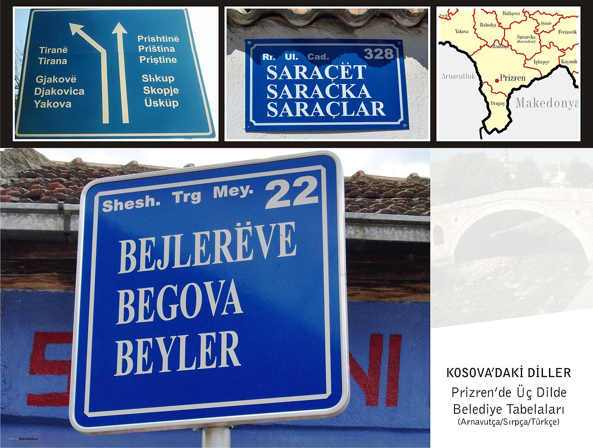
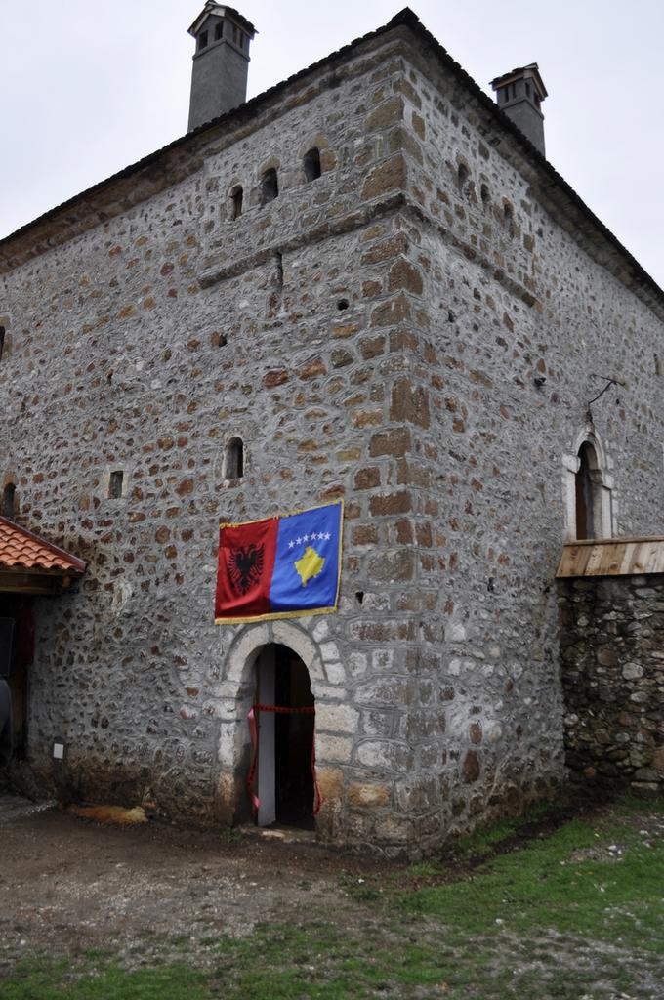
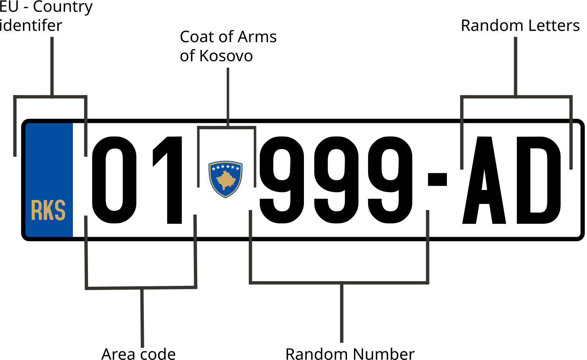

    <h2 class="section-title">{}</h2>
    <ul class="rule-list">
        <li>アルバニア語とセルビア語が併記された通り名看板がある</li>
        <li>家の入口に番地が記載された青い看板が付いている</li>
        <li>コソボの国旗の他にアルバニア国旗が掲揚されていることが多い</li>
    </ul>
    {}

{}
{}
{}
『RR. / UL.』といった形でアルバニア語とセルビア語が併記された通り名看板がある{}。
{}

{}
家の入口に番地が記載された青い看板が付いている{}。
{}

By James Michael DuPont - I, the copyright holder of this work, hereby publish it under the following license:, <a href="https://creativecommons.org/licenses/by-sa/3.0" title="Creative Commons Attribution-Share Alike 3.0">CC BY-SA 3.0</a>, <a href="https://commons.wikimedia.org/w/index.php?curid=12056690">Link</a>

{}
コソボの国旗の他にアルバニア国旗が掲揚されていることが多い。これはコソボ紛争の名残と考えられる{{% ref "https://ja.wikipedia.org/wiki/%E3%82%B3%E3%82%BD%E3%83%9C%E7%B4%9B%E4%BA%89" "コソボ紛争" %}}。
{}

{}
EUと同じくナンバープレートの左側が青色。{}の国旗があるがナンバー左が青色ならコソボが候補に入る。
{}

{}
{}
