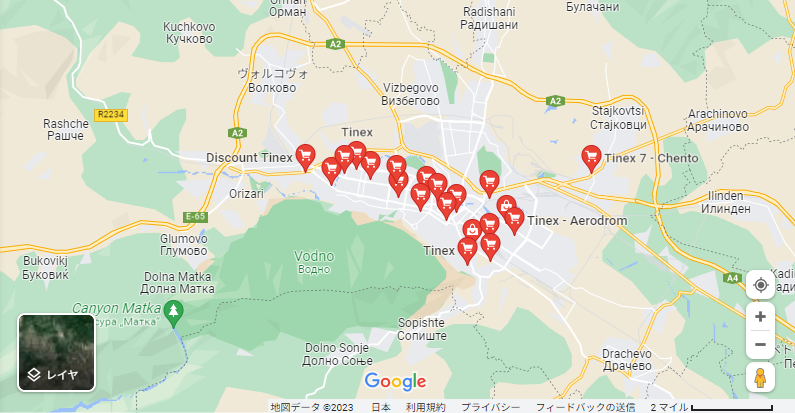

    <h2 class="section-title">{}</h2>
    <ul class="rule-list">
        <li>ドメインは.mk</li>
        <li>公用語はマケドニア語（македонски јазик）でキリル文字を使用する</li>
        <li>「Ќ・ќ」と「Ѓ・ѓ」は北マケドニア以外では使用されない</li>
        <li>ナンバープレートの左側付近が少しだけ赤く見える</li>
        <li>反射板の周りが黒色に塗られており細く丸いボラードがある{}</li>
        <li>ガードレールはセルビアやモンテネグロと異なり丸みを帯びている</li>
        <li class="no-evidence">Google Carのアンテナが見えないことが多い</li>
    </ul>
    {}

{}
{}

{}
基本的に反射板の周りが黒く塗られており、角ばったボラード{}と細く丸いボラード{}がある。またガードレールは角ばっておらず、Google Carのアンテナも見えないはず。
{}

METOKARA, <a href="https://creativecommons.org/licenses/by-sa/3.0" title="Creative Commons Attribution-Share Alike 3.0">CC 表示-継承 3.0</a>, <a href="https://commons.wikimedia.org/w/index.php?curid=56952790">リンク</a>による

{}
ナンバープレートの左側付近が少しだけ赤く見える{}。青いラインは無い場合の方が多い。
{}

{}

By Upwinxp - Own work, CC BY 4.0, <a href="https://commons.wikimedia.org/w/index.php?curid=77624620">Wikipedia Commons(Link)</a>
{}

{}
「Ќ・ќ」と「Ѓ・ѓ」の文字がある（真ん中の黒い看板にЌの文字がある）。
{}

{}
{}

{}
TINEXは北マセドニアの小売業者{}。なぜかスコピエにすごく集中して出店している。ドミナント戦略？
{}

<iframe src="https://www.google.com/maps/embed?pb=!4v1686315288931!6m8!1m7!1srTCpo9hVCHjwqxsLsg_27g!2m2!1d41.97510302684993!2d21.45374083354337!3f213.89959290203691!4f9.107857485123375!5f1.6351547338655483" width="530" height="250" style="border:0;" allowfullscreen="" loading="lazy" referrerpolicy="no-referrer-when-downgrade"></iframe>

{}
{}

    <h2 class="section-title">{}</h2>
    <ul class="rule-list">
        <li>Ohridは水色と白でペイントされたタクシーが走っているかも{}？</li>
    </ul>

{}
{}

By Sharon Hahn Darlin - <a rel="nofollow" class="external free" href="https://www.flickr.com/photos/sharonhahndarlin/52396951461/">https://www.flickr.com/photos/sharonhahndarlin/52396951461/</a>, <a href="https://creativecommons.org/licenses/by/2.0" title="Creative Commons Attribution 2.0">CC BY 2.0</a>, <a href="https://commons.wikimedia.org/w/index.php?curid=123626652">Link</a>

{}
{}