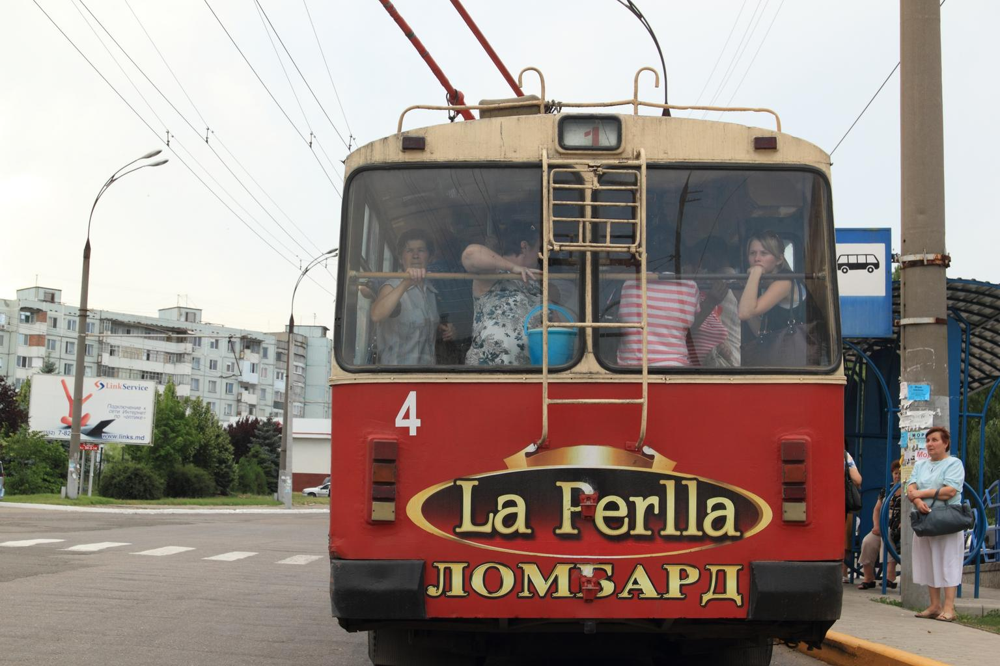
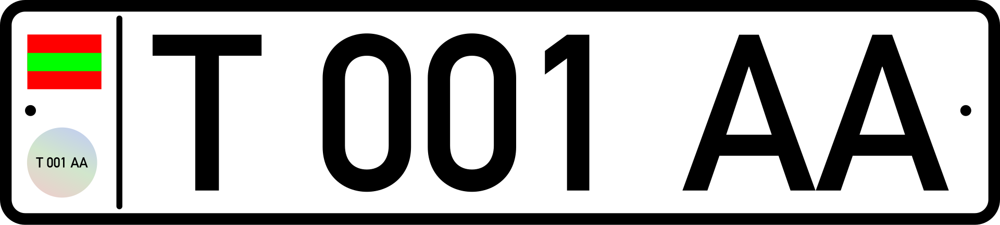

    <h2 class="section-title">{}</h2>
    <ul class="rule-list">
        <li>国際的にはモルドバの一部だが、事実上独立した地域</li>
        <li>公式カバレッジは無い</li>
        <li>公用語はロシア語・ウクライナ語・モルドバ語（キリル文字表記）</li>
    </ul>
    {}

{}
{}
{}
ロシア語のキリル文字が標識に多く見られ、{}の他の地域（ラテン文字のルーマニア語）とは異なる。
{}

{}
白っぽいナンバープレートで、左側に旗が描かれている。
{}

{}

Public Domain
{}

{}
{}
