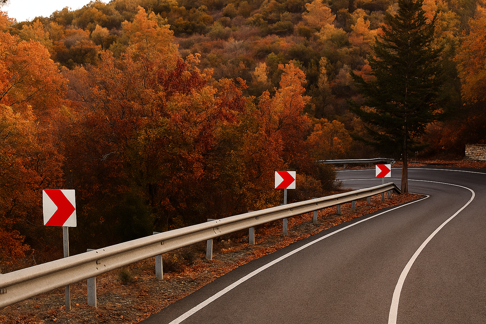

    <h2 class="section-title">{}</h2>
    <ul class="rule-list">
        <li>ギリシャ系の住民が多い南キプロスのみが追加されている(2025年11月現在)</li>
        <li>ドメインは.cy</li>
        <li>白色の独特なボラードが見つかる</li>
        <li>左側通行</li>
    </ul>
    {}

{}
{}

{}
白色の独特なボラードが見つかる{}。ただしボラードには稀に例外もある{}。また、左側通行なので左に標識がある。
{}

{}
英語・ギリシャ語の表記がある{}。キプロス自体は紛争状態であり1974年から南北に分断された状態になっている{}が、南側のギリシャ系が多い地域のみストリートビューが追加されている。
{}

{}
うしろのナンバープレートが黄色のものがいる{}。標識や道路標示も{}のものが使われていることがある。
{}

{}

[Do What the Fxxk You Want to Public License](http://www.wtfpl.net/about/)

Public Domain
{}

{}
電柱に感電注意のプレートや黄色のプレートが付いていることがある{}。
{}

{}
{}と違う点として、シェブロンは赤白のものが多い{}。
{}

{}
{}
