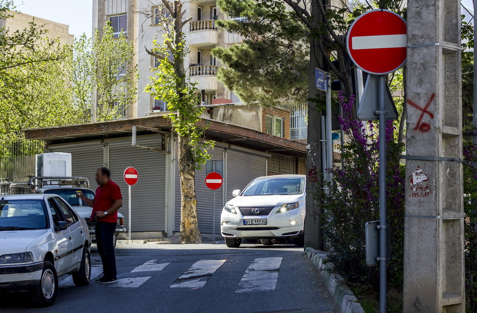
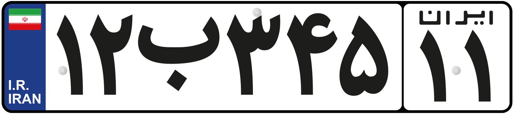
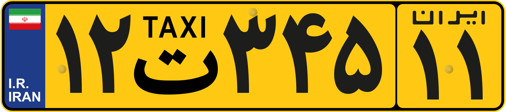

    <h2 class="section-title">{}</h2>
    <ul class="rule-list">
        <li>ドメインは.ir</li>
        <li>2024年6月時点では公式カバレッジはない</li>
    </ul>

{}
{}
{}
EU圏と同じようなデザインのナンバープレートが見つかる
{}

{}

CC0

CC0
{}

{}
{}
