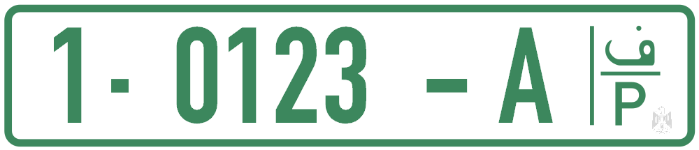

    <h2 class="section-title">{}</h2>
    <ul class="rule-list">
        <li>ドメインは.ps</li>
        <li>アラビア語（اللغة العربية）やヘブライ語（עברית）の文字がある</li>
        <li>ナンバープレートに白背景に緑文字のものがみつかる</li>
    </ul>

{}
{}

{}
ナンバープレートに白背景に緑文字のものが見つかる。しかしイスラエルの黄色ナンバーもかなり多い。
{}

<iframe src="https://www.google.com/maps/embed?pb=!4v1683474785152!6m8!1m7!1sqlv44ygxflBLfq7Jea_p8g!2m2!1d31.91934158590803!2d35.20715477458318!3f49.20218612057827!4f-12.96017591840446!5f2.8721873220127905" width="500" height="250" style="border:0;" allowfullscreen="" loading="lazy" referrerpolicy="no-referrer-when-downgrade"></iframe>

{}

By BasilLeaf - Own work, CC0, <a href="https://commons.wikimedia.org/w/index.php?curid=113341446">Wikimedia Commons</a>
{}
{}
{}