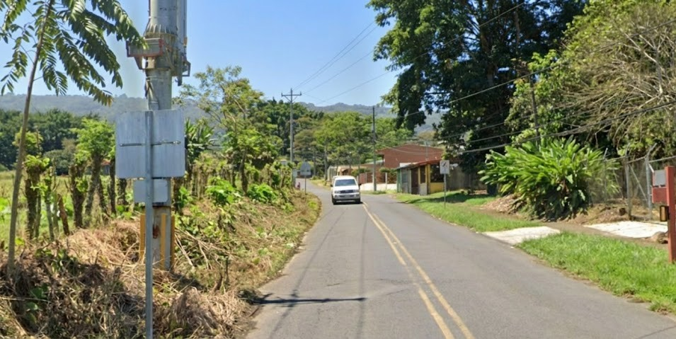
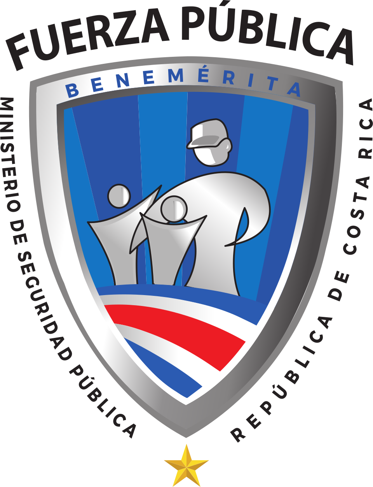
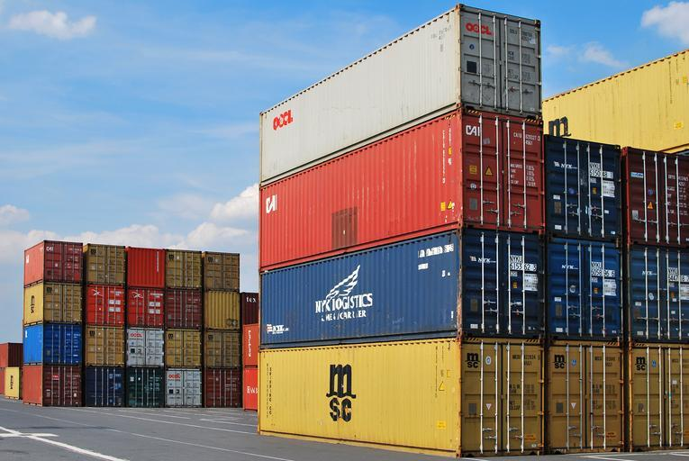

    <h2 class="section-title">{}</h2>
    <ul class="rule-list">
        <li>ドメインは.co.cr</li>
        <li>車は右側通行</li>
        <li>ナンバープレートが白背景に青文字</li>
        <li>とまれが「ALTO」はコスタリカ・{}・{}・{}のどれか</li>
        <li>火山があり黒っぽい土のエリアが多い</li>
        <li>標識の棒はシルバーで裏側にクロスがあることも{}</li>
    </ul>

{}
{}

{}
ナンバープレートは白背景に青文字が多い{}
{}

{}
灰色の□やコの形{}のポールを使った標識が多い。標識の裏にクロスがあることも多い{}
{}

{}
火山灰による肥沃な土地が広がっており、かなり黒っぽい土壌が多い{}。カリブプレートとココスプレートの間に位置しており、火山が多い国。
{}

<iframe src="https://www.google.com/maps/embed?pb=!4v1718907192354!6m8!1m7!1sLyK4tVfngidC-ng-3gSiEA!2m2!1d10.04577082160527!2d-84.26301217300175!3f203.0279562875457!4f4.393129302166031!5f0.4000000000000002" width="90%" height="450" style="border:0;" allowfullscreen="" loading="lazy" referrerpolicy="no-referrer-when-downgrade"></iframe>

{}
黄色の消火栓が多い{}。
{}

{}
メキシコよりも南の地域では、高い位置にカゴがあるゴミ捨て場が家の前に設置されている{}。このようにすることで野良犬にゴミを荒らされなくなるようだ{}。
{}

{}
国営通信会社 ICE（Instituto Costarricense de Electricidad）のkölbiの看板が見つかる{}{{% ref "https://es.wikipedia.org/wiki/K%C3%B6lbi" "Kölbi" %}}。プリペイドのチャージなどができるスポットに看板がある。
{}

{}
{}

    <h2 class="section-title">{}</h2>
    <ul class="rule-list">
        <li>Guanacaste(最も北西の州)は降水量が他の地域よりも少なく乾いた地形も多い</li>
        <li class="no-evidence">南部に行くほどタラマンカ山脈が広がり高い山が多くなる
            <ul>
                <li>南部{}</li>
                <li>北部{}</li>
            </ul>
        </li>
    </ul>

{}
{}

{}
降水量が他よりも少なく熱帯雨林も少ない{}。
{}

{}
{}

{}
山脈内部には道はなく、山脈の両サイドに道がある。熱帯雨林や雲霧林が広がり、周りの道沿いも緑が多い{}。
{}

{}
{}

    <h2 class="section-title">{}</h2>
    <ul class="rule-list">
        <li>コスタリカ公共警察の交番に相当する建物には地名が書いてある。</li>
        <li>コスタリカ最大の港Puerto Limónにつながる道ではコンテナを運ぶトラックが多い</li>
        <li>国境を超えるPaso Canoas{}・Peñas Blancas{}でもトラックの渋滞が多い</li>
    </ul>

{}
{}

{}
交番に地名が書いてある{}。
{}

{}
{}

{}
リモン港へ高速道路が伸びており、コンテナを運ぶトラックが見受けられる{}。
{}

{}
{}

By Brian Johnson &amp; Dane Kantner - <a rel="nofollow" class="external free" href="https://www.flickr.com/photos/danebrian/6806375700/">https://www.flickr.com/photos/danebrian/6806375700/</a>, <a href="https://creativecommons.org/licenses/by-sa/2.0" title="Creative Commons Attribution-Share Alike 2.0">CC BY-SA 2.0</a>, <a href="https://commons.wikimedia.org/w/index.php?curid=141535714">Link</a>

{}
{}
