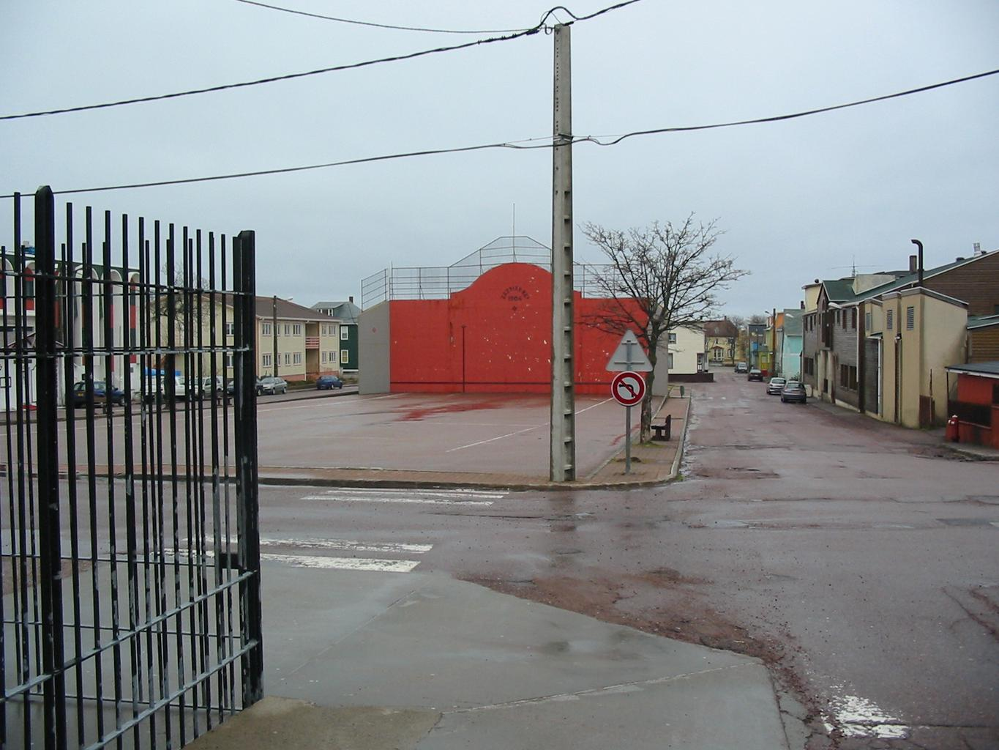

    <h2 class="section-title">{}</h2>
    <ul class="rule-list">
        <li>ドメインは.pm</li>
        <li>Google Carが特徴的</li>
        <li class="no-evidence">道路が全体的に赤く染まって見える</li>
    </ul>

{}
{}

{}
フランスの電柱や国旗があって家がカラフルで平坦{}。{}の特徴があるのに雰囲気が{}ならばこの島の可能性が高い。また道路が全体的に赤く染まって見える{}。
{}

{}Google Carが特徴的{}
{}

（画像なし）

{}
{}